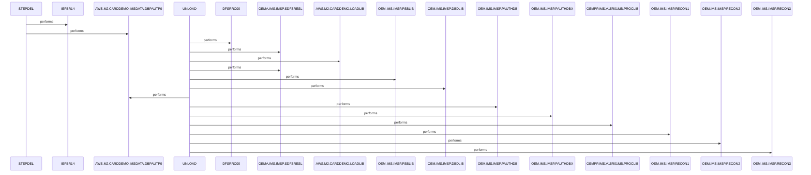

# DBPAUTP0

**File**: `jcl/DBPAUTP0.jcl`
**Type**: FileType.JCL
**Analyzed**: 2026-03-04 04:45:37.844098

## Purpose

This JCL job unloads the DBD DBPAUTP0. It first deletes the output dataset if it exists, then executes the unload program DFSRRC00 to extract the database definition. The job defines the necessary datasets for the IMS environment and the unload process.

**Business Context**: Database administration and maintenance, specifically for extracting database definitions for backup, migration, or analysis purposes.

## Inputs

| Name | Type | Description |
|------|------|-------------|
| OEM.IMS.IMSP.SDFSRESL | IOType.FILE_SEQUENTIAL | IMS RESLIB library containing IMS modules. |
| AWS.M2.CARDDEMO.LOADLIB | IOType.FILE_SEQUENTIAL | Load library containing program modules. |
| OEM.IMS.IMSP.PSBLIB | IOType.FILE_SEQUENTIAL | IMS PSB library. |
| OEM.IMS.IMSP.DBDLIB | IOType.FILE_SEQUENTIAL | IMS DBD library. |
| OEM.IMS.IMSP.PAUTHDB | IOType.FILE_SEQUENTIAL | IMS PAUTHDB dataset. |
| OEM.IMS.IMSP.PAUTHDBX | IOType.FILE_SEQUENTIAL | IMS PAUTHDBX dataset. |
| OEMPP.IMS.V15R01MB.PROCLIB(DFSVSMDB) | IOType.FILE_SEQUENTIAL | IMS VSAMP dataset. |
| OEM.IMS.IMSP.RECON1 | IOType.FILE_SEQUENTIAL | IMS RECON1 dataset. |
| OEM.IMS.IMSP.RECON2 | IOType.FILE_SEQUENTIAL | IMS RECON2 dataset. |
| OEM.IMS.IMSP.RECON3 | IOType.FILE_SEQUENTIAL | IMS RECON3 dataset. |

## Outputs

| Name | Type | Description |
|------|------|-------------|
| AWS.M2.CARDDEMO.IMSDATA.DBPAUTP0 | IOType.FILE_SEQUENTIAL | Output dataset containing the unloaded DBD DBPAUTP0. |
| SYSPRINT | IOType.REPORT | System print output for job execution messages and program output. |
| SYSUDUMP | IOType.REPORT | System dump output for debugging purposes. |

## Called Programs

| Program | Call Type | Purpose |
|---------|-----------|---------|
| IEFBR14 | CallType.STATIC_CALL | Deletes the output dataset AWS.M2.CARDDEMO.IMSDATA.DBPAUTP0 if it exists. |
| DFSRRC00 | CallType.STATIC_CALL | Unloads the DBD DBPAUTP0 using the specified parameters. |

## Paragraphs/Procedures

### DBPAUTP0
This is the main JOB statement that initiates the JCL execution. It defines the job name as 'DBPAUTP0 DB UNLOAD', sets the job class to 'A', message class to 'X', region size to 0K, and time limit to 30 seconds. It also specifies that the user ID should be notified upon completion. This paragraph doesn't directly process data but sets the environment for the subsequent steps. It defines overall job attributes like class, message class, region, and time. No specific error handling is defined at this level, but the system handles job-level errors. It does not call any other programs or paragraphs directly but initiates the execution of the entire JCL.

### STEPDEL
This step deletes the output dataset AWS.M2.CARDDEMO.IMSDATA.DBPAUTP0 if it exists from a previous run. It executes the utility program IEFBR14, which is a null program often used for dataset management tasks like deletion. The SYSPRINT DD statement defines the system output for messages. The SYSUT1 DD statement defines the dataset to be deleted, specifying its name, disposition (MOD,DELETE), unit (SYSDA), and space allocation (TRK,0). This step ensures that the output dataset is clean before the unload process begins. If the dataset does not exist, IEFBR14 will complete successfully without error. It does not call any other programs or paragraphs.

### ~~UNLOAD~~ (Dead Code)
*Paragraph 'UNLOAD' is never PERFORMed or referenced by any other paragraph or program*

## Dead Code

The following artifacts were identified as dead code by static analysis:

| Artifact | Type | Line | Reason |
|----------|------|------|--------|
| UNLOAD | paragraph | 15 | Paragraph 'UNLOAD' is never PERFORMed or referenced by any other paragraph or program |

## Sequence Diagram

```mermaid
sequenceDiagram
    participant STEPDEL as STEPDEL
    participant IEFBR14 as IEFBR14
    participant AWS_M2_CARDDEMO_IMSDATA_DBPAUTP0 as AWS.M2.CARDDEMO.IMSDATA.DBPAUTP0
    participant UNLOAD as UNLOAD
    participant DFSRRC00 as DFSRRC00
    participant OEMA_IMS_IMSP_SDFSRESL as OEMA.IMS.IMSP.SDFSRESL
    participant AWS_M2_CARDDEMO_LOADLIB as AWS.M2.CARDDEMO.LOADLIB
    participant OEM_IMS_IMSP_PSBLIB as OEM.IMS.IMSP.PSBLIB
    participant OEM_IMS_IMSP_DBDLIB as OEM.IMS.IMSP.DBDLIB
    participant OEM_IMS_IMSP_PAUTHDB as OEM.IMS.IMSP.PAUTHDB
    participant OEM_IMS_IMSP_PAUTHDBX as OEM.IMS.IMSP.PAUTHDBX
    participant OEMPP_IMS_V15R01MB_PROCLIB as OEMPP.IMS.V15R01MB.PROCLIB
    participant OEM_IMS_IMSP_RECON1 as OEM.IMS.IMSP.RECON1
    participant OEM_IMS_IMSP_RECON2 as OEM.IMS.IMSP.RECON2
    participant OEM_IMS_IMSP_RECON3 as OEM.IMS.IMSP.RECON3
    STEPDEL->>IEFBR14: performs
    STEPDEL->>AWS_M2_CARDDEMO_IMSDATA_DBPAUTP0: performs
    UNLOAD->>DFSRRC00: performs
    UNLOAD->>OEMA_IMS_IMSP_SDFSRESL: performs
    UNLOAD->>AWS_M2_CARDDEMO_LOADLIB: performs
    UNLOAD->>OEMA_IMS_IMSP_SDFSRESL: performs
    UNLOAD->>OEM_IMS_IMSP_PSBLIB: performs
    UNLOAD->>OEM_IMS_IMSP_DBDLIB: performs
    UNLOAD->>AWS_M2_CARDDEMO_IMSDATA_DBPAUTP0: performs
    UNLOAD->>OEM_IMS_IMSP_PAUTHDB: performs
    UNLOAD->>OEM_IMS_IMSP_PAUTHDBX: performs
    UNLOAD->>OEMPP_IMS_V15R01MB_PROCLIB: performs
    UNLOAD->>OEM_IMS_IMSP_RECON1: performs
    UNLOAD->>OEM_IMS_IMSP_RECON2: performs
    UNLOAD->>OEM_IMS_IMSP_RECON3: performs
```
