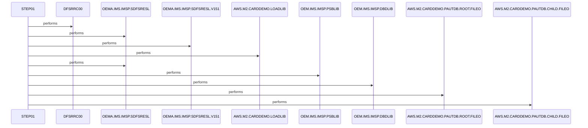

# LOADPADB

**File**: `jcl/LOADPADB.JCL`
**Type**: FileType.JCL
**Analyzed**: 2026-02-24 03:59:14.540061

## Purpose

This JCL defines a batch job named LOADPADB that executes the IMS utility program DFSRRC00 in BMP mode to load data into the PAUTDB IMS database. It reads root and child segment data from two sequential input files and uses the PSB named PSBPAUTB with DBD implied by PAUDBLOD parameter. Supporting libraries for IMS and application load modules are provided via DD statements.

**Business Context**: Supports loading demonstration data into the PAUTDB IMS database for the AWS M2 Card Demo application

## Inputs

| Name | Type | Description |
|------|------|-------------|
| INFILE1 | IOType.FILE_SEQUENTIAL | Input file containing root segment data for PAUTDB database load |
| INFILE2 | IOType.FILE_SEQUENTIAL | Input file containing child segment data for PAUTDB database load |
| IMS | IOType.OTHER | IMS control libraries including PSBLIB and DBDLIB for PSB and database definitions |
| STEPLIB | IOType.OTHER | Load libraries containing IMS RESLIBs and application load module AWS.M2.CARDDEMO.LOADLIB |

## Outputs

| Name | Type | Description |
|------|------|-------------|
| PAUTHDB | IOType.IMS_SEGMENT | Target IMS database for loading (dynamic allocation, explicit DD commented out) |
| PAUTHDBX | IOType.IMS_SEGMENT | Secondary IMS database or index for loading (dynamic allocation, explicit DD commented out) |
| SYSPRINT | IOType.REPORT | Standard output report from DFSRRC00 execution |
| SYSUDUMP | IOType.REPORT | System dump output for abends |

## Called Programs

| Program | Call Type | Purpose |
|---------|-----------|---------|
| DFSRRC00 | CallType.STATIC_CALL | IMS database load utility executed to populate PAUTDB with segment data from inputs |

## Paragraphs/Procedures

### STEP01
This step is the sole executable step in the LOADPADB job and serves as the primary orchestration point for running the IMS database load utility. It statically calls the DFSRRC00 program with PARM parameters specifying BMP region controller mode, the PAUDBLOD database load function, and PSBPAUTB for segment processing (lines 26-27). Inputs consumed include root segments from INFILE1 (line 36), child segments from INFILE2 (line 38), IMS control libraries from IMS DD (lines 33-34), and STEPLIB datasets for RESLIB and application modules (lines 28-30). Outputs produced include loaded data into the dynamically allocated PAUTHDB and PAUTHDBX IMS databases (commented DDs at lines 40-41), along with report output to SYSPRINT (line 48), dumps to SYSUDUMP (line 49), and error logs to IMSERR (line 50). No explicit business logic or conditional decisions are implemented in the JCL itself, as processing logic resides in DFSRRC00; the JCL assumes standard IMS load behavior for segment insertion based on input file formats. Error handling relies on z/OS job return codes from DFSRRC00, with no JCL-specific COND or IF/THEN steps; abends would produce SYSUDUMP output. DUMMY DDs are provided for IMSLOGR (line 46), IEFRDER (line 47), and others to satisfy utility requirements without actual I/O. The DFSVSAMP DD (lines 44-45) provides a sample VSAM definition member for IMS processing support. Overall, this step populates the PAUTDB IMS database with demo data for the Card Demo application, controlled entirely by the called program's parameters and input files.

## Sequence Diagram

