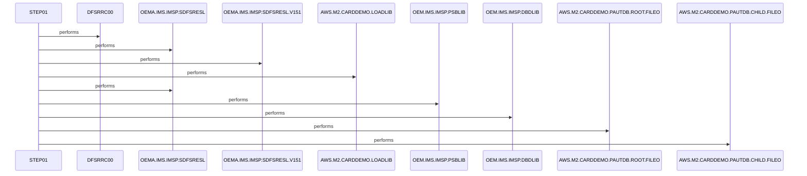

# LOADPADB

**File**: `jcl/LOADPADB.JCL`
**Type**: FileType.JCL
**Analyzed**: 2026-02-09 15:48:24.175208

## Purpose

This JCL executes the IMS program DFSRRC00 to load the PAUTDB database using a BMP (Batch Message Processing) region. It specifies the program DFSRRC00, the BMP region, the load utility PAUDBLOD, and the PSB PSBPAUTB as parameters.

## Inputs

| Name | Type | Description |
|------|------|-------------|
| AWS.M2.CARDDEMO.PAUTDB.ROOT.FILEO | IOType.FILE_SEQUENTIAL | Input file for the PAUTDB root segment load. |
| AWS.M2.CARDDEMO.PAUTDB.CHILD.FILEO | IOType.FILE_SEQUENTIAL | Input file for the PAUTDB child segment load. |
| OEMA.IMS.IMSP.SDFSRESL | IOType.FILE_SEQUENTIAL | IMS RESLIB |
| OEMA.IMS.IMSP.SDFSRESL.V151 | IOType.FILE_SEQUENTIAL | IMS RESLIB version 151 |
| AWS.M2.CARDDEMO.LOADLIB | IOType.FILE_SEQUENTIAL | Load library containing the application programs. |
| OEM.IMS.IMSP.PSBLIB | IOType.FILE_SEQUENTIAL | IMS PSB Library |
| OEM.IMS.IMSP.DBDLIB | IOType.FILE_SEQUENTIAL | IMS DBD Library |
| OEMPP.IMS.V15R01MB.PROCLIB(DFSVSMDB) | IOType.FILE_SEQUENTIAL | IMS VSAM parameters |

## Outputs

| Name | Type | Description |
|------|------|-------------|
| SYSPRINT | IOType.REPORT | System print output. |
| SYSUDUMP | IOType.REPORT | System dump output. |
| IMSERR | IOType.REPORT | IMS error output. |

## Called Programs

| Program | Call Type | Purpose |
|---------|-----------|---------|
| DFSRRC00 | CallType.STATIC_CALL | Executes the IMS BMP region to load the PAUTDB database. |

## Paragraphs/Procedures

### LOADPADB
[Citadel] Paragraph identified by static analysis

### STEP01
[Citadel] Paragraph identified by static analysis

## Open Questions

- ? The commented-out DD statements DDPAUTP0 and DDPAUTX0 refer to datasets OEM.IMS.IMSP.PAUTHDB and OEM.IMS.IMSP.PAUTHDBX. What is their purpose, and why are they commented out?
  - Context: The JCL does not provide enough information to determine the purpose of these datasets.
- ? What is the purpose of the DUMMY DD statements for FSVSAMP, IMSLOGR, and IEFRDER?
  - Context: The JCL does not provide enough information to determine the purpose of these datasets.

## Sequence Diagram

