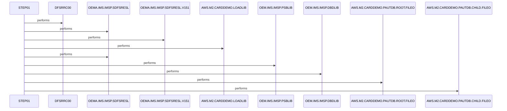

# LOADPADB

**File:** jcl/LOADPADB.JCL
**Type:** JCL
**Status:** In Progress
**Iterations:** 1
**Analyzed:** 2026-02-25 15:28:54.142367

## Purpose

The LOADPADB JCL job executes the IMS reconstruction utility DFSRRC00 to load/reconstruct the PAUTDB IMS database in BMP mode using PSB PAUTB. It reads root segments from INFILE1 and child segments from INFILE2 datasets. This job supports database population for the AWS M2 card demo application.

**Business Context:** IMS database loading for authorization database (PAUTDB) in M2 card demo environment
**Program Type:** BATCH
**Citations:** Lines 26, 27, 36, 38

## Inputs

### INFILE1
- **Type:** FILE_SEQUENTIAL
- **Description:** Root segment data for loading into PAUTDB IMS database
- **Lines:** 36

### INFILE2
- **Type:** FILE_SEQUENTIAL
- **Description:** Child segment data for loading into PAUTDB IMS database
- **Lines:** 38

### DFSVSAMP
- **Type:** OTHER
- **Description:** IMS database definition macro from proclib (DFSVSMDB member)
- **Lines:** 44

## Outputs

### PAUTDB
- **Type:** IMS_SEGMENT
- **Description:** Target IMS database loaded with root and child segments
- **Lines:** 27

### SYSPRINT
- **Type:** REPORT
- **Description:** Standard utility print output
- **Lines:** 48

### SYSUDUMP
- **Type:** REPORT
- **Description:** System dump output on abend
- **Lines:** 49

### IMSERR
- **Type:** REPORT
- **Description:** IMS-specific error messages
- **Lines:** 50

## Called Programs

| Program | Call Type | Purpose | Line |
|---------|-----------|---------|------|
| [DFSRRC00](./DFSRRC00.cbl.md) | STATIC_CALL | IMS database reconstruction/load utility | 26 |

## Data Flow

### Reads From
- **INFILE1**: Root segment records
  (Lines: 36)
- **INFILE2**: Child segment records
  (Lines: 38)

### Writes To
- **PAUTDB**: Loaded root and child segments
  (Lines: 27)

## Key Paragraphs

### STEP01
**Purpose:** This is the primary and only execution step in the LOADPADB JCL job, responsible for invoking the IMS DFSRRC00 utility to perform database reconstruction or loading into the PAUTDB database. It consumes root segment input data from the INFILE1 DD dataset (AWS.M2.CARDDEMO.PAUTDB.ROOT.FILEO) and child segment input data from INFILE2 (AWS.M2.CARDDEMO.PAUTDB.CHILD.FILEO). The step references IMS libraries via STEPLIB (including OEMA.IMS.IMSP.SDFSRESL and AWS.M2.CARDDEMO.LOADLIB), DFSRESLB, IMS (PSBLIB and DBDLIB), and DFSVSAMP (OEMPP.IMS.V15R01MB.PROCLIB(DFSVSMDB)) for necessary modules, PSBs, DBDs, and database macros. The PARM parameter specifies BMP processing mode, database PAUDBLOD, and PSB PSBPAUTB, directing the utility's behavior. Outputs include loaded data into the PAUTDB IMS database segments, along with diagnostic reports to SYSPRINT, SYSUDUMP, and IMSERR. Dummy DDs IMSLOGR and IEFRDER are provided for optional logging. There are no conditional branching or explicit business logic decisions within the JCL step itself; processing relies on the invoked program's internal logic. Error handling follows standard JCL and IMS conventions, with dumps and error messages captured in designated outputs, and job return codes determined by DFSRRC00. Commented DDs (DDPAUTP0, DDPAUTX0, FSVSAMP) indicate optional configurations not active in this version. This step orchestrates the complete database load process for the M2 card demo's PAUTDB.
- Calls: DFSRRC00
- Lines: 26-51

## Error Handling

- **DFSRRC00 utility failure or IMS errors:** Capture dumps in SYSUDUMP, errors in IMSERR, propagate return code to job
  (Lines: 49, 50)

## Resolved Questions

- **Q:** Exact segment structure and field-level details of PAUTDB root/child segments
  **A:** **PAUTDB (IMS DBD=DBPAUTP0) is a HIDAM database with the following exact segment structure:**

### Segments (from `ims/DBPAUTP0.dbd`):
```
- Root: PAUTSUM0
  - Length: 100 bytes
  - Parent: 0 (root)
  - Rules: (,HERE)
  - Pointers: TWINBWD
  - Key field: ACCNTID (SEQ,U, START=1, BYTES=6, TYPE=P - packed decimal)

- Child: PAUTDTL1 (dependent on PAUTSUM0)
  - Length: 200 bytes
  - Parent: ((PAUTSUM0,))
  - Key field: PAUT9CTS (SEQ,U, START=1, BYTES=8, TYPE=C - character)
```

**Notes:**
- **Dataset**: DD=DDPAUTP0 (VSAM access).
- **Index**: Separate HIDAM index database `DBPAUTX0` with segment PAUTINDX (6 bytes, key INDXSEQ packed 6 bytes) linking to PAUTSUM0 via ACCNTID.
- **PSB Confirmation** (e.g., `ims/PSBPAUTB.psb` for BMP mode used by LOADPADB): PCB PAUTBPCB (DBDNAME=DBPAUTP0, KEYLEN=14, PROCOPT=AP), senses PAUTSUM0 (parent=0) and PAUTDTL1 (parent=PAUTSUM0).
- **File Layouts** (from `jcl/UNLDPADB.JCL` unload): Root file LRECL=100 (FB), child LRECL=206 (FB), matching segment BYTES + IMS unload overhead.

**Field-Level Details Beyond Keys: INCONCLUSIVE**

- Full layouts are defined in COBOL copybooks `CIPAUSMY` (root/PAUTSUM0, ~100 bytes) and `CIPAUDTY` (child/PAUTDTL1, ~200 bytes), referenced in load/unload programs like `cbl/PAUDBLOD.CBL`, `cbl/PAUDBUNL.CBL`, `cbl/DBUNLDGS.CBL`, and application code (e.g., `cbl/COPAUA0C.cbl`).
- **Checked**: 
  - `search_code` for `CIPAUSMY`, `CIPAUDTY` (found 8+17 references in COBOL; README.md documents them).
  - `search_code` for `CIPAUSMY\.CPY`, `CIPAUDTY\.CPY`, `cpy/.*CIPAUSMY` (no matches).
  - `read_file` on DBDs (`ims/DBPAUTP0.dbd`, `ims/DBPAUTX0.dbd`).
  - `search_code` for SSA definitions (e.g., `PAUTSUM0`, `PAUTDTL1`), PCB (`PAUTBPCB`), confirming usage.
- Copybook sources absent from codebase (possibly external or omitted). Only keys/sizes definitive from DBD/PSB. Data fields (e.g., PA-ACCT-ID references) inferred as account/auth details but not fully mapped.

**Sources**: `ims/DBPAUTP0.dbd` (lines 17-40), `ims/DBPAUTX0.dbd` (17-33), `ims/PSBPAUTB.psb` (17-20), `jcl/LOADPADB.JCL` (36-38), `jcl/UNLDPADB.JCL` (48-56), multiple `cbl/*.CBL` (e.g., PAUDBLOD.CBL:148-153), README.md (216-217,249-257).

## Sequence Diagram



---
*Generated by War Rig WAR_RIG*