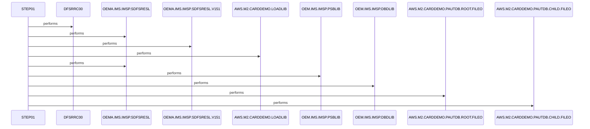

# LOADPADB

**File**: `jcl/LOADPADB.JCL`
**Type**: FileType.JCL
**Analyzed**: 2026-03-03 16:50:52.329381

## Purpose

This JCL job executes an IMS program (DFSRRC00) to load the PAUTDB database using the BMP (Batch Message Processing) region. It specifies the program, PSB, and input files required for the database load process.

**Business Context**: Database maintenance and loading.

## Inputs

| Name | Type | Description |
|------|------|-------------|
| AWS.M2.CARDDEMO.PAUTDB.ROOT.FILEO | IOType.FILE_SEQUENTIAL | Input file containing root segment data for the PAUTDB database. |
| AWS.M2.CARDDEMO.PAUTDB.CHILD.FILEO | IOType.FILE_SEQUENTIAL | Input file containing child segment data for the PAUTDB database. |

## Called Programs

| Program | Call Type | Purpose |
|---------|-----------|---------|
| DFSRRC00 | CallType.STATIC_CALL | Executes the IMS program to load the PAUTDB database. |

## Paragraphs/Procedures

### STEP01
This step executes the IMS program DFSRRC00 to load the PAUTDB database in a BMP region. It defines the program to be executed and passes parameters 'BMP,PAUDBLOD,PSBPAUTB' to it, specifying the execution environment and the PSB to be used. The STEPLIB DD statements define the libraries containing the required modules for IMS execution. The DFSRESLB DD statement specifies the IMS RESLIB. The IMS DD statements define the PSBLIB and DBDLIB to be used. INFILE1 and INFILE2 DD statements define the input files containing the root and child segment data for the PAUTDB database. DFSVSAMP DD defines the buffer pool parameters. The SYSPRINT, SYSUDUMP, and IMSERR DD statements define the output datasets for program messages and dumps.

## Open Questions

- ? What is the purpose of the commented-out DD statements DDPAUTP0 and DDPAUTX0?
  - Context: These DD statements are commented out, so their function in the current execution is unclear.

## Sequence Diagram

```mermaid
sequenceDiagram
    participant STEP01 as STEP01
    participant DFSRRC00 as DFSRRC00
    participant OEMA_IMS_IMSP_SDFSRESL as OEMA.IMS.IMSP.SDFSRESL
    participant OEMA_IMS_IMSP_SDFSRESL_V151 as OEMA.IMS.IMSP.SDFSRESL.V151
    participant AWS_M2_CARDDEMO_LOADLIB as AWS.M2.CARDDEMO.LOADLIB
    participant OEM_IMS_IMSP_PSBLIB as OEM.IMS.IMSP.PSBLIB
    participant OEM_IMS_IMSP_DBDLIB as OEM.IMS.IMSP.DBDLIB
    participant AWS_M2_CARDDEMO_PAUTDB_ROOT_FILEO as AWS.M2.CARDDEMO.PAUTDB.ROOT.FILEO
    participant AWS_M2_CARDDEMO_PAUTDB_CHILD_FILEO as AWS.M2.CARDDEMO.PAUTDB.CHILD.FILEO
    STEP01->>DFSRRC00: performs
    STEP01->>OEMA_IMS_IMSP_SDFSRESL: performs
    STEP01->>OEMA_IMS_IMSP_SDFSRESL_V151: performs
    STEP01->>AWS_M2_CARDDEMO_LOADLIB: performs
    STEP01->>OEMA_IMS_IMSP_SDFSRESL: performs
    STEP01->>OEM_IMS_IMSP_PSBLIB: performs
    STEP01->>OEM_IMS_IMSP_DBDLIB: performs
    STEP01->>AWS_M2_CARDDEMO_PAUTDB_ROOT_FILEO: performs
    STEP01->>AWS_M2_CARDDEMO_PAUTDB_CHILD_FILEO: performs
```
