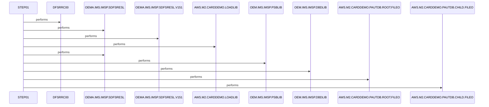

# LOADPADB

**File**: `jcl/LOADPADB.JCL`
**Type**: FileType.JCL
**Analyzed**: 2026-03-04 03:33:04.620980

## Purpose

This JCL job executes an IMS program (DFSRRC00) to load the PAUTDB database. It specifies the program to execute, the PSB and parameters, and defines the input and output datasets required for the load process.

**Business Context**: Loading and initializing the PAUTDB database for IMS application usage.

## Inputs

| Name | Type | Description |
|------|------|-------------|
| AWS.M2.CARDDEMO.PAUTDB.ROOT.FILEO | IOType.FILE_SEQUENTIAL | Input file containing root segment data for the PAUTDB database. |
| AWS.M2.CARDDEMO.PAUTDB.CHILD.FILEO | IOType.FILE_SEQUENTIAL | Input file containing child segment data for the PAUTDB database. |
| OEMA.IMS.IMSP.SDFSRESL | IOType.FILE_SEQUENTIAL | IMS RESLIB library. |
| OEMA.IMS.IMSP.SDFSRESL.V151 | IOType.FILE_SEQUENTIAL | IMS RESLIB library, version 151. |
| AWS.M2.CARDDEMO.LOADLIB | IOType.FILE_SEQUENTIAL | Application load library. |
| OEM.IMS.IMSP.PSBLIB | IOType.FILE_SEQUENTIAL | IMS PSB library. |
| OEM.IMS.IMSP.DBDLIB | IOType.FILE_SEQUENTIAL | IMS DBD library. |
| OEMPP.IMS.V15R01MB.PROCLIB(DFSVSMDB) | IOType.FILE_SEQUENTIAL | IMS VSAM definition. |

## Outputs

| Name | Type | Description |
|------|------|-------------|
| SYSPRINT | IOType.REPORT | System print output for job execution messages. |
| SYSUDUMP | IOType.REPORT | System dump output for debugging purposes. |
| IMSERR | IOType.REPORT | IMS error output. |

## Called Programs

| Program | Call Type | Purpose |
|---------|-----------|---------|
| DFSRRC00 | CallType.STATIC_CALL | Executes the IMS program to load the PAUTDB database. |

## Paragraphs/Procedures

### LOADPADB
This JCL defines the job LOADPADB, which is responsible for loading the PAUTDB database within an IMS environment. The job card specifies job name 'M2APP', CLASS 'A', MSGCLASS 'H', MSGLEVEL (1,1), REGION '0M', NOTIFY user ID, and TIME limit of 1440 minutes. It sets up the environment for executing an IMS program to perform the database load. The job leverages the DFSRRC00 program with specific parameters to initiate the load process. It defines the necessary datasets for the IMS environment, including RESLIB, PSBLIB, and DBDLIB, as well as the input files containing the data to be loaded into the PAUTDB database. The job also defines output datasets for system messages, dumps, and IMS errors.

### STEP01
This step executes the IMS program DFSRRC00, which is responsible for loading the PAUTDB database. The PARM parameter specifies 'BMP' to indicate a Batch Message Processing program, 'PAUDBLOD' which is likely the program name or a control parameter, and 'PSBPAUTB' which is the PSB (Program Specification Block) name. The STEPLIB DD statements define the libraries containing the executable code for the IMS program, including the IMS RESLIB and an application load library. The DFSRESLB DD statement specifies the IMS RESLIB. The IMS DD statements define the PSBLIB and DBDLIB, which contain the program and database definitions. INFILE1 and INFILE2 DD statements define the input datasets containing the root and child segment data for the PAUTDB database. The DFSVSAMP DD statement defines the VSAM parameters. The SYSPRINT, SYSUDUMP, and IMSERR DD statements define the output datasets for system messages, dumps, and IMS errors.

## Sequence Diagram

```mermaid
sequenceDiagram
    participant STEP01 as STEP01
    participant DFSRRC00 as DFSRRC00
    participant OEMA_IMS_IMSP_SDFSRESL as OEMA.IMS.IMSP.SDFSRESL
    participant OEMA_IMS_IMSP_SDFSRESL_V151 as OEMA.IMS.IMSP.SDFSRESL.V151
    participant AWS_M2_CARDDEMO_LOADLIB as AWS.M2.CARDDEMO.LOADLIB
    participant OEM_IMS_IMSP_PSBLIB as OEM.IMS.IMSP.PSBLIB
    participant OEM_IMS_IMSP_DBDLIB as OEM.IMS.IMSP.DBDLIB
    participant AWS_M2_CARDDEMO_PAUTDB_ROOT_FILEO as AWS.M2.CARDDEMO.PAUTDB.ROOT.FILEO
    participant AWS_M2_CARDDEMO_PAUTDB_CHILD_FILEO as AWS.M2.CARDDEMO.PAUTDB.CHILD.FILEO
    STEP01->>DFSRRC00: performs
    STEP01->>OEMA_IMS_IMSP_SDFSRESL: performs
    STEP01->>OEMA_IMS_IMSP_SDFSRESL_V151: performs
    STEP01->>AWS_M2_CARDDEMO_LOADLIB: performs
    STEP01->>OEMA_IMS_IMSP_SDFSRESL: performs
    STEP01->>OEM_IMS_IMSP_PSBLIB: performs
    STEP01->>OEM_IMS_IMSP_DBDLIB: performs
    STEP01->>AWS_M2_CARDDEMO_PAUTDB_ROOT_FILEO: performs
    STEP01->>AWS_M2_CARDDEMO_PAUTDB_CHILD_FILEO: performs
```
