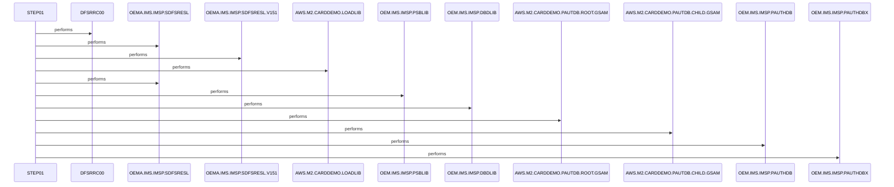

# UNLDGSAM

**File**: `jcl/UNLDGSAM.JCL`
**Type**: FileType.JCL
**Analyzed**: 2026-02-10 17:21:34.113694

## Purpose

This JCL job executes the IMS program DFSRRC00 to unload a GSAM database. It specifies the program to execute, the IMS libraries to use, and the GSAM datasets to be unloaded, along with other IMS control datasets.

## Inputs

| Name | Type | Description |
|------|------|-------------|
| OEMA.IMS.IMSP.SDFSRESL | IOType.FILE_SEQUENTIAL | IMS RESLIB library |
| OEMA.IMS.IMSP.SDFSRESL.V151 | IOType.FILE_SEQUENTIAL | IMS RESLIB library version 151 |
| AWS.M2.CARDDEMO.LOADLIB | IOType.FILE_SEQUENTIAL | Application load library |
| OEM.IMS.IMSP.PSBLIB | IOType.FILE_SEQUENTIAL | IMS PSBLIB library |
| OEM.IMS.IMSP.DBDLIB | IOType.FILE_SEQUENTIAL | IMS DBDLIB library |
| AWS.M2.CARDDEMO.PAUTDB.ROOT.GSAM | IOType.FILE_VSAM | Input GSAM database root segment |
| AWS.M2.CARDDEMO.PAUTDB.CHILD.GSAM | IOType.FILE_VSAM | Input GSAM database child segment |
| OEM.IMS.IMSP.PAUTHDB | IOType.FILE_SEQUENTIAL | IMS PAUTHDB |
| OEM.IMS.IMSP.PAUTHDBX | IOType.FILE_SEQUENTIAL | IMS PAUTHDBX |
| OEMPP.IMS.V15R01MB.PROCLIB(DFSVSMDB) | IOType.FILE_SEQUENTIAL | DFSVSMDB proc |

## Called Programs

| Program | Call Type | Purpose |
|---------|-----------|---------|
| DFSRRC00 | CallType.STATIC_CALL | Executes the IMS DL/I program to unload the GSAM database. |

## Paragraphs/Procedures

### UNLDGSAM
[Citadel] Paragraph identified by static analysis

### STEP01
[Citadel] Paragraph identified by static analysis

## Open Questions

- ? What is the purpose of the DUMMY datasets IEFRDER and IMSLOGR?
  - Context: Their function is not clear from the JCL.

## Sequence Diagram

