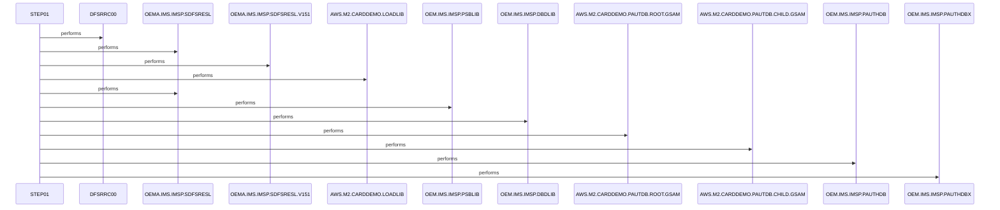

# UNLDGSAM

**File**: `jcl/UNLDGSAM.JCL`
**Type**: FileType.JCL
**Analyzed**: 2026-02-09 15:48:47.591944

## Purpose

This JCL job executes the IMS program DFSRRC00 to unload a GSAM database. It specifies the IMS region, database libraries, and input/output datasets required for the unload process.

## Inputs

| Name | Type | Description |
|------|------|-------------|
| AWS.M2.CARDDEMO.PAUTDB.ROOT.GSAM | IOType.FILE_SEQUENTIAL | Input GSAM database root segment to be unloaded. |
| AWS.M2.CARDDEMO.PAUTDB.CHILD.GSAM | IOType.FILE_SEQUENTIAL | Input GSAM database child segment to be unloaded. |
| OEM.IMS.IMSP.PAUTHDB | IOType.FILE_SEQUENTIAL | Input PAUTHDB dataset. |
| OEM.IMS.IMSP.PAUTHDBX | IOType.FILE_SEQUENTIAL | Input PAUTHDBX dataset. |
| OEMA.IMS.IMSP.SDFSRESL | IOType.FILE_SEQUENTIAL | IMS RESLIB library. |
| OEMA.IMS.IMSP.SDFSRESL.V151 | IOType.FILE_SEQUENTIAL | IMS RESLIB library version 151. |
| AWS.M2.CARDDEMO.LOADLIB | IOType.FILE_SEQUENTIAL | Load library. |
| OEM.IMS.IMSP.PSBLIB | IOType.FILE_SEQUENTIAL | IMS PSBLIB library. |
| OEM.IMS.IMSP.DBDLIB | IOType.FILE_SEQUENTIAL | IMS DBDLIB library. |
| OEMPP.IMS.V15R01MB.PROCLIB(DFSVSMDB) | IOType.FILE_SEQUENTIAL | DFSVSAMP dataset. |

## Outputs

| Name | Type | Description |
|------|------|-------------|
| SYSPRINT | IOType.REPORT | System print output. |
| SYSUDUMP | IOType.REPORT | System dump output. |
| IMSERR | IOType.REPORT | IMS error output. |

## Called Programs

| Program | Call Type | Purpose |
|---------|-----------|---------|
| DFSRRC00 | CallType.STATIC_CALL | Executes the IMS DL/I region controller to unload the GSAM database. |

## Paragraphs/Procedures

### STEP01
This step executes the IMS program DFSRRC00 to unload a GSAM database. The PARM parameter specifies the execution parameters for the IMS DL/I region controller, including the database unload function (DBUNLDGS) and the DLIGSAMP parameter. The STEPLIB DD statements define the libraries required for the IMS execution, including the IMS RESLIB and the application load library. The DFSRESLB DD statement specifies the IMS RESLIB. The IMS DD statements define the PSBLIB and DBDLIB libraries. The PASFILOP and PADFILOP DD statements define the input GSAM database root and child segment datasets to be unloaded. The DDPAUTP0 and DDPAUTX0 DD statements define the PAUTHDB and PAUTHDBX datasets. The DFSVSAMP DD statement defines the DFSVSMDB member from the specified PROCLIB. The IMSLOGR and IEFRDER DD statements are dummied out. The SYSPRINT, SYSUDUMP, and IMSERR DD statements define the system print, system dump, and IMS error output datasets, respectively.

## Open Questions

- ? What is the exact format and content of the GSAM database being unloaded?
  - Context: The JCL only specifies the dataset names, but not the structure or data within them.

## Sequence Diagram

