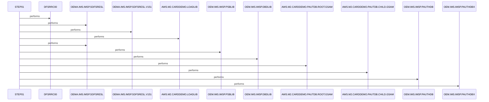

# UNLDGSAM

**File**: `jcl/UNLDGSAM.JCL`
**Type**: FileType.JCL
**Analyzed**: 2026-02-24 17:39:17.365333

## Purpose

This JCL job executes an IMS program (DFSRRC00) to unload a GSAM database. It specifies the program to execute, the IMS libraries required, and the input and output datasets.

## Inputs

| Name | Type | Description |
|------|------|-------------|
| AWS.M2.CARDDEMO.PAUTDB.ROOT.GSAM | IOType.FILE_SEQUENTIAL | Input GSAM database root segment to be unloaded. |
| AWS.M2.CARDDEMO.PAUTDB.CHILD.GSAM | IOType.FILE_SEQUENTIAL | Input GSAM database child segment to be unloaded. |
| OEM.IMS.IMSP.PAUTHDB | IOType.FILE_SEQUENTIAL | Input PAUTHDB dataset. |
| OEM.IMS.IMSP.PAUTHDBX | IOType.FILE_SEQUENTIAL | Input PAUTHDBX dataset. |
| OEMA.IMS.IMSP.SDFSRESL | IOType.FILE_SEQUENTIAL | IMS RESLIB |
| OEMA.IMS.IMSP.SDFSRESL.V151 | IOType.FILE_SEQUENTIAL | IMS RESLIB version 151 |
| AWS.M2.CARDDEMO.LOADLIB | IOType.FILE_SEQUENTIAL | Load library for the application |
| OEM.IMS.IMSP.PSBLIB | IOType.FILE_SEQUENTIAL | IMS PSBLIB |
| OEM.IMS.IMSP.DBDLIB | IOType.FILE_SEQUENTIAL | IMS DBDLIB |
| OEMPP.IMS.V15R01MB.PROCLIB(DFSVSMDB) | IOType.FILE_SEQUENTIAL | DFSVSAMP DD |

## Outputs

| Name | Type | Description |
|------|------|-------------|
| SYSPRINT | IOType.REPORT | System print output for the job. |
| SYSUDUMP | IOType.REPORT | System dump output for the job. |
| IMSERR | IOType.REPORT | IMS error output for the job. |

## Called Programs

| Program | Call Type | Purpose |
|---------|-----------|---------|
| DFSRRC00 | CallType.STATIC_CALL | Executes the IMS program to unload the GSAM database. |

## Paragraphs/Procedures

### UNLDGSAM
This JCL defines the job UNLDGSAM, which unloads a GSAM database using the IMS program DFSRRC00. The job card specifies job name, class, message class, message level, region size, notification ID, and time limit. The purpose of this job is to extract data from the AWS.M2.CARDDEMO.PAUTDB.ROOT.GSAM and AWS.M2.CARDDEMO.PAUTDB.CHILD.GSAM datasets, which are GSAM databases. The job does not directly process or transform data but sets up the environment and calls the IMS program to perform the unload operation. It specifies the necessary IMS libraries (SDFSRESL, PSBLIB, DBDLIB) and the input GSAM datasets. There is no explicit error handling in the JCL itself, but the IMS program DFSRRC00 will handle errors during the unload process. The job executes STEP01 to run the IMS program.

### STEP01
This step executes the IMS program DFSRRC00 with specific parameters to unload a GSAM database. The PARM parameter specifies 'DLI,DBUNLDGS,DLIGSAMP,,,,,,,,,,,N', indicating a DLI batch job using the DBUNLDGS PSB and DLIGSAMP DBD. The STEPLIB DD statements define the libraries required to execute the IMS program, including OEMA.IMS.IMSP.SDFSRESL, OEMA.IMS.IMSP.SDFSRESL.V151, and AWS.M2.CARDDEMO.LOADLIB. The DFSRESLB DD statement specifies the IMS RESLIB. The IMS DD statements define the PSBLIB and DBDLIB. The PASFILOP and PADFILOP DD statements define the input GSAM datasets to be unloaded: AWS.M2.CARDDEMO.PAUTDB.ROOT.GSAM and AWS.M2.CARDDEMO.PAUTDB.CHILD.GSAM, respectively. DDPAUTP0 and DDPAUTX0 define the PAUTHDB and PAUTHDBX datasets. The DFSVSAMP DD statement specifies the DFSVSMDB member in the OEMPP.IMS.V15R01MB.PROCLIB. The IMSLOGR and IEFRDER DD statements are dummy datasets. SYSPRINT, SYSUDUMP, and IMSERR DD statements define the output datasets for system messages, dumps, and IMS errors. This step reads the GSAM databases and writes to SYSPRINT, SYSUDUMP and IMSERR.

## Sequence Diagram

