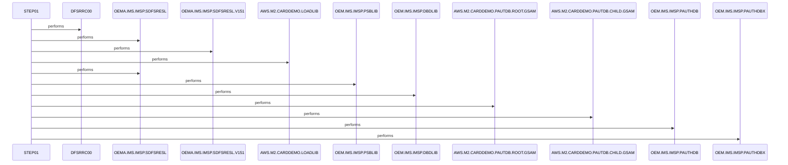

# UNLDGSAM

**File:** jcl/UNLDGSAM.JCL
**Type:** JCL
**Status:** In Progress
**Iterations:** 1
**Analyzed:** 2026-02-24 04:00:13.700183

## Purpose

This JCL job executes the IMS batch driver program DFSRRC00 to process the GSAM database DBUNLDGS using PSB DLIGSAMP under DLI control. It provides access to root and child GSAM input datasets for the PAUTDB database and required IMS libraries. The job is named UNLDGSAM, indicating an unload operation for IMS GSAM datasets.

**Business Context:** Supports the AWS M2 Card Demo application by unloading IMS PAUTDB GSAM database segments (ROOT and CHILD).
**Program Type:** BATCH
**Citations:** Lines 1, 26, 36, 39

## Inputs

### PASFILOP
- **Type:** FILE_SEQUENTIAL
- **Description:** Input GSAM dataset containing ROOT segment data for PAUTDB database
- **Lines:** 36

### PADFILOP
- **Type:** FILE_SEQUENTIAL
- **Description:** Input GSAM dataset containing CHILD segment data for PAUTDB database
- **Lines:** 39

### DDPAUTP0
- **Type:** OTHER
- **Description:** IMS PAUTHDB dataset (likely DBD or authorization library)
- **Lines:** 42

### DDPAUTX0
- **Type:** OTHER
- **Description:** IMS PAUTHDBX dataset (likely extended DBD or authorization library)
- **Lines:** 43

### IMS
- **Type:** OTHER
- **Description:** IMS PSBLIB and DBDLIB libraries
- **Lines:** 33

### DFSVSAMP
- **Type:** OTHER
- **Description:** IMS PROCLIB member DFSVSMDB containing VSAM definitions
- **Lines:** 46

## Outputs

### SYSPRINT
- **Type:** REPORT
- **Description:** Standard print output including job logs
- **Lines:** 50

### SYSUDUMP
- **Type:** REPORT
- **Description:** System dump for abends
- **Lines:** 51

### IMSERR
- **Type:** REPORT
- **Description:** IMS-specific error messages
- **Lines:** 52

## Called Programs

| Program | Call Type | Purpose | Line |
|---------|-----------|---------|------|
| [DFSRRC00](./DFSRRC00.cbl.md) | STATIC_CALL | Drives IMS batch DL/I processing for GSAM database unload | 26 |

## Data Flow

### Reads From
- **PASFILOP**: UNKNOWN - JCL does not specify record layouts
  (Lines: 36)
- **PADFILOP**: UNKNOWN - JCL does not specify record layouts
  (Lines: 39)

## Key Paragraphs

### STEP01
**Purpose:** STEP01 is the primary and only execution step in this JCL job, responsible for invoking the IMS batch region controller program DFSRRC00 to perform DL/I database operations. It consumes the PARM string 'DLI,DBUNLDGS,DLIGSAMP,,,,,,,,,,,N' which configures DLI access, targets database DBUNLDGS, and uses PSB DLIGSAMP (line 27). Inputs are read from GSAM datasets PASFILOP (ROOT segment, lines 36-37) and PADFILOP (CHILD segment, lines 39-40) with OLD disposition for input processing, supplemented by IMS libraries in STEPLIB (lines 28-30), DFSRESLB (31), IMS PSB/DBD libs (33-34), PAUTHDB files (42-43), and VSAM defs in DFSVSAMP (46-47). Outputs are directed to SYSPRINT (50), SYSUDUMP (51), and IMSERR (52) for logging, dumps, and errors; no explicit data output file is defined. Business logic resides entirely within DFSRRC00 and the invoked PSB logic, inferred as GSAM unload from job name UNLDGSAM and input datasets. No conditions or validations are implemented in JCL itself. Error handling uses SYSUDUMP for abends and DUMMY for IMSLOGR (48) and IEFRDER (49) to suppress unnecessary logging. This step does not call other JCL steps or subordinate paragraphs, as JCL structure is linear; it solely executes DFSRRC00. The GSAM datasets retain KEEP disposition post-processing. Completion sets standard return codes viewable in SYSPRINT.
- Calls: DFSRRC00
- Lines: 26-53

## Error Handling

- **Program abend or IMS error:** Dump to SYSUDUMP and log to IMSERR/SYSPRINT; logs suppressed via DUMMY
  (Lines: 48, 49, 51, 52)

## Resolved Questions

- **Q:** Precise function of DFSRRC00 with PARM 'DLI,DBUNLDGS,DLIGSAMP,,,,,,,,,,,N' and absence of explicit UNLOAD output DD
  **A:** **DFSRRC00 Function:**
DFSRRC00 is the IMS **batch message region driver** (also known as the IMS batch driver). In this JCL (jcl/UNLDGSAM.JCL, lines 26-27), it executes the custom COBOL application program **DBUNLDGS** (cbl/DBUNLDGS.CBL) in **DL/I batch mode** using the **DLIGSAMP PSB** (ims/DLIGSAMP.PSB).

- **PARM Breakdown** `'DLI,DBUNLDGS,DLIGSAMP,,,,,,,,,,,N'`:
  | Position | Value      | Meaning |
  |----------|------------|---------|
  | 1        | `DLI`     | DL/I batch processing (non-CICS, database-only mode). |
  | 2        | `DBUNLDGS`| Application program name (PROGRAM-ID in DBUNLDGS.CBL; entry point `DLITCBL`). |
  | 3        | `DLIGSAMP`| PSB name (defines PCBs for IMS DB `DBPAUTP0` + GSAMs `PASFLDBD`/`PADFLDBD`). |
  | 4-12     | (empty)   | Optional: alternate PCB, checkpoint interval, alternate response mode, auth/user/pass/plan/acct, resource name (defaults used). |
  | 13       | `N`       | No checkpoint/restart (or no RESUME). |

**DBUNLDGS Program Logic** (from source + citadel_analyze_file):
- **Input**: IMS hierarchical DB **PAUTDB** (`DBPAUTP0` PCB via DDs `DDPAUTP0`/`DDPAUTX0`):
  - `GN` root segments (`PAUTSUM0` via `PAUTBPCB`).
  - `GNP` child segments (`PAUTDTL1` under each root).
- **Output**: **GSAM datasets** (`PASFLDBD` root via `PASFILOP` DD; `PADFLDBD` child via `PADFILOP` DD):
  - `ISRT` each root to GSAM root PCB (`PASFLPCB`, PROCOPT=LS).
  - `ISRT` each child to GSAM child PCB (`PADFLPCB`, PROCOPT=LS).
- Loops until `GB` (end of DB). Counters track reads/inserts (displayed). Abends on errors.
- **Purpose**: Copies/migrates **all records** from IMS DB `PAUTDB` (pending auth summaries + details) to flat GSAM files (sequential-access IMS DBs). GSAM DDs have `DISP=(OLD,KEEP,KEEP)` for reload/append.

**Absence of Explicit UNLOAD Output DD** (e.g., no `SYSREC00` or sequential dump):
- This is **not** a standard IMS unload utility (e.g., DFSURGL0/DFSUDMP0, which generate sequential unload files).
- No sequential/tape output needed: **GSAM DDs (`PASFILOP`, `PADFILOP`)** *are* the outputs. Program directly `ISRT`s via IMS DL/I calls to populate/reload GSAM datasets (line numbers 302-334 in DBUNLDGS.CBL).
- Commented-out sequential files (`OPFILE1`/`OPFILE2`, lines 26-47) were replaced by GSAM inserts—likely for direct IMS GSAM access instead of dump files.
- Job name `UNLDGSAM` + desc. imply "unload to GSAM"; it's a **custom DB-to-GSAM migration** (read IMS hierarchical → write GSAM flat files).

**Data Flow** (Mermaid):
```mermaid
graph LR
    IMS_DB[IMS DB PAUTDB<br/>DDPAUTP0/X0] --> GN/GNP[DBUNLDGS<br/>PAUTBPCB<br/>Read Roots/Children]
    GN/GNP --> ISRT[ISRT to GSAM PCBs<br/>PASFL/PADFL]
    GSAM_ROOT[PASFILOP<br/>PAUTDB.ROOT.GSAM] <-- ISRT
    GSAM_CHILD[PADFILOP<br/>PAUTDB.CHILD.GSAM] <-- ISRT
```

**Sources**: jcl/UNLDGSAM.JCL (full), cbl/DBUNLDGS.CBL (full + citadel_analyze_file), ims/DLIGSAMP.PSB (full). No DBD for `DBUNLDGS` (program name, not DB). No skills found.

## Sequence Diagram



---
*Generated by War Rig WAR_RIG*