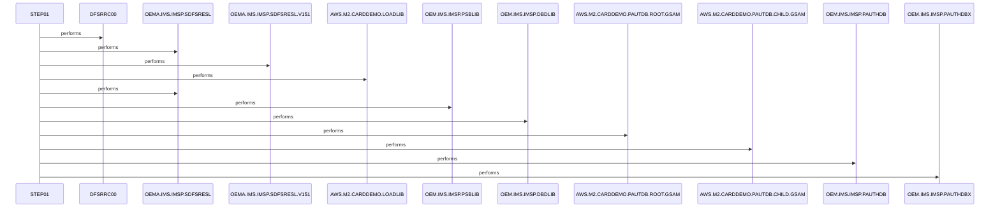

# UNLDGSAM

**File**: `jcl/UNLDGSAM.JCL`
**Type**: FileType.JCL
**Analyzed**: 2026-03-04 03:33:11.695968

## Purpose

This JCL job executes the IMS program DFSRRC00 to unload GSAM databases. It specifies the program to execute, the IMS libraries, and the input and output datasets required for the unload process.

**Business Context**: UNKNOWN

## Inputs

| Name | Type | Description |
|------|------|-------------|
| AWS.M2.CARDDEMO.PAUTDB.ROOT.GSAM | IOType.FILE_SEQUENTIAL | Input GSAM database root segment to be unloaded. |
| AWS.M2.CARDDEMO.PAUTDB.CHILD.GSAM | IOType.FILE_SEQUENTIAL | Input GSAM database child segment to be unloaded. |
| OEM.IMS.IMSP.PAUTHDB | IOType.FILE_SEQUENTIAL | Input PAUTHDB database. |
| OEM.IMS.IMSP.PAUTHDBX | IOType.FILE_SEQUENTIAL | Input PAUTHDBX database. |
| OEMA.IMS.IMSP.SDFSRESL | IOType.FILE_SEQUENTIAL | IMS RESLIB |
| OEMA.IMS.IMSP.SDFSRESL.V151 | IOType.FILE_SEQUENTIAL | IMS RESLIB version 151 |
| AWS.M2.CARDDEMO.LOADLIB | IOType.FILE_SEQUENTIAL | Load library |
| OEM.IMS.IMSP.PSBLIB | IOType.FILE_SEQUENTIAL | IMS PSBLIB |
| OEM.IMS.IMSP.DBDLIB | IOType.FILE_SEQUENTIAL | IMS DBDLIB |
| OEMPP.IMS.V15R01MB.PROCLIB(DFSVSMDB) | IOType.FILE_SEQUENTIAL | IMS PROCLIB member DFSVSMDB |

## Outputs

| Name | Type | Description |
|------|------|-------------|
| SYSPRINT | IOType.REPORT | System print output for job execution messages. |
| SYSUDUMP | IOType.REPORT | System dump output for debugging purposes. |
| IMSERR | IOType.REPORT | IMS error messages. |

## Called Programs

| Program | Call Type | Purpose |
|---------|-----------|---------|
| DFSRRC00 | CallType.STATIC_CALL | Executes the IMS DL/I region controller to unload the GSAM database. |

## Paragraphs/Procedures

### UNLDGSAM
This JCL job, named UNLDGSAM, is designed to execute an IMS database unload process for GSAM databases. It sets up the job environment, including job class, message class, region size, notification ID, and time limit. The job then executes the IMS program DFSRRC00 with specific parameters to perform the database unload. The JCL defines the necessary datasets for the IMS program, including the IMS RESLIB, PSBLIB, DBDLIB, and the GSAM databases to be unloaded. It also defines the SYSPRINT, SYSUDUMP, and IMSERR datasets for outputting job execution messages, debugging information, and IMS error messages, respectively. The overall purpose of this job is to unload the contents of the specified GSAM databases for backup, migration, or other data management purposes.

### STEP01
This step executes the IMS program DFSRRC00, which is the DL/I region controller. The PARM parameter specifies the execution environment and the database unload function (DBUNLDGS). The STEPLIB DD statements define the libraries containing the IMS modules required for execution, including OEMA.IMS.IMSP.SDFSRESL, OEMA.IMS.IMSP.SDFSRESL.V151, and AWS.M2.CARDDEMO.LOADLIB. The DFSRESLB DD statement specifies the IMS RESLIB. The IMS DD statements define the PSBLIB and DBDLIB. The PASFILOP and PADFILOP DD statements define the GSAM databases to be unloaded. The DDPAUTP0 and DDPAUTX0 DD statements define the PAUTHDB and PAUTHDBX databases. The DFSVSAMP DD statement specifies the DFSVSMDB member in the OEMPP.IMS.V15R01MB.PROCLIB. The IMSLOGR and IEFRDER DD statements are dummy datasets. The SYSPRINT, SYSUDUMP, and IMSERR DD statements define the output datasets for job execution messages, debugging information, and IMS error messages, respectively.

## Sequence Diagram

```mermaid
sequenceDiagram
    participant STEP01 as STEP01
    participant DFSRRC00 as DFSRRC00
    participant OEMA_IMS_IMSP_SDFSRESL as OEMA.IMS.IMSP.SDFSRESL
    participant OEMA_IMS_IMSP_SDFSRESL_V151 as OEMA.IMS.IMSP.SDFSRESL.V151
    participant AWS_M2_CARDDEMO_LOADLIB as AWS.M2.CARDDEMO.LOADLIB
    participant OEM_IMS_IMSP_PSBLIB as OEM.IMS.IMSP.PSBLIB
    participant OEM_IMS_IMSP_DBDLIB as OEM.IMS.IMSP.DBDLIB
    participant AWS_M2_CARDDEMO_PAUTDB_ROOT_GSAM as AWS.M2.CARDDEMO.PAUTDB.ROOT.GSAM
    participant AWS_M2_CARDDEMO_PAUTDB_CHILD_GSAM as AWS.M2.CARDDEMO.PAUTDB.CHILD.GSAM
    participant OEM_IMS_IMSP_PAUTHDB as OEM.IMS.IMSP.PAUTHDB
    participant OEM_IMS_IMSP_PAUTHDBX as OEM.IMS.IMSP.PAUTHDBX
    STEP01->>DFSRRC00: performs
    STEP01->>OEMA_IMS_IMSP_SDFSRESL: performs
    STEP01->>OEMA_IMS_IMSP_SDFSRESL_V151: performs
    STEP01->>AWS_M2_CARDDEMO_LOADLIB: performs
    STEP01->>OEMA_IMS_IMSP_SDFSRESL: performs
    STEP01->>OEM_IMS_IMSP_PSBLIB: performs
    STEP01->>OEM_IMS_IMSP_DBDLIB: performs
    STEP01->>AWS_M2_CARDDEMO_PAUTDB_ROOT_GSAM: performs
    STEP01->>AWS_M2_CARDDEMO_PAUTDB_CHILD_GSAM: performs
    STEP01->>OEM_IMS_IMSP_PAUTHDB: performs
    STEP01->>OEM_IMS_IMSP_PAUTHDBX: performs
```
