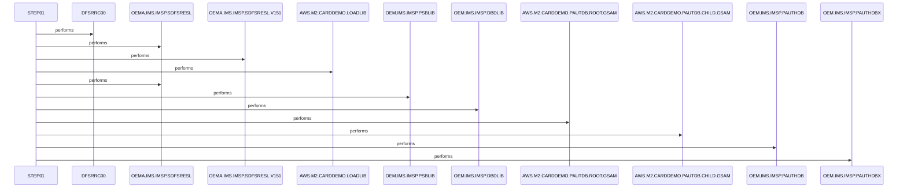

# UNLDGSAM

**File**: `jcl/UNLDGSAM.JCL`
**Type**: FileType.JCL
**Analyzed**: 2026-03-04 04:45:26.751779

## Purpose

This JCL job executes an IMS program (DFSRRC00) to unload a GSAM database. It specifies the program to execute, the parameters for the execution, and the datasets required for the IMS program to run, including the GSAM database files to be unloaded.

**Business Context**: Database administration and maintenance, specifically unloading a GSAM database for backup or migration purposes.

## Inputs

| Name | Type | Description |
|------|------|-------------|
| OEMA.IMS.IMSP.SDFSRESL | IOType.FILE_SEQUENTIAL | IMS RESLIB |
| OEMA.IMS.IMSP.SDFSRESL.V151 | IOType.FILE_SEQUENTIAL | IMS RESLIB version 151 |
| AWS.M2.CARDDEMO.LOADLIB | IOType.FILE_SEQUENTIAL | Load library containing the IMS program. |
| OEM.IMS.IMSP.PSBLIB | IOType.FILE_SEQUENTIAL | IMS PSB library. |
| OEM.IMS.IMSP.DBDLIB | IOType.FILE_SEQUENTIAL | IMS DBD library. |
| AWS.M2.CARDDEMO.PAUTDB.ROOT.GSAM | IOType.FILE_VSAM | GSAM database root segment to be unloaded. |
| AWS.M2.CARDDEMO.PAUTDB.CHILD.GSAM | IOType.FILE_VSAM | GSAM database child segment to be unloaded. |
| OEM.IMS.IMSP.PAUTHDB | IOType.FILE_SEQUENTIAL | IMS PAUTHDB file |
| OEM.IMS.IMSP.PAUTHDBX | IOType.FILE_SEQUENTIAL | IMS PAUTHDBX file |
| OEMPP.IMS.V15R01MB.PROCLIB(DFSVSMDB) | IOType.FILE_SEQUENTIAL | IMS VSAM definition |

## Called Programs

| Program | Call Type | Purpose |
|---------|-----------|---------|
| DFSRRC00 | CallType.STATIC_CALL | Executes the IMS program to unload the GSAM database. |

## Paragraphs/Procedures

### UNLDGSAM
This JCL job defines the steps and resources required to execute an IMS program for unloading a GSAM database. It starts by defining the job name, class, message class, region size, notification settings, and time limit (lines 1-2). The job then proceeds to execute the IMS program DFSRRC00 using the STEP01 execution step (line 26). This step specifies the program to be executed, along with the parameters required for the execution, which include 'DLI,DBUNLDGS,DLIGSAMP,,,,,,,,,,,N'. The job also defines the necessary datasets for the IMS program to run, such as the IMS RESLIB (lines 28-29, 31), the load library (line 30), the PSB and DBD libraries (lines 33-34), and the GSAM database files to be unloaded (lines 36, 39). The job also includes dummy datasets for IMS logging and reporting (lines 48-49) and defines the SYSOUT datasets for printing and dumping (lines 50-52). This JCL does not call any other programs or procedures directly, but it relies on the IMS program DFSRRC00 to perform the actual database unloading operation.

### STEP01
This step executes the IMS program DFSRRC00 with specific parameters to unload a GSAM database. The EXEC statement (line 26) calls program DFSRRC00 and passes parameters 'DLI,DBUNLDGS,DLIGSAMP,,,,,,,,,,,N'. The STEPLIB DD statements (lines 28-30) define the libraries containing the executable code for DFSRRC00 and other required IMS modules. The DFSRESLB DD statement (line 31) specifies the IMS RESLIB. The IMS DD statement (lines 33-34) defines the PSB and DBD libraries required by the IMS program. The PASFILOP and PADFILOP DD statements (lines 36-40) define the GSAM database files (root and child segments) that will be unloaded. The DDPAUTP0 and DDPAUTX0 DD statements (lines 42-43) define the IMS PAUTHDB and PAUTHDBX files. The DFSVSAMP DD statement (lines 46-47) defines the VSAM definition. The IMSLOGR and IEFRDER DD statements (lines 48-49) are dummy datasets. The SYSPRINT, SYSUDUMP, and IMSERR DD statements (lines 50-52) define the output datasets for program messages, dumps, and errors, respectively. This step does not directly call any other programs or procedures, but it relies on the DFSRRC00 program to perform the database unload operation.

## Sequence Diagram

```mermaid
sequenceDiagram
    participant STEP01 as STEP01
    participant DFSRRC00 as DFSRRC00
    participant OEMA_IMS_IMSP_SDFSRESL as OEMA.IMS.IMSP.SDFSRESL
    participant OEMA_IMS_IMSP_SDFSRESL_V151 as OEMA.IMS.IMSP.SDFSRESL.V151
    participant AWS_M2_CARDDEMO_LOADLIB as AWS.M2.CARDDEMO.LOADLIB
    participant OEM_IMS_IMSP_PSBLIB as OEM.IMS.IMSP.PSBLIB
    participant OEM_IMS_IMSP_DBDLIB as OEM.IMS.IMSP.DBDLIB
    participant AWS_M2_CARDDEMO_PAUTDB_ROOT_GSAM as AWS.M2.CARDDEMO.PAUTDB.ROOT.GSAM
    participant AWS_M2_CARDDEMO_PAUTDB_CHILD_GSAM as AWS.M2.CARDDEMO.PAUTDB.CHILD.GSAM
    participant OEM_IMS_IMSP_PAUTHDB as OEM.IMS.IMSP.PAUTHDB
    participant OEM_IMS_IMSP_PAUTHDBX as OEM.IMS.IMSP.PAUTHDBX
    STEP01->>DFSRRC00: performs
    STEP01->>OEMA_IMS_IMSP_SDFSRESL: performs
    STEP01->>OEMA_IMS_IMSP_SDFSRESL_V151: performs
    STEP01->>AWS_M2_CARDDEMO_LOADLIB: performs
    STEP01->>OEMA_IMS_IMSP_SDFSRESL: performs
    STEP01->>OEM_IMS_IMSP_PSBLIB: performs
    STEP01->>OEM_IMS_IMSP_DBDLIB: performs
    STEP01->>AWS_M2_CARDDEMO_PAUTDB_ROOT_GSAM: performs
    STEP01->>AWS_M2_CARDDEMO_PAUTDB_CHILD_GSAM: performs
    STEP01->>OEM_IMS_IMSP_PAUTHDB: performs
    STEP01->>OEM_IMS_IMSP_PAUTHDBX: performs
```
