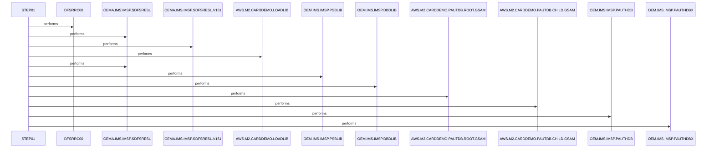

# UNLDGSAM

**File**: `jcl/UNLDGSAM.JCL`
**Type**: FileType.JCL
**Analyzed**: 2026-03-03 16:51:03.829043

## Purpose

This JCL job executes the IMS program DFSRRC00 to unload GSAM databases. It specifies the program to execute, the required libraries, and the input and output datasets for the unload process.

**Business Context**: UNKNOWN

## Inputs

| Name | Type | Description |
|------|------|-------------|
| OEMA.IMS.IMSP.SDFSRESL | IOType.FILE_SEQUENTIAL | IMS RESLIB library. |
| OEMA.IMS.IMSP.SDFSRESL.V151 | IOType.FILE_SEQUENTIAL | IMS RESLIB library version 151. |
| AWS.M2.CARDDEMO.LOADLIB | IOType.FILE_SEQUENTIAL | Application load library. |
| OEM.IMS.IMSP.PSBLIB | IOType.FILE_SEQUENTIAL | IMS PSB library. |
| OEM.IMS.IMSP.DBDLIB | IOType.FILE_SEQUENTIAL | IMS DBD library. |
| AWS.M2.CARDDEMO.PAUTDB.ROOT.GSAM | IOType.FILE_VSAM | Input GSAM database root segment. |
| AWS.M2.CARDDEMO.PAUTDB.CHILD.GSAM | IOType.FILE_VSAM | Input GSAM database child segment. |
| OEM.IMS.IMSP.PAUTHDB | IOType.FILE_SEQUENTIAL | IMS PAUTHDB. |
| OEM.IMS.IMSP.PAUTHDBX | IOType.FILE_SEQUENTIAL | IMS PAUTHDBX. |
| OEMPP.IMS.V15R01MB.PROCLIB(DFSVSMDB) | IOType.FILE_SEQUENTIAL | IMS VSAM Definition parameters. |

## Called Programs

| Program | Call Type | Purpose |
|---------|-----------|---------|
| DFSRRC00 | CallType.STATIC_CALL | Executes the IMS DL/I program to unload the GSAM database. |

## Paragraphs/Procedures

### STEP01
This step executes the IMS program DFSRRC00 with specific parameters to unload a GSAM database. It defines the program to be executed (DFSRRC00) and passes parameters such as 'DLI,DBUNLDGS,DLIGSAMP,,,,,,,,,,,N' to configure the execution environment and specify the unload operation. The STEPLIB DD statements define the libraries required for the program to run, including IMS RESLIB and the application load library. The DFSRESLB DD statement specifies the IMS RESLIB dataset. The IMS DD statements define the PSBLIB and DBDLIB datasets needed for IMS database access. PASFILOP and PADFILOP DD statements define the input GSAM database datasets (root and child segments). DDPAUTP0 and DDPAUTX0 define the PAUTHDB and PAUTHDBX datasets. DFSVSAMP defines the VSAM parameters. Finally, SYSPRINT, SYSUDUMP, and IMSERR DD statements define the output datasets for system messages, dumps, and error messages, respectively.

## Open Questions

- ? What is the business purpose of unloading the GSAM database?
  - Context: The JCL does not provide information about the specific business process that triggers the database unload.

## Sequence Diagram

```mermaid
sequenceDiagram
    participant STEP01 as STEP01
    participant DFSRRC00 as DFSRRC00
    participant OEMA_IMS_IMSP_SDFSRESL as OEMA.IMS.IMSP.SDFSRESL
    participant OEMA_IMS_IMSP_SDFSRESL_V151 as OEMA.IMS.IMSP.SDFSRESL.V151
    participant AWS_M2_CARDDEMO_LOADLIB as AWS.M2.CARDDEMO.LOADLIB
    participant OEM_IMS_IMSP_PSBLIB as OEM.IMS.IMSP.PSBLIB
    participant OEM_IMS_IMSP_DBDLIB as OEM.IMS.IMSP.DBDLIB
    participant AWS_M2_CARDDEMO_PAUTDB_ROOT_GSAM as AWS.M2.CARDDEMO.PAUTDB.ROOT.GSAM
    participant AWS_M2_CARDDEMO_PAUTDB_CHILD_GSAM as AWS.M2.CARDDEMO.PAUTDB.CHILD.GSAM
    participant OEM_IMS_IMSP_PAUTHDB as OEM.IMS.IMSP.PAUTHDB
    participant OEM_IMS_IMSP_PAUTHDBX as OEM.IMS.IMSP.PAUTHDBX
    STEP01->>DFSRRC00: performs
    STEP01->>OEMA_IMS_IMSP_SDFSRESL: performs
    STEP01->>OEMA_IMS_IMSP_SDFSRESL_V151: performs
    STEP01->>AWS_M2_CARDDEMO_LOADLIB: performs
    STEP01->>OEMA_IMS_IMSP_SDFSRESL: performs
    STEP01->>OEM_IMS_IMSP_PSBLIB: performs
    STEP01->>OEM_IMS_IMSP_DBDLIB: performs
    STEP01->>AWS_M2_CARDDEMO_PAUTDB_ROOT_GSAM: performs
    STEP01->>AWS_M2_CARDDEMO_PAUTDB_CHILD_GSAM: performs
    STEP01->>OEM_IMS_IMSP_PAUTHDB: performs
    STEP01->>OEM_IMS_IMSP_PAUTHDBX: performs
```
