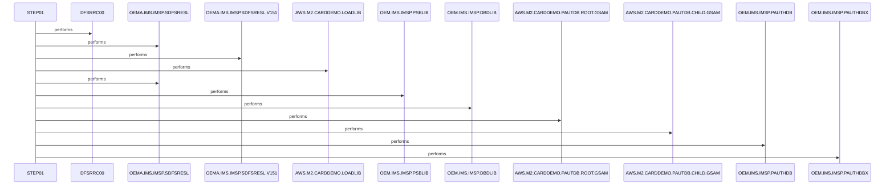

# UNLDGSAM

**File**: `jcl/UNLDGSAM.JCL`
**Type**: FileType.JCL
**Analyzed**: 2026-02-27 14:45:27.519209

## Purpose

This JCL job executes the IMS program DFSRRC00 to unload a GSAM database. It specifies the program to execute, the required libraries, and the input and output datasets.

**Business Context**: UNKNOWN

## Inputs

| Name | Type | Description |
|------|------|-------------|
| AWS.M2.CARDDEMO.PAUTDB.ROOT.GSAM | IOType.FILE_VSAM | Input GSAM database root segment to be unloaded. |
| AWS.M2.CARDDEMO.PAUTDB.CHILD.GSAM | IOType.FILE_VSAM | Input GSAM database child segment to be unloaded. |
| OEM.IMS.IMSP.PAUTHDB | IOType.FILE_SEQUENTIAL | Input database file. |
| OEM.IMS.IMSP.PAUTHDBX | IOType.FILE_SEQUENTIAL | Input database index file. |
| OEMA.IMS.IMSP.SDFSRESL | IOType.FILE_SEQUENTIAL | IMS RESLIB |
| OEMA.IMS.IMSP.SDFSRESL.V151 | IOType.FILE_SEQUENTIAL | IMS RESLIB version 151 |
| AWS.M2.CARDDEMO.LOADLIB | IOType.FILE_SEQUENTIAL | Load library |
| OEM.IMS.IMSP.PSBLIB | IOType.FILE_SEQUENTIAL | IMS PSBLIB |
| OEM.IMS.IMSP.DBDLIB | IOType.FILE_SEQUENTIAL | IMS DBDLIB |
| OEMPP.IMS.V15R01MB.PROCLIB(DFSVSMDB) | IOType.FILE_SEQUENTIAL | DFSVSAMP member |

## Outputs

| Name | Type | Description |
|------|------|-------------|
| SYSPRINT | IOType.REPORT | System print output for job execution messages. |
| SYSUDUMP | IOType.REPORT | System dump output for debugging purposes. |
| IMSERR | IOType.REPORT | IMS error output. |

## Called Programs

| Program | Call Type | Purpose |
|---------|-----------|---------|
| DFSRRC00 | CallType.STATIC_CALL | Executes the IMS DL/I program to unload the GSAM database. |

## Paragraphs/Procedures

### STEP01
This step executes the IMS program DFSRRC00. It specifies the program name, parameters, and required libraries. The PARM parameter defines the execution environment as DLI, specifies the database unload function (DBUNLDGS), and sets other options for the IMS execution. The STEPLIB DD statements define the libraries required for the IMS program to execute, including the IMS RESLIB and the application load library. The DFSRESLB DD statement defines the IMS RESLIB. The IMS DD statements define the PSBLIB and DBDLIB. PASFILOP and PADFILOP define the input GSAM databases to be unloaded. DDPAUTP0 and DDPAUTX0 define additional input database files. DFSVSAMP defines the buffer pool parameters. IMSLOGR and IEFRDER are dummy datasets. SYSPRINT, SYSUDUMP, and IMSERR define the output datasets for job execution messages, system dumps, and IMS errors, respectively. The program unloads the GSAM database defined by PASFILOP and PADFILOP.

## Open Questions

- ? What is the specific purpose of unloading the GSAM database in the context of the broader application?
  - Context: The JCL provides the technical details of the unload process but lacks information about the business reason for performing this operation.

## Sequence Diagram

```mermaid
sequenceDiagram
    participant STEP01 as STEP01
    participant DFSRRC00 as DFSRRC00
    participant OEMA_IMS_IMSP_SDFSRESL as OEMA.IMS.IMSP.SDFSRESL
    participant OEMA_IMS_IMSP_SDFSRESL_V151 as OEMA.IMS.IMSP.SDFSRESL.V151
    participant AWS_M2_CARDDEMO_LOADLIB as AWS.M2.CARDDEMO.LOADLIB
    participant OEM_IMS_IMSP_PSBLIB as OEM.IMS.IMSP.PSBLIB
    participant OEM_IMS_IMSP_DBDLIB as OEM.IMS.IMSP.DBDLIB
    participant AWS_M2_CARDDEMO_PAUTDB_ROOT_GSAM as AWS.M2.CARDDEMO.PAUTDB.ROOT.GSAM
    participant AWS_M2_CARDDEMO_PAUTDB_CHILD_GSAM as AWS.M2.CARDDEMO.PAUTDB.CHILD.GSAM
    participant OEM_IMS_IMSP_PAUTHDB as OEM.IMS.IMSP.PAUTHDB
    participant OEM_IMS_IMSP_PAUTHDBX as OEM.IMS.IMSP.PAUTHDBX
    STEP01->>DFSRRC00: performs
    STEP01->>OEMA_IMS_IMSP_SDFSRESL: performs
    STEP01->>OEMA_IMS_IMSP_SDFSRESL_V151: performs
    STEP01->>AWS_M2_CARDDEMO_LOADLIB: performs
    STEP01->>OEMA_IMS_IMSP_SDFSRESL: performs
    STEP01->>OEM_IMS_IMSP_PSBLIB: performs
    STEP01->>OEM_IMS_IMSP_DBDLIB: performs
    STEP01->>AWS_M2_CARDDEMO_PAUTDB_ROOT_GSAM: performs
    STEP01->>AWS_M2_CARDDEMO_PAUTDB_CHILD_GSAM: performs
    STEP01->>OEM_IMS_IMSP_PAUTHDB: performs
    STEP01->>OEM_IMS_IMSP_PAUTHDBX: performs
```
