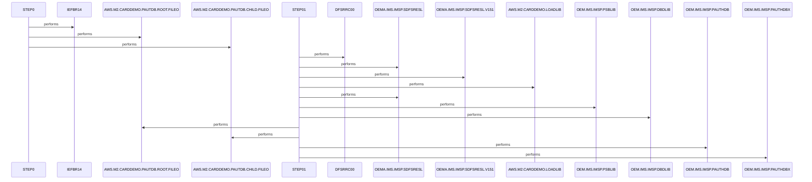

# UNLDPADB

**File:** jcl/UNLDPADB.JCL
**Type:** JCL
**Status:** In Progress
**Iterations:** 1
**Analyzed:** 2026-02-24 03:56:00.933952

## Purpose

This JCL job named UNLDPADB unloads IMS database PAUTDB root and child segments into sequential flat files using DFSRRC00 utility. STEP0 cleans up prior output files via IEFBR14 with delete dispositions. It supports AWS M2 Card Demo data export.

**Business Context:** IMS database unload for AWS.M2.CARDDEMO payment authorization demo, likely for data migration, backup, or flat-file processing.
**Program Type:** BATCH
**Citations:** Lines 1, 23, 25, 38, 48, 53

## Inputs

### DD1
- **Type:** FILE_SEQUENTIAL
- **Description:** Prior run output file AWS.M2.CARDDEMO.PAUTDB.ROOT.FILEO for deletion
- **Lines:** 33

### DD2
- **Type:** FILE_SEQUENTIAL
- **Description:** Prior run output file AWS.M2.CARDDEMO.PAUTDB.CHILD.FILEO for deletion
- **Lines:** 35

### DDPAUTP0
- **Type:** IMS_SEGMENT
- **Description:** IMS database OEM.IMS.IMSP.PAUTHDB providing root segments for unload
- **Lines:** 58

### DDPAUTX0
- **Type:** IMS_SEGMENT
- **Description:** IMS database OEM.IMS.IMSP.PAUTHDBX providing child segments for unload
- **Lines:** 59

### PARM
- **Type:** PARAMETER
- **Description:** DFSRRC00 parameters DLI,PAUDBUNL,PAUTBUNL specifying access and PCBs
- **Lines:** 39

## Outputs

### OUTFIL1
- **Type:** FILE_SEQUENTIAL
- **Description:** Unloaded root segments from PAUTDB RECFM=FB LRECL=100
- **Lines:** 48

### OUTFIL2
- **Type:** FILE_SEQUENTIAL
- **Description:** Unloaded child segments from PAUTDB RECFM=FB LRECL=206
- **Lines:** 53

## Called Programs

| Program | Call Type | Purpose | Line |
|---------|-----------|---------|------|
| [IEFBR14](./IEFBR14.cbl.md) | STATIC_CALL | Null execution to trigger DD delete dispositions for cleanup | 25 |
| [DFSRRC00](./DFSRRC00.cbl.md) | STATIC_CALL | IMS database unload utility to extract segments to sequential files | 38 |

## Data Flow

### Reads From
- **DDPAUTP0**: ALL_ROOT_SEGMENT_FIELDS
  (Lines: 58)
- **DDPAUTX0**: ALL_CHILD_SEGMENT_FIELDS
  (Lines: 59)

### Writes To
- **OUTFIL1**: ROOT segment data
  (Lines: 48)
- **OUTFIL2**: CHILD segment data
  (Lines: 53)

## Key Paragraphs

### UNLDPADB
**Purpose:** This paragraph encompasses the JOB card and header comments defining the UNLDPADB batch job. Its primary purpose is to establish the execution parameters including CLASS=A, MSGCLASS=H, REGION=0M, NOTIFY=&SYSUID, and TIME=1440 for long-running IMS utility. It includes extensive copyright and Apache License 2.0 notices from Amazon.com, outlining usage restrictions and terms. No input data or files are consumed directly at this level. No outputs are produced directly, but it enables step-level outputs. There are no business logic decisions, validations, or conditions checked here. Error handling is deferred to individual steps via standard JCL mechanisms. It orchestrates overall flow by sequencing STEP0 for cleanup followed by STEP01 for unload. Comments explicitly note 'EXECUTE IMS PROGRAM' purpose. This sets the context for PAUTDB database unloading in AWS.M2.CARDDEMO environment.
- Calls: STEP0, STEP01
- Lines: 1-24

### STEP0
**Purpose:** This paragraph is the STEP0 execution block running PGM=IEFBR14, a do-nothing utility used exclusively for DD disposition effects. Its primary role is cleanup, deleting prior output files to prevent conflicts in subsequent steps. It references DD1 (AWS.M2.CARDDEMO.PAUTDB.ROOT.FILEO) and DD2 (AWS.M2.CARDDEMO.PAUTDB.CHILD.FILEO) with DISP=(OLD,DELETE,DELETE), removing them if they exist. Additional DDs SYSPRINT, SYSOUT, SYSDUMP route to SYSOUT=* for any diagnostic output. No data is read, processed, or transformed; effect is solely from JCL dispositions. No business rules, conditions, or validations are applied. Errors like allocation failures cause standard JCL abend with no custom handling. This step calls no other paragraphs or programs. It ensures clean slate for OUTFIL1/OUTFIL2 creation in STEP01. Control passes implicitly to next step upon completion.
- Called by: UNLDPADB
- Lines: 25-37

### STEP01
**Purpose:** This paragraph is the STEP01 execution block invoking PGM=DFSRRC00, the IMS database unload utility for segment extraction. Its primary purpose is to read hierarchical PAUTDB data and write it sequentially to flat files for export. It consumes IMS databases via DDPAUTP0 (PAUTHDB) and DDPAUTX0 (PAUTHDBX) using DLI access per PARM='DLI,PAUDBUNL,PAUTBUNL,,,,,,,,,,,N'. Supporting inputs include STEPLIB, DFSRESLB, IMS libraries, and DFSVSAMP for PSB/DBD. Outputs are OUTFIL1 (root segments, LRECL=100 FB) and OUTFIL2 (child segments, LRECL=206 FB) with CATLG and space allocation. No data transformations occur; it performs direct segment unload. No explicit conditions or business rules beyond utility defaults. Errors log to SYSPRINT, SYSUDUMP, IMSERR, IMSLOGR (DUMMY); JCL abends on failures. Calls no subordinate paragraphs or programs. Completes the core unload function post-cleanup.
- Called by: UNLDPADB
- Lines: 38-69

## Resolved Questions

- **Q:** Precise segment names and field layouts unloaded by PAUDBUNL/PAUTBUNL PCBs
  **A:** **Segment Names:**
- **Root Segment: PAUTSUM0** (Pending Authorization Summary, 100 bytes total length)
- **Child Segment: PAUTDTL1** (Pending Authorization Details, 200 bytes total length, child of PAUTSUM0)

These are accessed via the PAUTBUNL PSB (PCB: PAUTBPCB on DBD **DBPAUTP0**, PROCOPT=GOTP), which defines:
```
PAUTBPCB PCB TYPE=DB,DBDNAME=DBPAUTP0,PROCOPT=GOTP,KEYLEN=14
SENSEG NAME=PAUTSUM0,PARENT=0
SENSEG NAME=PAUTDTL1,PARENT=PAUTSUM0
```

**Unloading Process (PAUDBUNL.CBL):**
- Uses unqualified SSA for GN (root: `'PAUTSUM0 '`) and GNP (child: `'PAUTDTL1 '`).
- Writes **entire raw segments** to flat files (no transformation):
  - **OUTFIL1** (`AWS.M2.CARDDEMO.PAUTDB.ROOT.FILEO`, LRECL=100, RECFM=FB): Full PAUTSUM0 segments (from `PENDING-AUTH-SUMMARY COPY CIPAUSMY` moved to `OPFIL1-REC PIC X(100)`).
  - **OUTFIL2** (`AWS.M2.CARDDEMO.PAUTDB.CHILD.FILEO`, LRECL=206, RECFM=FB): Prefixed root key + full PAUTDTL1 (`ROOT-SEG-KEY PIC S9(11) COMP-3` from `PA-ACCT-ID` + `CHILD-SEG-REC PIC X(200)` from `PENDING-AUTH-DETAILS COPY CIPAUDTY`).

**Known Field Layouts (from DBPAUTP0.dbd):**
- **PAUTSUM0** (root):
  | Field    | Position | Length | Type   | Notes |
  |----------|----------|--------|--------|-------|
  | ACCNTID | 1        | 6      | Packed | SEQ unique key (likely `PA-ACCT-ID PIC 9(11) COMP-3`).
- **PAUTDTL1** (child):
  | Field   | Position | Length | Type | Notes |
  |---------|----------|--------|------|-------|
  | PAUT9CTS| 1        | 8      | Char | SEQ unique key.

Full detailed field layouts for both segments are defined in copybooks **CIPAUSMY** (summary) and **CIPAUDTY** (details), referenced in PAUDBUNL.CBL (lines 139, 143). These copybooks match segment sizes (100/200 bytes) but were not located in the codebase (no `*.cpy` files found via searches).

**Sources Checked:**
- JCL: `jcl/UNLDPADB.JCL` (DFSRRC00 PARM confirms PAUDBUNL/PAUTBUNL).
- PSB: `ims/PAUTBUNL.PSB` (segments/PCB).
- DBD: `ims/DBPAUTP0.dbd` (keys/sizes).
- COBOL: `cbl/PAUDBUNL.CBL` (logic/SSAs/copybooks/output format; analyzed via `citadel_analyze_file`).
- Code searches: Confirmed segments/copybooks across related files (e.g., README.md, other COBOLs).
- No skills/docs found for these specifics.

This is definitive for names, hierarchy, sizes, keys, and unload format. Full non-key fields require copybook contents (potentially external).

## Sequence Diagram



---
*Generated by War Rig WAR_RIG*