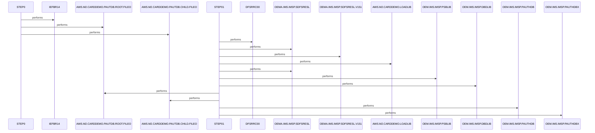

# UNLDPADB

**File**: `jcl/UNLDPADB.JCL`
**Type**: FileType.JCL
**Analyzed**: 2026-02-24 17:39:12.749757

## Purpose

This JCL job unloads an IMS database (PAUTDB) and reloads it. It first deletes the existing database files, then executes the IMS program DFSRRC00 with the PAUDBUNL PSB to unload the database, and finally re-creates the database files.

## Inputs

| Name | Type | Description |
|------|------|-------------|
| OEM.IMS.IMSP.PAUTHDB | IOType.FILE_SEQUENTIAL | Input IMS database to be unloaded. |
| OEM.IMS.IMSP.PAUTHDBX | IOType.FILE_SEQUENTIAL | Input IMS database index to be unloaded. |
| OEMA.IMS.IMSP.SDFSRESL | IOType.FILE_SEQUENTIAL | IMS RESLIB library. |
| OEMA.IMS.IMSP.SDFSRESL.V151 | IOType.FILE_SEQUENTIAL | IMS RESLIB library version 151. |
| AWS.M2.CARDDEMO.LOADLIB | IOType.FILE_SEQUENTIAL | Load library containing the IMS program. |
| OEM.IMS.IMSP.PSBLIB | IOType.FILE_SEQUENTIAL | IMS PSB library. |
| OEM.IMS.IMSP.DBDLIB | IOType.FILE_SEQUENTIAL | IMS DBD library. |
| OEMPP.IMS.V15R01MB.PROCLIB(DFSVSMDB) | IOType.FILE_SEQUENTIAL | IMS VSAM definition library. |

## Outputs

| Name | Type | Description |
|------|------|-------------|
| AWS.M2.CARDDEMO.PAUTDB.ROOT.FILEO | IOType.FILE_SEQUENTIAL | Output file for the unloaded root segment of the PAUTDB database. |
| AWS.M2.CARDDEMO.PAUTDB.CHILD.FILEO | IOType.FILE_SEQUENTIAL | Output file for the unloaded child segment of the PAUTDB database. |

## Called Programs

| Program | Call Type | Purpose |
|---------|-----------|---------|
| IEFBR14 | CallType.STATIC_CALL | Dummy program used to delete the existing database files. |
| DFSRRC00 | CallType.STATIC_CALL | IMS program used to unload the PAUTDB database. |

## Paragraphs/Procedures

### STEP0
This step executes the IEFBR14 program, a dummy program that performs no actual processing. In this JCL, it's used to delete the existing IMS database files (AWS.M2.CARDDEMO.PAUTDB.ROOT.FILEO and AWS.M2.CARDDEMO.PAUTDB.CHILD.FILEO) before the database is unloaded and re-created. The DD statements DD1 and DD2 define the datasets to be deleted, specifying DISP=(OLD,DELETE,DELETE). The first DELETE ensures the dataset is deleted at the end of the step, regardless of the step's success or failure. This step prepares the environment for the subsequent unloading and reloading of the IMS database by removing any existing data.

### STEP01
This step executes the IMS program DFSRRC00 to unload the PAUTDB database. The PGM parameter specifies the program to be executed, and the PARM parameter passes control information to the IMS program. The PARM string 'DLI,PAUDBUNL,PAUTBUNL,,,,,,,,,,,N' indicates that the program is to be executed in DLI mode, using the PAUDBUNL PSB (Program Specification Block) and the PAUTBUNL control region. The STEPLIB DD statements define the libraries containing the IMS modules required for execution, including OEMA.IMS.IMSP.SDFSRESL, OEMA.IMS.IMSP.SDFSRESL.V151, and AWS.M2.CARDDEMO.LOADLIB. The DFSRESLB DD statement defines the IMS RESLIB library. The IMS DD statement defines the PSBLIB and DBDLIB libraries. The OUTFIL1 and OUTFIL2 DD statements define the output files where the unloaded database segments will be written. DDPAUTP0 and DDPAUTX0 define the input IMS database and index. DFSVSAMP defines the VSAM parameters. The remaining DD statements define dummy datasets for IMS logging and error handling.

## Sequence Diagram

