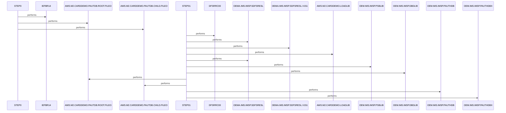

# UNLDPADB

**File:** jcl/UNLDPADB.JCL
**Type:** JCL
**Status:** In Progress
**Iterations:** 1
**Analyzed:** 2026-02-25 15:29:52.791147

## Purpose

This JCL job executes an IMS database unload for the PAUTDB database, producing sequential flat files for root and child segments. STEP0 uses IEFBR14 to delete any existing output files. STEP01 invokes the IMS utility DFSRRC00 to perform the unload using DLI access.

**Business Context:** Supports AWS M2 Card Demo application by unloading Payment Authorization Test IMS database (PAUTDB) for offline processing, backup, or migration.
**Program Type:** BATCH
**Citations:** Lines 23, 25, 38

## Inputs

### DDPAUTP0
- **Type:** IMS_SEGMENT
- **Description:** IMS primary database PAUTHDB containing PAUTDB root and child segments
- **Lines:** 58

### DDPAUTX0
- **Type:** IMS_SEGMENT
- **Description:** IMS secondary database/index PAUTHDBX for PAUTDB
- **Lines:** 59

## Outputs

### OUTFIL1
- **Type:** FILE_SEQUENTIAL
- **Description:** Sequential file containing unloaded root segments from PAUTDB (LRECL=100, RECFM=FB)
- **Lines:** 48

### OUTFIL2
- **Type:** FILE_SEQUENTIAL
- **Description:** Sequential file containing unloaded child segments from PAUTDB (LRECL=206, RECFM=FB)
- **Lines:** 53

## Called Programs

| Program | Call Type | Purpose | Line |
|---------|-----------|---------|------|
| [IEFBR14](./IEFBR14.cbl.md) | STATIC_CALL | Perform dataset deletion for prior output files | 25 |
| [DFSRRC00](./DFSRRC00.cbl.md) | STATIC_CALL | Execute IMS database unload utility for PAUTDB | 38 |

## Data Flow

### Reads From
- **DDPAUTP0**: All PAUTDB root and child segments
  (Lines: 58)
- **DDPAUTX0**: PAUTDB secondary index data
  (Lines: 59)

### Writes To
- **OUTFIL1**: PAUTDB root segments
  (Lines: 48)
- **OUTFIL2**: PAUTDB child segments
  (Lines: 53)

### Transformations
- **PAUTDB hierarchical segments** → **Sequential flat file records**: Unloads IMS database segments into fixed-block sequential files preserving record data
  (Lines: 39)

## Key Paragraphs

### UNLDPADB
**Purpose:** This is the JOB card paragraph defining the overall job execution parameters and context for the IMS database unload. It specifies job class A, message class H, region 0M, notification to SYSUID, and maximum time 1440 minutes. Lines 3-22 contain copyright notices, Apache License 2.0 details, and a high-level comment indicating execution of an IMS program. No data is read or written here; it sets the execution environment. There is no business logic or decisions made. No error handling defined at job level beyond defaults. It orchestrates sequential execution of subordinate STEP0 and STEP01 without COND parameters. Purpose is to provide metadata and scheduling info for the PAUTDB unload job.
- Calls: STEP0, STEP01
- Lines: 1-24

### STEP0
**Purpose:** This preparatory step executes PGM=IEFBR14, a null utility program that performs no computation but enables DD statements for dataset management. It defines DD1 and DD2 pointing to prior versions of output files AWS.M2.CARDDEMO.PAUTDB.ROOT.FILEO and CHILD.FILEO with DISP=(OLD,DELETE,DELETE), ensuring deletion if they exist to prevent conflicts. Additional DDs (SYSPRINT, SYSOUT, SYSDUMP) route output to SYSOUT*. It consumes no runtime data inputs beyond checking for existing files. It produces no new data files, only performs cleanup. No business logic, validations, or conditions are checked; deletion is unconditional via DISP. No error handling beyond JCL defaults (step abend on uncorrectable errors). This step is called first sequentially by the job and prepares for STEP01 by clearing output paths.
- Called by: UNLDPADB
- Calls: IEFBR14
- Lines: 25-37

### STEP01
**Purpose:** This is the primary processing step executing PGM=DFSRRC00, the IMS database reorganization utility configured for UNLOAD function via PARM='DLI,PAUDBUNL,PAUTBUNL,,,,,,,,,,,N'. It reads all root and child segments from input IMS databases DDPAUTP0 (PAUTHDB) and DDPAUTX0 (PAUTHDBX) using DLI access. Outputs are written to OUTFIL1 (root segments, LRECL=100, SPACE=(400,(20,20))) and OUTFIL2 (child segments, LRECL=206). Required IMS libraries are provided via STEPLIB (SDFSRESL, LOADLIB), DFSRESLB, and IMS (PSBLIB, DBDLIB). DFsVSAMP references the VSAM definition for PAUTDB, with DUMMY for IMSLOGR, IEFRDER, and SYSOUTs for diagnostics. No explicit business rules or validations beyond IMS utility defaults for unload completeness. Error handling relies on IMS messages to IMSERR/SYSUDUMP/SYSPRINT and JCL defaults. Executed unconditionally after STEP0, it accomplishes the core unload of PAUTDB for the card demo application.
- Called by: UNLDPADB
- Calls: DFSRRC00
- Lines: 38-69

## Error Handling

- **Dataset not found or I/O error in STEP0 deletes:** JCL default: continue to next step or abend if severe
  (Lines: 33)
- **IMS utility failure in STEP01 (e.g., DB not accessible):** IMS messages to SYSOUT*/IMSERR; job abends on RC non-zero
  (Lines: 66)

## Open Questions

- **Detailed segment layouts and field mappings in PAUTDB**
  - Context: JCL references DBD/PSB but no copybook or DBD source provided
  - Suggestion: Analyze OEM.IMS.IMSP.PAUTHDB DBD source or unload file samples

## Resolved Questions

- **Q:** Exact role of PAUDBUNL/PAUTBUNL in PARM
  **A:** **PAUDBUNL** is the **application program name** (PROGRAM-ID from `cbl/PAUDBUNL.CBL`, lines 17-18), a custom COBOL program implementing the unload logic. It uses `CBLTDLI` calls (e.g., `FUNC-GN`/`FUNC-GNP`) via the `PAUTBPCB` PCB mask (copied from linkage section, line 150) to:

- Perform unqualified GN calls on root segment `PAUTSUM0` (lines 213-216, 228), writing full records to `OUTFIL1` (`AWS.M2.CARDDEMO.PAUTDB.ROOT.FILEO`, LRECL=100).
- For each root, perform unqualified GNP calls on child segment `PAUTDTL1` (lines 257-260, 271), prefixing with root key (`PA-ACCT-ID` moved to `ROOT-SEG-KEY`, line 230) and writing to `OUTFIL2` (`AWS.M2.CARDDEMO.PAUTDB.CHILD.FILEO`, LRECL=206).
- Accesses IMS DB datasets via `DDPAUTP0`/`DDPAUTX0` (`OEM.IMS.IMSP.PAUTHDB*`).
- Handles status codes (e.g., 'GB' for end-of-DB, 'GE' for no more children) and writes stats/displays (lines 180+).

**PAUTBUNL** is the **PSB name** (from `ims/PAUTBUNL.PSB`, line 21: `PSBGEN LANG=COBOL,PSBNAME=PAUTBUNL`), defining access to DBD `DBPAUTP0` (line 18):
```
PAUTBPCB PCB TYPE=DB,DBDNAME=DBPAUTP0,PROCOPT=GOTP,KEYLEN=14
SENSEG NAME=PAUTSUM0,PARENT=0
SENSEG NAME=PAUTDTL1,PARENT=PAUTSUM0
```
- Matches PCB (`PAUTBPCB`), segments (`PAUTSUM0`/`PAUTDTL1` via unqualified SSAs, lines 111-118), and COBOL language.
- PROCOPT=GOTP enables Get Next/Parent for sequential unload.

**In the PARM** (`'DLI,PAUDBUNL,PAUTBUNL,,,,,,,,,,,N'` in `jcl/UNLDPADB.JCL` line 39):
- `DLI`: Specifies DLI (non-CICS batch) access mode.
- `PAUDBUNL`: Program to dynamically load/execute (from `STEPLIB` `AWS.M2.CARDDEMO.LOADLIB`).
- `PAUTBUNL`: PSB to schedule (from `IMS` DD: PSBLIB/DBDLIB).
- Remaining commas/N: Default optional parms (e.g., checkpoint intervals, no checkpoint?).

`DFSRRC00` (IMS SDFSRESL) acts as the **batch DL/I driver**, initializing IMS environment (`DFSRESLB`, `DFSVSAMP`, etc.), scheduling the PSB, and invoking the program via `ENTRY 'DLITCBL'` (line 158). This produces flat files for root/children from PAUTDB (`DBPAUTP0`), as per system-overview skill (PAUDBUNL for IMS unloading).

No standard IMS unload utility (e.g., DFSURGL0); this is a **custom user-exit style unload** via application program + PSB under DFSRRC00 driver.

## Sequence Diagram



---
*Generated by War Rig WAR_RIG*