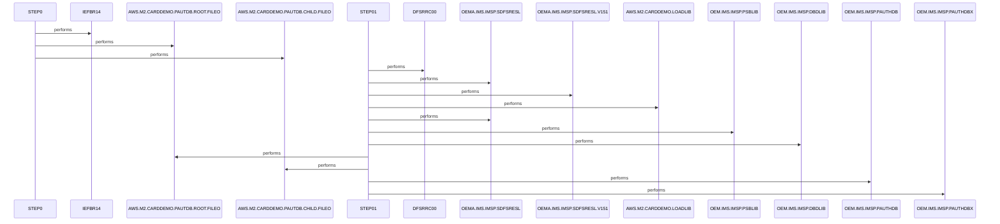

# UNLDPADB

**File**: `jcl/UNLDPADB.JCL`
**Type**: FileType.JCL
**Analyzed**: 2026-02-10 17:21:25.358030

## Purpose

This JCL job unloads the PAUTDB database in IMS. It first deletes the existing database files, then executes the DFSRRC00 program with the PAUDBUNL PSB to unload the database to new files.

**Business Context**: Database maintenance and reorganization.

## Inputs

| Name | Type | Description |
|------|------|-------------|
| OEM.IMS.IMSP.PAUTHDB | IOType.FILE_VSAM | Input database to be unloaded. |
| OEM.IMS.IMSP.PAUTHDBX | IOType.FILE_VSAM | Input database index to be unloaded. |
| OEMA.IMS.IMSP.SDFSRESL | IOType.FILE_SEQUENTIAL | IMS RESLIB library. |
| OEMA.IMS.IMSP.SDFSRESL.V151 | IOType.FILE_SEQUENTIAL | IMS RESLIB library. |
| AWS.M2.CARDDEMO.LOADLIB | IOType.FILE_SEQUENTIAL | Application load library. |
| OEM.IMS.IMSP.PSBLIB | IOType.FILE_SEQUENTIAL | IMS PSB library. |
| OEM.IMS.IMSP.DBDLIB | IOType.FILE_SEQUENTIAL | IMS DBD library. |
| OEMPP.IMS.V15R01MB.PROCLIB(DFSVSMDB) | IOType.FILE_SEQUENTIAL | IMS VSAM definition. |

## Outputs

| Name | Type | Description |
|------|------|-------------|
| AWS.M2.CARDDEMO.PAUTDB.ROOT.FILEO | IOType.FILE_VSAM | Unloaded root segment of PAUTDB database. |
| AWS.M2.CARDDEMO.PAUTDB.CHILD.FILEO | IOType.FILE_VSAM | Unloaded child segment of PAUTDB database. |

## Called Programs

| Program | Call Type | Purpose |
|---------|-----------|---------|
| IEFBR14 | CallType.STATIC_CALL | Dummy program to delete existing database files. |
| DFSRRC00 | CallType.STATIC_CALL | IMS program to unload the PAUTDB database. |

## Paragraphs/Procedures

### STEP0
This step executes the dummy program IEFBR14 to delete the existing database files AWS.M2.CARDDEMO.PAUTDB.ROOT.FILEO and AWS.M2.CARDDEMO.PAUTDB.CHILD.FILEO. The DD1 and DD2 DD statements define the datasets to be deleted using DISP=(OLD,DELETE,DELETE). This step ensures that the old database files are removed before the unload process creates new ones. No specific data is read or written within this step, as IEFBR14 is a null program. The purpose is purely for file management, preparing the environment for the subsequent database unload operation. No error handling is explicitly defined within this step; any errors during deletion would result in JCL errors. This step does not call any other programs or paragraphs.

### STEP01
This step executes the IMS program DFSRRC00 to unload the PAUTDB database. The PARM parameter specifies the execution environment as DLI, the PSB name as PAUDBUNL, and the database name as PAUTBUNL. The STEPLIB DD statement defines the libraries containing the IMS modules required for execution, including OEMA.IMS.IMSP.SDFSRESL, OEMA.IMS.IMSP.SDFSRESL.V151, and AWS.M2.CARDDEMO.LOADLIB. The DFSRESLB DD statement defines the IMS RESLIB. The IMS DD statement defines the PSB and DBD libraries. The OUTFIL1 and OUTFIL2 DD statements define the output datasets where the unloaded database segments will be written. The DDPAUTP0 and DDPAUTX0 DD statements define the input database and its index. The DFSVSAMP DD statement defines the VSAM buffer pool parameters. The remaining DD statements (IMSLOGR, IEFRDER, SYSPRINT, SYSUDUMP, IMSERR) define various system output datasets. This step reads the PAUTDB database and its index and writes the unloaded data to AWS.M2.CARDDEMO.PAUTDB.ROOT.FILEO and AWS.M2.CARDDEMO.PAUTDB.CHILD.FILEO. The program DFSRRC00 handles the logic for unloading the database based on the provided PSB and DBD definitions. Error handling is managed by IMS, and any errors during the unload process will be reported in the SYSPRINT and IMSERR datasets. This step does not call any other programs or paragraphs directly, but relies on the IMS execution environment to manage the database unload process.

## Open Questions

- ? What is the purpose of the DUMMY datasets (FSVSAMP, IMSLOGR, IEFRDER)?
  - Context: Their function is not clear from the JCL alone.

## Sequence Diagram

