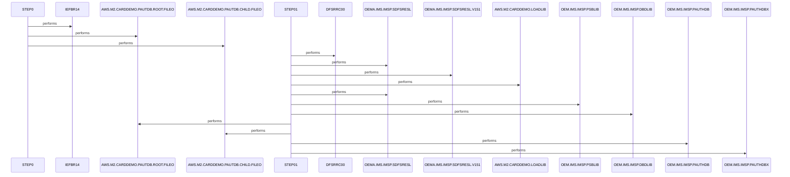

# UNLDPADB

**File**: `jcl/UNLDPADB.JCL`
**Type**: FileType.JCL
**Analyzed**: 2026-02-09 15:48:40.717921

## Purpose

This JCL job unloads an IMS database (PAUTDB) and reloads it. It first deletes the existing database files, then executes the IMS program DFSRRC00 with the PAUDBUNL PSB to unload the database, and finally recreates the database files.

## Inputs

| Name | Type | Description |
|------|------|-------------|
| OEM.IMS.IMSP.PAUTHDB | IOType.FILE_SEQUENTIAL | Input IMS database to be unloaded. |
| OEM.IMS.IMSP.PAUTHDBX | IOType.FILE_SEQUENTIAL | Input IMS database index to be unloaded. |
| OEMA.IMS.IMSP.SDFSRESL | IOType.FILE_SEQUENTIAL | IMS RESLIB |
| OEMA.IMS.IMSP.SDFSRESL.V151 | IOType.FILE_SEQUENTIAL | IMS RESLIB version 151 |
| AWS.M2.CARDDEMO.LOADLIB | IOType.FILE_SEQUENTIAL | Load library containing the IMS program. |
| OEM.IMS.IMSP.PSBLIB | IOType.FILE_SEQUENTIAL | PSB library for IMS. |
| OEM.IMS.IMSP.DBDLIB | IOType.FILE_SEQUENTIAL | DBD library for IMS. |
| OEMPP.IMS.V15R01MB.PROCLIB(DFSVSMDB) | IOType.FILE_SEQUENTIAL | DFSVSMDB proc from IMS PROCLIB |

## Outputs

| Name | Type | Description |
|------|------|-------------|
| AWS.M2.CARDDEMO.PAUTDB.ROOT.FILEO | IOType.FILE_SEQUENTIAL | Output file for the unloaded root segment of the PAUTDB database. |
| AWS.M2.CARDDEMO.PAUTDB.CHILD.FILEO | IOType.FILE_SEQUENTIAL | Output file for the unloaded child segment of the PAUTDB database. |

## Called Programs

| Program | Call Type | Purpose |
|---------|-----------|---------|
| IEFBR14 | CallType.STATIC_CALL | Dummy program used to delete the existing database files. |
| DFSRRC00 | CallType.STATIC_CALL | IMS program to unload the PAUTDB database. |

## Paragraphs/Procedures

### STEP0
This step executes the dummy program IEFBR14 to delete the existing IMS database files before the unload process. It is a standard practice to ensure a clean slate before creating new files or reloading data. The program IEFBR14 does nothing but return a zero return code, effectively serving as a placeholder for file deletion operations defined in the DD statements. DD1 defines the root file AWS.M2.CARDDEMO.PAUTDB.ROOT.FILEO, and DD2 defines the child file AWS.M2.CARDDEMO.PAUTDB.CHILD.FILEO. Both DD statements specify DISP=(OLD,DELETE,DELETE), which means that if the files exist, they will be deleted at the beginning and end of the step. This step does not read any input data or produce any output other than deleting the specified files. It calls no other programs or paragraphs.

### STEP01
This step executes the IMS program DFSRRC00 to unload the PAUTDB database. The PARM parameter specifies 'DLI,PAUDBUNL,PAUTBUNL,,,,,,,,,,,N', indicating a DLI batch job using the PAUDBUNL PSB and PAUTBUNL program name. The STEPLIB DD statements define the libraries required to execute the IMS program, including OEMA.IMS.IMSP.SDFSRESL, OEMA.IMS.IMSP.SDFSRESL.V151, and AWS.M2.CARDDEMO.LOADLIB. The DFSRESLB DD statement specifies the IMS RESLIB. The IMS DD statements define the PSB and DBD libraries. OUTFIL1 and OUTFIL2 DD statements define the output files for the unloaded root and child segments, respectively. DDPAUTP0 and DDPAUTX0 DD statements define the input IMS database and index. DFSVSAMP DD defines the buffer pool parameters. The SYSPRINT, SYSUDUMP, and IMSERR DD statements define the output datasets for system messages, dumps, and error messages. The program reads the IMS database (PAUTHDB and PAUTHDBX) and writes the unloaded data to AWS.M2.CARDDEMO.PAUTDB.ROOT.FILEO and AWS.M2.CARDDEMO.PAUTDB.CHILD.FILEO. It calls the IMS program DFSRRC00.

## Open Questions

- ? What is the exact purpose of the 'N' parameter in the PARM field of STEP01?
  - Context: The meaning of the final 'N' parameter in the PARM string for DFSRRC00 is unclear from the JCL alone.

## Sequence Diagram

