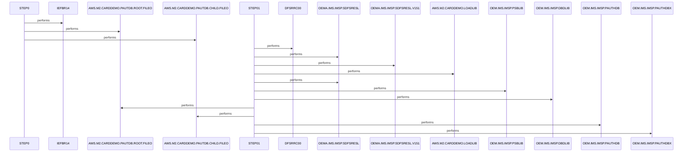

# UNLDPADB

**File**: `jcl/UNLDPADB.JCL`
**Type**: FileType.JCL
**Analyzed**: 2026-03-04 03:33:27.107255

## Purpose

This JCL job unloads the PAUTDB database using the IMS program DFSRRC00. It deletes and recreates the root and child files, and executes the PAUDBUNL program to unload the database.

**Business Context**: Database maintenance and data extraction.

## Inputs

| Name | Type | Description |
|------|------|-------------|
| OEM.IMS.IMSP.PSBLIB | IOType.FILE_SEQUENTIAL | IMS PSBLIB library containing PSB definitions. |
| OEM.IMS.IMSP.DBDLIB | IOType.FILE_SEQUENTIAL | IMS DBDLIB library containing DBD definitions. |
| OEM.IMS.IMSP.PAUTHDB | IOType.FILE_SEQUENTIAL | Input database to be unloaded. |
| OEM.IMS.IMSP.PAUTHDBX | IOType.FILE_SEQUENTIAL | Input database index to be unloaded. |
| OEMA.IMS.IMSP.SDFSRESL | IOType.FILE_SEQUENTIAL | IMS SDFSRESL library. |
| OEMA.IMS.IMSP.SDFSRESL.V151 | IOType.FILE_SEQUENTIAL | IMS SDFSRESL library version 151. |
| AWS.M2.CARDDEMO.LOADLIB | IOType.FILE_SEQUENTIAL | Load library containing the PAUDBUNL program. |
| OEMPP.IMS.V15R01MB.PROCLIB(DFSVSMDB) | IOType.FILE_SEQUENTIAL | DFSVSAMP member. |

## Outputs

| Name | Type | Description |
|------|------|-------------|
| AWS.M2.CARDDEMO.PAUTDB.ROOT.FILEO | IOType.FILE_SEQUENTIAL | Unloaded root segment data. |
| AWS.M2.CARDDEMO.PAUTDB.CHILD.FILEO | IOType.FILE_SEQUENTIAL | Unloaded child segment data. |

## Called Programs

| Program | Call Type | Purpose |
|---------|-----------|---------|
| DFSRRC00 | CallType.STATIC_CALL | Executes the IMS DL/I program PAUDBUNL to unload the database. |
| IEFBR14 | CallType.STATIC_CALL | Dummy program to delete the existing datasets. |

## Paragraphs/Procedures

### STEP0
This step executes the IEFBR14 program, which is a dummy program used to delete the existing datasets AWS.M2.CARDDEMO.PAUTDB.ROOT.FILEO and AWS.M2.CARDDEMO.PAUTDB.CHILD.FILEO. The DD statements DD1 and DD2 define these datasets and specify their disposition as OLD, DELETE, DELETE, ensuring they are deleted at the end of the step. This step prepares the environment for the subsequent step by removing any existing files with the same names, allowing the unload process to create new files. The SYSPRINT, SYSOUT, and SYSDUMP DD statements define the output datasets for system messages, standard output, and system dumps, respectively. This step does not read any input data, but it modifies the system catalog by deleting the specified datasets.

### STEP01
This step executes the IMS program DFSRRC00 to unload the PAUTDB database. The PARM parameter specifies the execution parameters for DFSRRC00, including 'DLI' to indicate a DL/I batch job, 'PAUDBUNL' as the program to be executed, and 'PAUTBUNL' as the PSB name. The STEPLIB DD statements define the libraries containing the necessary modules for IMS execution, including OEMA.IMS.IMSP.SDFSRESL, OEMA.IMS.IMSP.SDFSRESL.V151, and AWS.M2.CARDDEMO.LOADLIB. The DFSRESLB DD statement specifies the IMS SDFSRESL library. The IMS DD statements define the PSBLIB and DBDLIB libraries. The OUTFIL1 and OUTFIL2 DD statements define the output datasets AWS.M2.CARDDEMO.PAUTDB.ROOT.FILEO and AWS.M2.CARDDEMO.PAUTDB.CHILD.FILEO, respectively, which will contain the unloaded data. The DDPAUTP0 and DDPAUTX0 DD statements define the input database and index datasets. The DFSVSAMP DD statement specifies the DFSVSMDB member from the OEMPP.IMS.V15R01MB.PROCLIB library, which contains buffer pool parameters. The remaining DD statements (IMSLOGR, IEFRDER, SYSPRINT, SYSUDUMP, IMSERR) define dummy or output datasets for logging and error handling. This step reads the PAUTHDB and PAUTHDBX datasets and writes the unloaded data to the ROOT.FILEO and CHILD.FILEO datasets.

## Sequence Diagram

```mermaid
sequenceDiagram
    participant STEP0 as STEP0
    participant IEFBR14 as IEFBR14
    participant AWS_M2_CARDDEMO_PAUTDB_ROOT_FILEO as AWS.M2.CARDDEMO.PAUTDB.ROOT.FILEO
    participant AWS_M2_CARDDEMO_PAUTDB_CHILD_FILEO as AWS.M2.CARDDEMO.PAUTDB.CHILD.FILEO
    participant STEP01 as STEP01
    participant DFSRRC00 as DFSRRC00
    participant OEMA_IMS_IMSP_SDFSRESL as OEMA.IMS.IMSP.SDFSRESL
    participant OEMA_IMS_IMSP_SDFSRESL_V151 as OEMA.IMS.IMSP.SDFSRESL.V151
    participant AWS_M2_CARDDEMO_LOADLIB as AWS.M2.CARDDEMO.LOADLIB
    participant OEM_IMS_IMSP_PSBLIB as OEM.IMS.IMSP.PSBLIB
    participant OEM_IMS_IMSP_DBDLIB as OEM.IMS.IMSP.DBDLIB
    participant OEM_IMS_IMSP_PAUTHDB as OEM.IMS.IMSP.PAUTHDB
    participant OEM_IMS_IMSP_PAUTHDBX as OEM.IMS.IMSP.PAUTHDBX
    STEP0->>IEFBR14: performs
    STEP0->>AWS_M2_CARDDEMO_PAUTDB_ROOT_FILEO: performs
    STEP0->>AWS_M2_CARDDEMO_PAUTDB_CHILD_FILEO: performs
    STEP01->>DFSRRC00: performs
    STEP01->>OEMA_IMS_IMSP_SDFSRESL: performs
    STEP01->>OEMA_IMS_IMSP_SDFSRESL_V151: performs
    STEP01->>AWS_M2_CARDDEMO_LOADLIB: performs
    STEP01->>OEMA_IMS_IMSP_SDFSRESL: performs
    STEP01->>OEM_IMS_IMSP_PSBLIB: performs
    STEP01->>OEM_IMS_IMSP_DBDLIB: performs
    STEP01->>AWS_M2_CARDDEMO_PAUTDB_ROOT_FILEO: performs
    STEP01->>AWS_M2_CARDDEMO_PAUTDB_CHILD_FILEO: performs
    STEP01->>OEM_IMS_IMSP_PAUTHDB: performs
    STEP01->>OEM_IMS_IMSP_PAUTHDBX: performs
```
