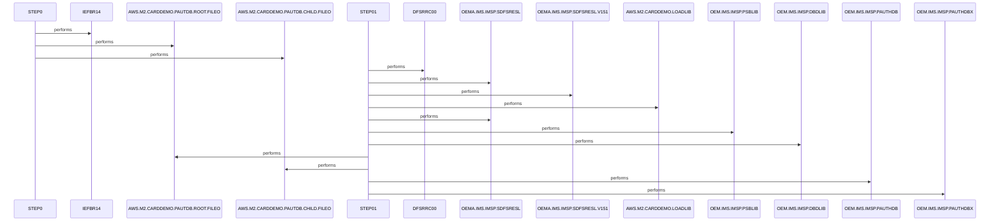

# UNLDPADB

**File**: `jcl/UNLDPADB.JCL`
**Type**: FileType.JCL
**Analyzed**: 2026-02-27 14:45:13.448278

## Purpose

This JCL unloads and redefines an IMS database. It first deletes the existing database files and then executes the DFSRRC00 utility to unload the database. Finally, it allocates new datasets for the database.

**Business Context**: Database maintenance and reorganization.

## Inputs

| Name | Type | Description |
|------|------|-------------|
| AWS.M2.CARDDEMO.PAUTDB.ROOT.FILEO | IOType.FILE_VSAM | Existing root segment file of the PAUTDB database to be unloaded. |
| AWS.M2.CARDDEMO.PAUTDB.CHILD.FILEO | IOType.FILE_VSAM | Existing child segment file of the PAUTDB database to be unloaded. |
| OEM.IMS.IMSP.PAUTHDB | IOType.FILE_VSAM | IMS PAUTHDB database. |
| OEM.IMS.IMSP.PAUTHDBX | IOType.FILE_VSAM | IMS PAUTHDBX database. |
| OEMA.IMS.IMSP.SDFSRESL | IOType.FILE_SEQUENTIAL | IMS RESLIB |
| OEMA.IMS.IMSP.SDFSRESL.V151 | IOType.FILE_SEQUENTIAL | IMS RESLIB version 151 |
| AWS.M2.CARDDEMO.LOADLIB | IOType.FILE_SEQUENTIAL | Load library containing the IMS program DFSRRC00. |
| OEM.IMS.IMSP.PSBLIB | IOType.FILE_SEQUENTIAL | IMS PSB library. |
| OEM.IMS.IMSP.DBDLIB | IOType.FILE_SEQUENTIAL | IMS DBD library. |
| OEMPP.IMS.V15R01MB.PROCLIB(DFSVSMDB) | IOType.FILE_SEQUENTIAL | IMS procedure library member DFSVSMDB. |

## Outputs

| Name | Type | Description |
|------|------|-------------|
| AWS.M2.CARDDEMO.PAUTDB.ROOT.FILEO | IOType.FILE_VSAM | New root segment file for the PAUTDB database. |
| AWS.M2.CARDDEMO.PAUTDB.CHILD.FILEO | IOType.FILE_VSAM | New child segment file for the PAUTDB database. |
| SYSPRINT | IOType.REPORT | System print output for the job. |
| SYSOUT | IOType.REPORT | System output for the job. |
| SYSDUMP | IOType.REPORT | System dump output for the job. |
| SYSUDUMP | IOType.REPORT | System user dump output for the job. |
| IMSERR | IOType.REPORT | IMS error output for the job. |

## Called Programs

| Program | Call Type | Purpose |
|---------|-----------|---------|
| IEFBR14 | CallType.STATIC_CALL | Deletes the existing database files. |
| DFSRRC00 | CallType.STATIC_CALL | Unloads the IMS database. |

## Paragraphs/Procedures

### STEP0
This step executes the IEFBR14 program to delete the existing IMS database files. IEFBR14 is a dummy program that performs no action other than returning a completion code of zero. The DD statements DD1 and DD2 define the datasets to be deleted: AWS.M2.CARDDEMO.PAUTDB.ROOT.FILEO and AWS.M2.CARDDEMO.PAUTDB.CHILD.FILEO, respectively. The DISP parameter specifies that the datasets should be deleted regardless of whether the step completes successfully. This step prepares the environment for the subsequent steps that will unload and redefine the database. No specific data is read or written in this step, as the deletion is handled by the system based on the DD statement parameters. The program IEFBR14 is called to perform the deletion operation.

### STEP01
This step executes the DFSRRC00 utility to unload the IMS database. The PGM parameter specifies the program to be executed, DFSRRC00. The PARM parameter passes control parameters to the program, including 'DLI,PAUDBUNL,PAUTBUNL,,,,,,,,,,,N'. The STEPLIB DD statement defines the libraries containing the DFSRRC00 program and related modules: OEMA.IMS.IMSP.SDFSRESL, OEMA.IMS.IMSP.SDFSRESL.V151, and AWS.M2.CARDDEMO.LOADLIB. The DFSRESLB DD statement defines the IMS RESLIB. The IMS DD statement defines the IMS PSB and DBD libraries. The OUTFIL1 and OUTFIL2 DD statements define the output datasets for the unloaded database: AWS.M2.CARDDEMO.PAUTDB.ROOT.FILEO and AWS.M2.CARDDEMO.PAUTDB.CHILD.FILEO, respectively. The DDPAUTP0 and DDPAUTX0 DD statements define the IMS PAUTHDB and PAUTHDBX databases. The DFSVSAMP DD statement defines the IMS procedure library member DFSVSMDB. The IMSLOGR and IEFRDER DD statements are dummy datasets. The SYSPRINT, SYSUDUMP, and IMSERR DD statements define the system print, user dump, and IMS error output datasets, respectively. The program DFSRRC00 is called to perform the database unload operation.

## Open Questions

- ? What is the purpose of the parameters passed to DFSRRC00?
  - Context: The PARM parameter in STEP01 passes 'DLI,PAUDBUNL,PAUTBUNL,,,,,,,,,,,N' to DFSRRC00, but the meaning of these parameters is unclear without further documentation.

## Sequence Diagram

```mermaid
sequenceDiagram
    participant STEP0 as STEP0
    participant IEFBR14 as IEFBR14
    participant AWS_M2_CARDDEMO_PAUTDB_ROOT_FILEO as AWS.M2.CARDDEMO.PAUTDB.ROOT.FILEO
    participant AWS_M2_CARDDEMO_PAUTDB_CHILD_FILEO as AWS.M2.CARDDEMO.PAUTDB.CHILD.FILEO
    participant STEP01 as STEP01
    participant DFSRRC00 as DFSRRC00
    participant OEMA_IMS_IMSP_SDFSRESL as OEMA.IMS.IMSP.SDFSRESL
    participant OEMA_IMS_IMSP_SDFSRESL_V151 as OEMA.IMS.IMSP.SDFSRESL.V151
    participant AWS_M2_CARDDEMO_LOADLIB as AWS.M2.CARDDEMO.LOADLIB
    participant OEM_IMS_IMSP_PSBLIB as OEM.IMS.IMSP.PSBLIB
    participant OEM_IMS_IMSP_DBDLIB as OEM.IMS.IMSP.DBDLIB
    participant OEM_IMS_IMSP_PAUTHDB as OEM.IMS.IMSP.PAUTHDB
    participant OEM_IMS_IMSP_PAUTHDBX as OEM.IMS.IMSP.PAUTHDBX
    STEP0->>IEFBR14: performs
    STEP0->>AWS_M2_CARDDEMO_PAUTDB_ROOT_FILEO: performs
    STEP0->>AWS_M2_CARDDEMO_PAUTDB_CHILD_FILEO: performs
    STEP01->>DFSRRC00: performs
    STEP01->>OEMA_IMS_IMSP_SDFSRESL: performs
    STEP01->>OEMA_IMS_IMSP_SDFSRESL_V151: performs
    STEP01->>AWS_M2_CARDDEMO_LOADLIB: performs
    STEP01->>OEMA_IMS_IMSP_SDFSRESL: performs
    STEP01->>OEM_IMS_IMSP_PSBLIB: performs
    STEP01->>OEM_IMS_IMSP_DBDLIB: performs
    STEP01->>AWS_M2_CARDDEMO_PAUTDB_ROOT_FILEO: performs
    STEP01->>AWS_M2_CARDDEMO_PAUTDB_CHILD_FILEO: performs
    STEP01->>OEM_IMS_IMSP_PAUTHDB: performs
    STEP01->>OEM_IMS_IMSP_PAUTHDBX: performs
```
