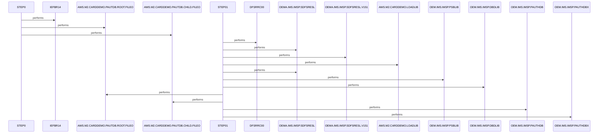

# UNLDPADB

**File**: `jcl/UNLDPADB.JCL`
**Type**: FileType.JCL
**Analyzed**: 2026-03-04 04:45:20.769486

## Purpose

This JCL job unloads the PAUTDB database using the IMS program DFSRRC00. It first deletes the existing ROOT and CHILD files, then executes the unload utility to create new versions of these files.

## Inputs

| Name | Type | Description |
|------|------|-------------|
| OEM.IMS.IMSP.PSBLIB | IOType.FILE_SEQUENTIAL | IMS PSBLIB library containing PSB definitions. |
| OEM.IMS.IMSP.DBDLIB | IOType.FILE_SEQUENTIAL | IMS DBDLIB library containing DBD definitions. |
| OEM.IMS.IMSP.PAUTHDB | IOType.FILE_SEQUENTIAL | Input database to be unloaded. |
| OEM.IMS.IMSP.PAUTHDBX | IOType.FILE_SEQUENTIAL | Input database index to be unloaded. |
| OEMPP.IMS.V15R01MB.PROCLIB(DFSVSMDB) | IOType.FILE_SEQUENTIAL | DFSVSAMP DD card points to this member in PROCLIB, likely containing buffer pool parameters. |

## Outputs

| Name | Type | Description |
|------|------|-------------|
| AWS.M2.CARDDEMO.PAUTDB.ROOT.FILEO | IOType.FILE_SEQUENTIAL | Unloaded root segment data. |
| AWS.M2.CARDDEMO.PAUTDB.CHILD.FILEO | IOType.FILE_SEQUENTIAL | Unloaded child segment data. |

## Called Programs

| Program | Call Type | Purpose |
|---------|-----------|---------|
| DFSRRC00 | CallType.STATIC_CALL | IMS program used to unload the database. |
| IEFBR14 | CallType.STATIC_CALL | Dummy program used to delete existing datasets. |

## Paragraphs/Procedures

### STEP0
This step executes the dummy program IEFBR14 to delete the existing PAUTDB root and child files. The DD statements DD1 and DD2 define the datasets to be deleted: AWS.M2.CARDDEMO.PAUTDB.ROOT.FILEO and AWS.M2.CARDDEMO.PAUTDB.CHILD.FILEO, respectively. The DISP parameter is set to (OLD,DELETE,DELETE), which means that the datasets are deleted regardless of whether the step completes successfully. This ensures that the old files are removed before the unload process creates new ones. No specific input data is read in this step, and no output data is generated other than the deletion of the specified files. This step is crucial for preventing conflicts and ensuring that the unload process starts with a clean slate.

### STEP01
This step executes the IMS program DFSRRC00 to unload the PAUTDB database. The PARM parameter specifies the execution parameters for DFSRRC00, including 'DLI' to indicate a DLI batch job, 'PAUDBUNL' as the PSB name, and 'PAUTBUNL' as the DBD name. The 'N' parameter likely controls some other option within the unload process. The STEPLIB DD statement defines the libraries containing the necessary IMS modules, including OEMA.IMS.IMSP.SDFSRESL, OEMA.IMS.IMSP.SDFSRESL.V151, and AWS.M2.CARDDEMO.LOADLIB. The DFSRESLB DD statement specifies the IMS RESLIB. The IMS DD statement defines the PSBLIB and DBDLIB libraries. The OUTFIL1 and OUTFIL2 DD statements define the output datasets for the unloaded root and child segments, respectively, specifying their dataset names, DISP parameters (NEW,CATLG,DELETE), DCB attributes (LRECL, BLKSIZE, RECFM), UNIT, and SPACE allocation. The DDPAUTP0 and DDPAUTX0 DD statements define the input database and index datasets. The DFSVSAMP DD statement points to a member in PROCLIB (DFSVSMDB) likely containing buffer pool parameters. The remaining DD statements (IMSLOGR, IEFRDER, SYSPRINT, SYSUDUMP, IMSERR) define various system output datasets.

## Open Questions

- ? What is the purpose of the 'N' parameter in the PARM string for DFSRRC00?
  - Context: The meaning of this parameter is unclear from the JCL alone.

## Sequence Diagram

```mermaid
sequenceDiagram
    participant STEP0 as STEP0
    participant IEFBR14 as IEFBR14
    participant AWS_M2_CARDDEMO_PAUTDB_ROOT_FILEO as AWS.M2.CARDDEMO.PAUTDB.ROOT.FILEO
    participant AWS_M2_CARDDEMO_PAUTDB_CHILD_FILEO as AWS.M2.CARDDEMO.PAUTDB.CHILD.FILEO
    participant STEP01 as STEP01
    participant DFSRRC00 as DFSRRC00
    participant OEMA_IMS_IMSP_SDFSRESL as OEMA.IMS.IMSP.SDFSRESL
    participant OEMA_IMS_IMSP_SDFSRESL_V151 as OEMA.IMS.IMSP.SDFSRESL.V151
    participant AWS_M2_CARDDEMO_LOADLIB as AWS.M2.CARDDEMO.LOADLIB
    participant OEM_IMS_IMSP_PSBLIB as OEM.IMS.IMSP.PSBLIB
    participant OEM_IMS_IMSP_DBDLIB as OEM.IMS.IMSP.DBDLIB
    participant OEM_IMS_IMSP_PAUTHDB as OEM.IMS.IMSP.PAUTHDB
    participant OEM_IMS_IMSP_PAUTHDBX as OEM.IMS.IMSP.PAUTHDBX
    STEP0->>IEFBR14: performs
    STEP0->>AWS_M2_CARDDEMO_PAUTDB_ROOT_FILEO: performs
    STEP0->>AWS_M2_CARDDEMO_PAUTDB_CHILD_FILEO: performs
    STEP01->>DFSRRC00: performs
    STEP01->>OEMA_IMS_IMSP_SDFSRESL: performs
    STEP01->>OEMA_IMS_IMSP_SDFSRESL_V151: performs
    STEP01->>AWS_M2_CARDDEMO_LOADLIB: performs
    STEP01->>OEMA_IMS_IMSP_SDFSRESL: performs
    STEP01->>OEM_IMS_IMSP_PSBLIB: performs
    STEP01->>OEM_IMS_IMSP_DBDLIB: performs
    STEP01->>AWS_M2_CARDDEMO_PAUTDB_ROOT_FILEO: performs
    STEP01->>AWS_M2_CARDDEMO_PAUTDB_CHILD_FILEO: performs
    STEP01->>OEM_IMS_IMSP_PAUTHDB: performs
    STEP01->>OEM_IMS_IMSP_PAUTHDBX: performs
```
