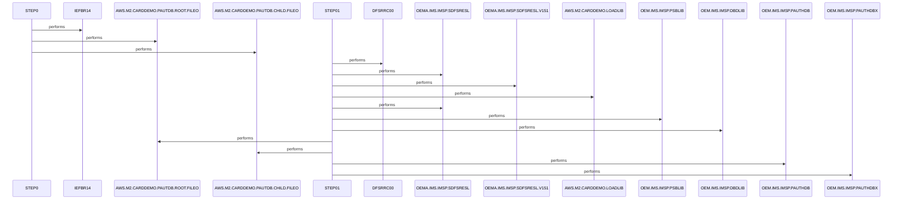

# UNLDPADB

**File**: `jcl/UNLDPADB.JCL`
**Type**: FileType.JCL
**Analyzed**: 2026-03-03 16:50:50.862269

## Purpose

This JCL job unloads the PAUTDB database in IMS. It deletes existing database files, executes the DFSRRC00 utility to unload the database, and then recreates the database files.

**Business Context**: Database maintenance and data extraction.

## Inputs

| Name | Type | Description |
|------|------|-------------|
| OEM.IMS.IMSP.PAUTHDB | IOType.FILE_VSAM | Input IMS database to be unloaded. |
| OEM.IMS.IMSP.PAUTHDBX | IOType.FILE_VSAM | Input IMS database index to be unloaded. |
| OEMA.IMS.IMSP.SDFSRESL | IOType.FILE_SEQUENTIAL | IMS RESLIB library. |
| OEMA.IMS.IMSP.SDFSRESL.V151 | IOType.FILE_SEQUENTIAL | IMS RESLIB library version 151. |
| AWS.M2.CARDDEMO.LOADLIB | IOType.FILE_SEQUENTIAL | Load library containing the IMS program. |
| OEM.IMS.IMSP.PSBLIB | IOType.FILE_SEQUENTIAL | IMS PSB library. |
| OEM.IMS.IMSP.DBDLIB | IOType.FILE_SEQUENTIAL | IMS DBD library. |
| OEMPP.IMS.V15R01MB.PROCLIB(DFSVSMDB) | IOType.FILE_SEQUENTIAL | IMS VSAM definition. |

## Outputs

| Name | Type | Description |
|------|------|-------------|
| AWS.M2.CARDDEMO.PAUTDB.ROOT.FILEO | IOType.FILE_VSAM | Output file for the unloaded PAUTDB root segment. |
| AWS.M2.CARDDEMO.PAUTDB.CHILD.FILEO | IOType.FILE_VSAM | Output file for the unloaded PAUTDB child segment. |

## Called Programs

| Program | Call Type | Purpose |
|---------|-----------|---------|
| DFSRRC00 | CallType.STATIC_CALL | IMS Resource Recovery Services (RRS) utility to unload the database. |
| IEFBR14 | CallType.STATIC_CALL | Dummy program used to delete the existing database files. |

## Paragraphs/Procedures

### STEP0
This step executes the IEFBR14 program, a dummy program that performs no actual processing. In this JCL, it's used to delete the existing VSAM datasets AWS.M2.CARDDEMO.PAUTDB.ROOT.FILEO and AWS.M2.CARDDEMO.PAUTDB.CHILD.FILEO. The DD statements DD1 and DD2 define these datasets with a DISP=(OLD,DELETE,DELETE) parameter, ensuring they are deleted at the end of the step. This step prepares the environment for the subsequent step, which will create new versions of these datasets with the unloaded data.

### STEP01
This step executes the IMS utility DFSRRC00 to unload the PAUTDB database. The PARM parameter specifies the execution environment as DLI, the program to be executed as PAUDBUNL, and the PSB name as PAUTBUNL. The STEPLIB DD statement defines the libraries required to execute the IMS utility, including the IMS RESLIB and the application load library. The DFSRESLB DD statement defines the IMS RESLIB. The IMS DD statement defines the PSBLIB and DBDLIB. The OUTFIL1 and OUTFIL2 DD statements define the output datasets where the unloaded data will be written. DDPAUTP0 and DDPAUTX0 define the input IMS database and index. DFSVSAMP defines the VSAM parameters. The remaining DD statements define various system output datasets.

## Open Questions

- ? What is the purpose of the PAUDBUNL program called in STEP01?
  - Context: The JCL executes DFSRRC00 with PARM='DLI,PAUDBUNL,PAUTBUNL'. The function of PAUDBUNL is unclear from the JCL alone.

## Sequence Diagram

```mermaid
sequenceDiagram
    participant STEP0 as STEP0
    participant IEFBR14 as IEFBR14
    participant AWS_M2_CARDDEMO_PAUTDB_ROOT_FILEO as AWS.M2.CARDDEMO.PAUTDB.ROOT.FILEO
    participant AWS_M2_CARDDEMO_PAUTDB_CHILD_FILEO as AWS.M2.CARDDEMO.PAUTDB.CHILD.FILEO
    participant STEP01 as STEP01
    participant DFSRRC00 as DFSRRC00
    participant OEMA_IMS_IMSP_SDFSRESL as OEMA.IMS.IMSP.SDFSRESL
    participant OEMA_IMS_IMSP_SDFSRESL_V151 as OEMA.IMS.IMSP.SDFSRESL.V151
    participant AWS_M2_CARDDEMO_LOADLIB as AWS.M2.CARDDEMO.LOADLIB
    participant OEM_IMS_IMSP_PSBLIB as OEM.IMS.IMSP.PSBLIB
    participant OEM_IMS_IMSP_DBDLIB as OEM.IMS.IMSP.DBDLIB
    participant OEM_IMS_IMSP_PAUTHDB as OEM.IMS.IMSP.PAUTHDB
    participant OEM_IMS_IMSP_PAUTHDBX as OEM.IMS.IMSP.PAUTHDBX
    STEP0->>IEFBR14: performs
    STEP0->>AWS_M2_CARDDEMO_PAUTDB_ROOT_FILEO: performs
    STEP0->>AWS_M2_CARDDEMO_PAUTDB_CHILD_FILEO: performs
    STEP01->>DFSRRC00: performs
    STEP01->>OEMA_IMS_IMSP_SDFSRESL: performs
    STEP01->>OEMA_IMS_IMSP_SDFSRESL_V151: performs
    STEP01->>AWS_M2_CARDDEMO_LOADLIB: performs
    STEP01->>OEMA_IMS_IMSP_SDFSRESL: performs
    STEP01->>OEM_IMS_IMSP_PSBLIB: performs
    STEP01->>OEM_IMS_IMSP_DBDLIB: performs
    STEP01->>AWS_M2_CARDDEMO_PAUTDB_ROOT_FILEO: performs
    STEP01->>AWS_M2_CARDDEMO_PAUTDB_CHILD_FILEO: performs
    STEP01->>OEM_IMS_IMSP_PAUTHDB: performs
    STEP01->>OEM_IMS_IMSP_PAUTHDBX: performs
```
