# COPAUA0C - Complete Reference

*This file contains detailed technical documentation. See SKILL.md for a summary.*

## Program Header

- **Program ID:** COPAUA0C
- **File Name:** cbl/COPAUA0C.cbl
- **File Type:** COBOL
- **Analyzed By:** Scribe
- **Analyzed At:** 2026-01-30T19:29:38.313200

## Purpose

**Summary:** COPAUA0C is a CICS COBOL program that processes payment authorization requests triggered via IBM MQ. It initializes by retrieving MQ trigger message data from CICS, configures and opens the request queue using MQOPEN, and sets up for reading and processing messages in a loop. The program orchestrates initialization, main processing, and termination before returning to CICS.

**Business Context:** Payment card authorization processing, involving queue-based request handling, account validation, and response generation
**Program Type:** ONLINE_CICS

## Inputs

### MQTM

- **Type:** CICS_COMMAREA
- **Description:** CICS input containing MQ trigger message with queue name and trigger data

### REQUEST-QUEUE

- **Type:** OTHER
- **Description:** IBM MQ queue named in WS-REQUEST-QNAME for reading authorization requests

## Outputs

### ERROR-LOG

- **Type:** OTHER
- **Description:** Error details logged via 9500-LOG-ERROR on MQOPEN failure

## Business Rules

### BR001

**Description:** Only use retrieved MQTM data if CICS RETRIEVE response is normal

**Logic:** Conditional MOVE of queue name and trigger data if EIBRESP normal

**Conditions:**
- `EIBRESP = DFHRESP(NORMAL)`

### BR002

**Description:** Set request queue open flag only if MQOPEN compcode is OK, otherwise treat as critical error

**Logic:** IF WS-COMPCODE = MQCC-OK set flag ELSE populate errors and log

**Conditions:**
- `WS-COMPCODE = MQCC-OK`

## Paragraphs

### COPAUA0C

The COPAUA0C paragraph is the procedure division entry point label for the program. Static analysis identifies it as the origin of calls to multiple MQ-related subroutines (CMQODV, CMQMDV, CMQV, CMQTML, CMQPMOV, CMQGMOV) and business authorization programs (CCPAURQY, CCPAURLY, CCPAUERY, CIPAUSMY, CIPAUDTY, CVACT03Y, CVACT01Y, CVCUS01Y). These calls likely support MQ object descriptor building, message descriptor handling, validation, and database inquiries for authorization, URLY queries, ERY checks, summary, duty, activation, and customer records. No specific inputs are consumed directly here as it is an entry label. No outputs produced directly; flow proceeds to subsequent paragraphs like MAIN-PARA. No business decisions or conditions implemented in this single-line paragraph. Error handling is delegated to the called programs. It sets up the initial program invocation context before main orchestration.

**Calls:** CMQODV, CMQMDV, CMQODV, CMQMDV, CMQV, CMQTML, CMQPMOV, CMQGMOV, CCPAURQY, CCPAURLY, CCPAUERY, CIPAUSMY, CIPAUDTY, CVACT03Y, CVACT01Y, CVCUS01Y

### MAIN-PARA

This is the main orchestration paragraph that controls the overall program flow. It begins by performing 1000-INITIALIZE THRU 1000-EXIT to retrieve CICS trigger data, open the MQ request queue, and perform initial read. After initialization, it performs 2000-MAIN-PROCESS THRU 2000-EXIT to enter the core loop for processing authorization request messages from the queue. Once main processing completes, control passes to 9000-TERMINATE THRU 9000-EXIT for cleanup and resource closure. Finally, it executes CICS RETURN to end the transaction and return control to CICS. No data is directly read or written here; it consumes return codes implicitly from performed paragraphs. No explicit business logic decisions or validations are made in this paragraph. Error handling relies entirely on subordinate paragraphs setting flags or abending. No loops present. It calls no external programs directly.

**Calls:** 1000-INITIALIZE, 2000-MAIN-PROCESS, 9000-TERMINATE

### 1000-INITIALIZE

This paragraph handles program initialization, serving as the setup phase before entering the main processing loop. It consumes EIBRESP and MQTM data from CICS RETRIEVE INTO(MQTM) NOHANDLE command. If retrieval is normal, it moves MQTM-QNAME to WS-REQUEST-QNAME and MQTM-TRIGGERDATA to WS-TRIGGER-DATA; otherwise, ignores due to NOHANDLE. It hardcodes WS-WAIT-INTERVAL to 5000 milliseconds for MQ get wait. It then performs 1100-OPEN-REQUEST-QUEUE THRU 1100-EXIT to open the MQ queue and 3100-READ-REQUEST-MQ THRU 3100-EXIT for initial message read. Outputs include populated WS-REQUEST-QNAME, WS-TRIGGER-DATA, WS-WAIT-INTERVAL, and queue handle if successful. Business logic is minimal: conditional use of trigger data and fixed wait interval. Error handling for RETRIEVE is ignored via NOHANDLE; delegated to called paragraphs for queue open/read. No loops or complex decisions here.

**Calls:** 1100-OPEN-REQUEST-QUEUE, 3100-READ-REQUEST-MQ

### 1000-EXIT

This is the exit point for the 1000-INITIALIZE paragraph. It contains only an EXIT statement to return control to the caller (MAIN-PARA). No inputs are consumed. No outputs are produced or modified. No business logic, decisions, validations, or error handling performed. No calls made to other paragraphs or programs. It facilitates clean THRU control flow from 1000-INITIALIZE.

### 1100-OPEN-REQUEST-QUEUE

This paragraph performs the critical task of opening the IBM MQ request queue for shared input processing. It consumes WS-REQUEST-QNAME and constant MQOT-Q, moving them to MQM-OD-REQUEST's MQOD-OBJECTTYPE and MQOD-OBJECTNAME. It computes WS-OPTIONS as MQOO-INPUT-SHARED for non-exclusive queue access. It then CALLs MQOPEN with connection, object descriptor, options, output handle, compcode, and reason code. If WS-COMPCODE equals MQCC-OK, sets WS-REQUEST-MQ-OPEN to TRUE; else sets ERR-CRITICAL and ERR-MQ to TRUE, populates ERR-LOCATION ('M001'), ERR-CODE-1/2 with codes, ERR-MESSAGE ('REQ MQ OPEN ERROR'), and performs 9500-LOG-ERROR. Outputs include queue object handle W01-HOBJ-REQUEST if success, or error structures if failure. Business logic enforces queue availability before processing, treating open failure as critical. Three decision points: compcode check post-MQOPEN, implicit resp checks via compcode/reason. Error handling logs critical failures without abend shown here.

**Calls:** 9500-LOG-ERROR

### 1100-EXIT

This paragraph serves as the exit point for the 1100 section, providing a clean termination to return control to the invoking PERFORM statement. It consumes no inputs, data, files, or variables, as it contains only an EXIT statement. It produces no outputs, modifications, or side effects. There is no business logic, conditional decisions, validations, or error handling implemented here. It does not call any other paragraphs or programs. Its sole role is to ensure proper flow control by resuming execution sequentially after the THRU range in the calling code, preventing any unintended fall-through.

### 1200-SCHEDULE-PSB

This paragraph is responsible for scheduling the IMS PSB identified by PSB-NAME to enable DL/I database calls, handling the case where it may already be scheduled. It consumes the PSB-NAME variable and DIBSTAT from the initial SCHD execution. It produces IMS-RETURN-CODE by moving DIBSTAT, sets IMS-PSB-SCHD flag if successful, or populates error fields (ERR-LOCATION, ERR-CODE-1, ERR-MESSAGE) if failed. Business logic includes checking PSB-SCHEDULED-MORE-THAN-ONCE to TERM the existing schedule before rescheduling, and evaluating STATUS-OK after SCHD to determine success. Error handling sets ERR-CRITICAL and ERR-IMS flags on failure and performs 9500-LOG-ERROR to record 'IMS SCHD FAILED'. It calls 9500-LOG-ERROR only on error conditions to log critical IMS scheduling issues.

**Calls:** 9500-LOG-ERROR

### 1200-EXIT

This paragraph acts as the exit routine for the 1200-SCHEDULE-PSB section, executing EXIT to return control to the caller. It reads no inputs or data structures. It writes or modifies nothing. No decisions, validations, or business rules are applied. No error handling is present. It calls no other paragraphs or programs, serving only as a structural flow control point.

### 2000-MAIN-PROCESS

This is the primary orchestration paragraph that implements a processing loop for authorization request messages until no more are available or the loop limit is reached. It consumes flags like NO-MORE-MSG-AVAILABLE and WS-LOOP-END for loop control, WS-MSG-PROCESSED for counting, and data from previously read MQ messages via subordinate paragraphs. It produces incremented WS-MSG-PROCESSED counter, commits transactions via CICS SYNCPOINT, and sets IMS-PSB-NOT-SCHD flag after each iteration. Business logic centers on the UNTIL loop condition, sequential calls to extract and process each message, and a check against WS-REQSTS-PROCESS-LIMIT to terminate early if exceeded. Error handling is delegated to called paragraphs like 2100, 5000, and 3100, with no explicit handling here; syncpoint ensures atomicity per message. It calls 2100-EXTRACT-REQUEST-MSG THRU 2100-EXIT to parse incoming messages, 5000-PROCESS-AUTH THRU 5000-EXIT for authorization logic, and conditionally 3100-READ-REQUEST-MQ THRU 3100-EXIT to fetch the next message.

**Calls:** 2100-EXTRACT-REQUEST-MSG, 5000-PROCESS-AUTH, 3100-READ-REQUEST-MQ

### 2000-EXIT

This paragraph functions as the exit for the 2000-MAIN-PROCESS section, issuing EXIT to hand control back to the superior caller. No inputs are read or required. No outputs, variables, or files are modified. There are no conditional branches, business rules, or validations. Error conditions are not addressed here. No subordinate calls are made, making it a minimal flow termination point.

### 2100-EXTRACT-REQUEST-MSG

This paragraph's primary purpose is to parse the raw comma-delimited buffer from the MQ request message into structured authorization request fields. It consumes W01-GET-BUFFER(1:W01-DATALEN) as input, which is populated by the prior MQGET call. It performs UNSTRING DELIMITED BY ',' to populate PA-RQ-AUTH-DATE, PA-RQ-AUTH-TIME, PA-RQ-CARD-NUM, PA-RQ-AUTH-TYPE, PA-RQ-CARD-EXPIRY-DATE, PA-RQ-MESSAGE-TYPE, PA-RQ-MESSAGE-SOURCE, PA-RQ-PROCESSING-CODE, WS-TRANSACTION-AMT-AN, PA-RQ-MERCHANT-CATAGORY-CODE, PA-RQ-ACQR-COUNTRY-CODE, PA-RQ-POS-ENTRY-MODE, PA-RQ-MERCHANT-ID, PA-RQ-MERCHANT-NAME, PA-RQ-MERCHANT-CITY, PA-RQ-MERCHANT-STATE, PA-RQ-MERCHANT-ZIP, and PA-RQ-TRANSACTION-ID. It then applies business logic to compute PA-RQ-TRANSACTION-AMT as NUMVAL of WS-TRANSACTION-AMT-AN and moves it to WS-TRANSACTION-AMT. No conditional decisions are made. There is no error handling or validation for malformed buffers or missing fields. It produces populated PA-RQ-* and WS-TRANSACTION-AMT fields for downstream processing. It makes no calls to other paragraphs or programs.

### 2100-EXIT

This paragraph serves as the standard exit point for the 2100-EXTRACT-REQUEST-MSG paragraph in COBOL PERFORM THRU structures. Its primary role is to return control immediately to the calling paragraph. It consumes no inputs whatsoever. It produces no outputs or modifications to data. There is no business logic, conditional decisions, or validations performed. No error handling is implemented as it is a simple transfer of control. It does not call any other paragraphs or external programs. This ensures modular flow control without unnecessary code.

### 3100-READ-REQUEST-MQ

This paragraph's primary purpose is to retrieve the next authorization request message from the MQ request queue using MQGET with configurable wait and options. It consumes MQ connection handle (W01-HCONN-REQUEST), queue object handle (W01-HOBJ-REQUEST), working storage variables like WS-WAIT-INTERVAL, and initializes MQM-MD-REQUEST and MQM-GET-MESSAGE-OPTIONS. It computes MQGMO-OPTIONS as no-syncpoint + wait + convert + fail-if-quiescing, sets MD fields to NONE/STRING, buffer length, and calls MQGET passing all parameters including output buffer W01-GET-BUFFER, W01-DATALEN, WS-COMPCODE, WS-REASON. If WS-COMPCODE = MQCC-OK, it saves MQMD-CORRELID to WS-SAVE-CORRELID and MQMD-REPLYTOQ to WS-REPLY-QNAME. Business logic checks: if not OK and WS-REASON = MQRC-NO-MSG-AVAILABLE, sets NO-MORE-MSG-AVAILABLE TRUE; else sets ERR-CRITICAL and ERR-CICS TRUE, populates ERR-LOCATION 'M003', error codes from WS-COMPCODE/REASON, ERR-MESSAGE 'FAILED TO READ REQUEST MQ', ERR-EVENT-KEY from PA-CARD-NUM, and performs 9500-LOG-ERROR. Error handling is comprehensive for MQ failures excluding no-message case. It produces filled W01-GET-BUFFER for extraction, saved correlid/reply queue, or error states/flags. It calls 9500-LOG-ERROR on critical MQ errors.

**Calls:** 9500-LOG-ERROR

### 3100-EXIT

This paragraph acts as the exit point for 3100-READ-REQUEST-MQ to facilitate THRU constructs. Its role is solely to return control to the invoking paragraph via EXIT. No data inputs are read or required. No data outputs are generated or modified. No business rules, conditions, or decisions are evaluated. Error handling is not present as it performs no operations beyond EXIT. No subordinate calls are made to paragraphs or programs. This supports structured procedural flow in the program.

### 5000-PROCESS-AUTH

This paragraph is the central orchestrator for processing a single authorization request, controlling the sequence of IMS reads, decision, response, and optional DB update. It consumes extracted PA-RQ-* fields from prior 2100 paragraph and IMS data via subordinate reads. It initializes by setting APPROVE-AUTH TRUE, performs 1200-SCHEDULE-PSB THRU EXIT to schedule IMS PSB, sets CARD-FOUND-XREF and FOUND-ACCT-IN-MSTR TRUE optimistically, then performs 5100-READ-XREF-RECORD THRU EXIT. Business logic: IF CARD-FOUND-XREF (likely toggled in 5100 if not found), performs 5200-READ-ACCT-RECORD, 5300-READ-CUST-RECORD, 5500-READ-AUTH-SUMMRY, 5600-READ-PROFILE-DATA THRU respective EXITS. Unconditionally performs 6000-MAKE-DECISION THRU EXIT (presumably updates APPROVE-AUTH based on data), 7100-SEND-RESPONSE THRU EXIT using saved reply queue/correlid. Finally, IF CARD-FOUND-XREF performs 8000-WRITE-AUTH-TO-DB THRU EXIT. No explicit error handling or validations here; defers to callees. It produces authorization decision effects via decision/response/DB write. Calls multiple subordinate paragraphs for data access, decision, output.

**Calls:** 1200-SCHEDULE-PSB, 5100-READ-XREF-RECORD, 5200-READ-ACCT-RECORD, 5300-READ-CUST-RECORD, 5500-READ-AUTH-SUMMRY, 5600-READ-PROFILE-DATA, 6000-MAKE-DECISION, 7100-SEND-RESPONSE, 8000-WRITE-AUTH-TO-DB

### 5000-EXIT

This paragraph acts as the standard exit point for the routine immediately preceding it in the program flow, ensuring clean return of control to the calling paragraph without any additional processing. It consumes no inputs, data, files, or variables, performing no reads or computations. It produces no outputs, modifications to working storage, files, or flags. There is no business logic implemented, no decisions made, conditions checked, or validations performed. No error handling mechanisms are present, as it is a terminal statement. It calls no other paragraphs or programs. Its sole role is to terminate execution of the current paragraph scope via the EXIT statement, maintaining structured control flow in the COBOL program.

### 5100-READ-XREF-RECORD

This paragraph is responsible for reading the card cross-reference record from the WS-CCXREF-FILE VSAM dataset using the requested card number as the key, as part of validating a card request in the transaction flow. It consumes the input PA-RQ-CARD-NUM (moved to XREF-CARD-NUM at line 7) and performs a CICS READ into CARD-XREF-RECORD. It produces the loaded CARD-XREF-RECORD if found, sets CARD-FOUND-XREF to TRUE on normal response, or CARD-NFOUND-XREF and NFOUND-ACCT-IN-MSTR to TRUE on NOTFND; on errors, it populates error fields like ERR-LOCATION, ERR-MESSAGE, ERR-EVENT-KEY. The business logic uses EVALUATE on WS-RESP-CD: NORMAL sets found flag; NOTFND logs warning 'A001'/'CARD NOT FOUND IN XREF' via 9500-LOG-ERROR; OTHER logs critical 'C001'/'FAILED TO READ XREF FILE' with RESP/RESP2 codes. Error handling distinguishes warnings (NOTFND) from critical CICS failures (OTHER), setting ERR-WARNING/ERR-APP or ERR-CRITICAL/ERR-CICS accordingly and always performing 9500-LOG-ERROR. It calls 9500-LOG-ERROR up to twice depending on response, to audit not-found and failure conditions for operational monitoring.

**Calls:** 9500-LOG-ERROR

### 5100-EXIT

This paragraph serves as the exit routine specifically for the 5100-READ-XREF-RECORD paragraph, returning control to the caller after the read and response handling is complete. It takes no inputs, as all processing in the prior section has concluded. It generates no outputs or data changes. No business logic, validations, or decisions are implemented here. Error handling is absent, deferring to the calling context if needed. No subordinate calls to other paragraphs or programs are made. Its purpose is to delineate the end of the XREF read logic block, promoting modular code structure.

### 5200-READ-ACCT-RECORD

This paragraph performs the read of the account master record from the WS-ACCTFILENAME VSAM dataset, using the account ID from the prior XREF record as key, to confirm account existence after card validation. It inputs XREF-ACCT-ID (moved to WS-CARD-RID-ACCT-ID-X at line 54) and executes CICS READ into ACCOUNT-RECORD. It outputs the loaded ACCOUNT-RECORD if successful, sets FOUND-ACCT-IN-MSTR to TRUE on NORMAL, NFOUND-ACCT-IN-MSTR to TRUE on NOTFND; errors populate ERR-LOCATION, ERR-MESSAGE, ERR-EVENT-KEY, WS-CODE-DISPLAY. Business logic via EVALUATE WS-RESP-CD: NORMAL sets found flag; NOTFND logs warning 'A002'/'ACCT NOT FOUND IN XREF' via 9500-LOG-ERROR (note: message references XREF but read is ACCT); OTHER logs critical 'C002'/'FAILED TO READ ACCT FILE' with codes. Error handling categorizes NOTFND as application warning (ERR-WARNING/ERR-APP) and others as critical CICS (ERR-CRITICAL/ERR-CICS), invoking 9500-LOG-ERROR for traceability. It calls 9500-LOG-ERROR for logging not-found or failure events to support auditing and debugging.

**Calls:** 9500-LOG-ERROR

### 5200-EXIT

This paragraph functions as the exit point for the 5200-READ-ACCT-RECORD routine, simply returning control to the invoking paragraph post-read processing. No inputs are read or required. No outputs, writes, or variable modifications occur. It contains no business rules, conditional logic, or validations. Error conditions are not handled directly here. No calls to other paragraphs or external programs. The paragraph ensures proper flow termination for the account read section, upholding COBOL procedural discipline.

### 5300-READ-CUST-RECORD

This paragraph is responsible for reading a customer record from the VSAM customer master dataset using CICS READF command keyed on the customer ID from the cross-reference. It first moves XREF-CUST-ID to WS-CARD-RID-CUST-ID and prepares the RIDFLD key. The CICS READ populates the entire CUSTOMER-RECORD structure if successful. It then evaluates the WS-RESP-CD response: on NORMAL, sets FOUND-CUST-IN-MSTR to TRUE indicating successful retrieval; on NOTFND, sets NFOUND-CUST-IN-MSTR to TRUE, populates warning-level error details (A003, 'CUST NOT FOUND IN XREF') with the cust ID as event key, and performs 9500-LOG-ERROR for auditing without halting. For any other response code, it treats as critical CICS error (C003), formats RESP and RESP2 codes into display fields and error structure, sets error flags, adds message 'FAILED TO READ CUST FILE', and performs 9500-LOG-ERROR. No file outputs are produced; instead, it updates flags and error logging structures for use by caller. This supports business validation in authorization flows by confirming customer existence before further processing. Error handling favors logging over abend to allow graceful degradation. It is likely called iteratively from a main processing loop handling transaction cards.

**Calls:** 9500-LOG-ERROR

### 5300-EXIT

This paragraph serves as the standard exit point for the 5300-READ-CUST-RECORD routine. It consumes no inputs and performs no data modifications or business logic. The sole action is issuing an EXIT statement, which transfers control back to the calling paragraph. There are no conditions checked, no error handling, and no calls made. Its role ensures clean flow control after the read evaluation completes, whether successful or errored. Outputs are implicitly the updated flags and error structures from the prior section. This is invoked automatically at the end of 5300-READ-CUST-RECORD.

### 5500-READ-AUTH-SUMMRY

This paragraph retrieves the pending authorization summary segment (PAUTSUM0) from the IMS database using EXEC DLI GU via the PAUT-PCB-NUM. It begins by moving XREF-ACCT-ID to PA-ACCT-ID for the WHERE clause qualification on ACCNTID. The GU call populates PENDING-AUTH-SUMMARY if found. It then moves DIBSTAT to IMS-RETURN-CODE and evaluates: on STATUS-OK, sets FOUND-PAUT-SMRY-SEG to TRUE; on SEGMENT-NOT-FOUND, sets NFOUND-PAUT-SMRY-SEG to TRUE without logging. For any other status, it logs a critical IMS error (I002, 'IMS GET SUMMARY FAILED') with the return code and card number as event key via 9500-LOG-ERROR. No persistent outputs are written; updates flags and error structures for caller consumption. This enables business rules checking pending auth totals against account activity. Error handling logs critical issues but does not abend, supporting continuation. Likely called after customer read in auth validation sequence.

**Calls:** 9500-LOG-ERROR

### 5500-EXIT

This paragraph acts as the exit routine for 5500-READ-AUTH-SUMMRY. It takes no inputs and executes only an EXIT statement to return control to the invoker. No business decisions, validations, or data transformations occur. Error handling is absent as it relies on prior evaluation. No paragraphs or programs are called. Its purpose is to provide structured termination of the read logic, passing back updated flags like FOUND-PAUT-SMRY-SEG. Invoked at the conclusion of 5500-READ-AUTH-SUMMRY.

### 5600-READ-PROFILE-DATA

This paragraph is currently a no-operation stub for reading profile data. It consumes no inputs such as files, variables, or keys. The only statement is CONTINUE, which does nothing and passes control through. No outputs are produced, no flags set, and no data structures modified. There is no business logic, conditionals, or error handling implemented. No other paragraphs or programs are called. This may be a placeholder awaiting future enhancement for profile segment retrieval, possibly from IMS or another source in the authorization workflow. Its role in program flow is neutral, likely called sequentially after prior reads but contributing nothing currently.

### 5600-EXIT

This paragraph serves as the standard exit point for the 5600 section, ensuring clean control flow return to the caller. It consumes no inputs and produces no outputs or modifications to data. There is no business logic, decision-making, or validation performed within this paragraph. No error handling is implemented as it is purely a flow control statement. It does not call any other paragraphs or programs. The sole statement is EXIT, which transfers control sequentially or to the PERFORM caller.

### 6000-MAKE-DECISION

This paragraph is the core decision-making logic for authorization approval or decline based on credit availability. It consumes request data from PA-RQ- fields, working storage flags like FOUND-PAUT-SMRY-SEG and FOUND-ACCT-IN-MSTR, transaction amount, and credit data from PAUT summary or account master. It produces populated PA-RL- response fields, WS-APPROVED-AMT, formatted display amount, and a string buffer W02-PUT-BUFFER with pointer-updated length for subsequent MQ send. Business logic first moves key request fields to response, then hierarchically checks PAUT summary for available credit (limit minus balance) and declines with insufficient funds if transaction exceeds it; falls back to account master data if no summary; declines outright if no account. Further sets response code '05'/decline or '00'/approve, approved amount accordingly, default reason '0000', and evaluates specific decline reasons like '3100' for not founds, '4100' for funds, '4200' inactive, etc. No explicit error handling or validations beyond the flags assumed set previously. It makes no calls to other paragraphs or programs.

### 6000-EXIT

This paragraph acts as the exit for the 6000-MAKE-DECISION section, providing structured return of control. It reads no data inputs and writes no outputs. No decisions, business rules, or validations occur. Error handling is not present. No subordinate calls are made. It simply executes EXIT to resume flow at the PERFORM site.

### 7100-SEND-RESPONSE

This paragraph handles sending the authorization response by putting a message onto the MQ reply queue. It consumes MQ configuration like WS-REPLY-QNAME, WS-SAVE-CORRELID, pre-built W02-PUT-BUFFER and WS-RESP-LENGTH from prior decision logic. It produces the message on the reply queue and updates WS-COMPCODE/WS-REASON from the call; on failure, populates error fields for logging. Business logic sets MQOD for queue object, MQMD for reply message properties (type, correlid, format string, non-persistent), put options no-syncpoint, then calls MQPUT1. If completion code not OK, it sets critical MQ error flags, formats error codes/messages with card num as key, and performs error logging. Error handling is comprehensive for MQ failure via logging subroutine. It calls MQPUT1 for the put operation and 9500-LOG-ERROR on failure.

**Calls:** 9500-LOG-ERROR

### 7100-EXIT

This is the exit paragraph for the 7100-SEND-RESPONSE section, facilitating return to caller. No data is read or written. There are no logic branches, conditions, or validations. Error handling is absent as it is a terminal flow control point. No calls to paragraphs or programs occur. Control is returned via the EXIT statement.

### 8000-WRITE-AUTH-TO-DB

This paragraph is the primary orchestrator for writing authorization results to the IMS PAUT database after processing. It consumes pre-set variables and flags from earlier program flow, including NFOUND-PAUT-SMRY-SEG, FOUND-PAUT-SMRY-SEG, XREF-ACCT-ID, XREF-CUST-ID, ACCT-CREDIT-LIMIT, ACCT-CASH-CREDIT-LIMIT, AUTH-RESP-APPROVED, WS-APPROVED-AMT, PA-TRANSACTION-AMT, and PA-RQ/PA-RL fields. It produces updated or newly inserted PAUTSUM0 summary segment and new PAUTDTL1 detail segment via subordinate calls. There are no direct business decisions made here; instead, it delegates all logic to called paragraphs. Error handling is handled within the called paragraphs by logging to 9500-LOG-ERROR if IMS operations fail. Control flows sequentially without loops or conditions. It calls 8400-UPDATE-SUMMARY THRU 8400-EXIT to manage summary statistics and 8500-INSERT-AUTH THRU 8500-EXIT to log the detail record with timestamps.

**Calls:** 8400-UPDATE-SUMMARY, 8500-INSERT-AUTH

### 8000-EXIT

This paragraph provides the exit point for 8000-WRITE-AUTH-TO-DB, executing a simple EXIT statement to return control to the calling paragraph. It consumes no data inputs as it performs no operations beyond transfer of control. It produces no outputs or modifications to data structures. There is no business logic, conditional decisions, or validations implemented. No error handling is present since errors are managed upstream. It makes no calls to other paragraphs or programs. It is invoked via THRU 8000-EXIT from 8000-WRITE-AUTH-TO-DB.

### 8400-UPDATE-SUMMARY

This paragraph manages the update or insertion of the PAUTSUM0 summary segment based on prior IMS read results. It reads flags NFOUND-PAUT-SMRY-SEG and FOUND-PAUT-SMRY-SEG, XREF-ACCT-ID, XREF-CUST-ID, ACCT-CREDIT-LIMIT, ACCT-CASH-CREDIT-LIMIT, AUTH-RESP-APPROVED, WS-APPROVED-AMT, and PA-TRANSACTION-AMT. It writes updated fields to PENDING-AUTH-SUMMARY which is then REPLd or ISRTd to IMS PAUTSUM0, affecting summary counters and balances. Business logic includes conditional initialization if not found, always setting limits, and branching adds to approved/declined stats based on AUTH-RESP-APPROVED to track auth attempts and balance impacts. It validates IMS status via DIBSTAT to IMS-RETURN-CODE and STATUS-OK; if failed, sets ERR-LOCATION 'I003', ERR-CRITICAL/ERR-IMS true, ERR-CODE-1, ERR-MESSAGE 'IMS UPDATE SUMRY FAILED', ERR-EVENT-KEY PA-CARD-NUM, and calls 9500-LOG-ERROR. No loops; linear flow with IF/END-IF structures. It is called by 8000-WRITE-AUTH-TO-DB to consolidate auth stats per account.

**Calls:** 9500-LOG-ERROR

### 8400-EXIT

This paragraph serves as the exit point for 8400-UPDATE-SUMMARY, performing EXIT to return control to the caller. It requires no inputs as it executes no logic. It generates no outputs or data changes. No business rules, conditions, or validations are applied. Error conditions are handled prior to reaching this exit. It issues no calls. Invoked via THRU 8400-EXIT.

### 8500-INSERT-AUTH

This paragraph constructs and inserts the PAUTDTL1 detail segment capturing full auth transaction and response. It reads current time via CICS, PA-RQ-* request fields, PA-RL-* response fields, AUTH-RESP-APPROVED, XREF-ACCT-ID, and builds PENDING-AUTH-DETAILS. It writes the complete detail record to IMS as child of PAUTSUM0 qualified by PA-ACCT-ID. Business logic computes inverted timestamps (99999-YYDDD, 999999999-TIME-WITH-MS), copies all request/response fields, sets match flags based on approval, spaces fraud fields, and performs hierarchical ISRT. IMS status checked via DIBSTAT; if not STATUS-OK, sets ERR-LOCATION 'I004', ERR-CRITICAL/ERR-IMS, ERR-CODE-1, ERR-MESSAGE 'IMS INSERT DETL FAILED', ERR-EVENT-KEY PA-CARD-NUM, performs 9500-LOG-ERROR. Flow is linear with computes and moves, no loops. Called by 8000-WRITE-AUTH-TO-DB to log individual auth events.

**Calls:** 9500-LOG-ERROR

### 8500-EXIT

The 8500-EXIT paragraph acts as a flow control exit point, typically invoked at the end of a PERFORM THRU chain from a prior paragraph to return control to the calling logic. It consumes no inputs, performing no reads, validations, or data accesses. It produces no outputs, sets no flags, and makes no modifications to working storage or files. There is no business logic implemented, with no conditional statements, loops, or decisions. Error handling is absent as this is a terminal exit stub. It calls no other paragraphs or external programs. The single EXIT statement ensures control returns seamlessly to the invoker, maintaining structured program flow. This paragraph enforces COBOL best practices for modular exit handling. Positioned at the start of the termination sequence, it likely concludes a prior processing routine. Its simplicity supports readability and debuggability in the overall program structure.

### 9000-TERMINATE

The 9000-TERMINATE paragraph orchestrates final program cleanup during shutdown, ensuring resources are released properly before exit. It consumes the IMS-PSB-SCHD flag from working storage to determine if IMS termination is needed. It produces IMS PSB termination via DLI TERM if applicable and invokes queue closure. Business logic centers on conditionally executing IMS cleanup based on scheduling status. No direct error handling occurs here; errors are delegated to subordinate paragraphs. It calls 9100-CLOSE-REQUEST-QUEUE thru 9100-EXIT to handle MQ resource cleanup. Following IMS TERM, control flows to queue closure unconditionally. This paragraph ensures orderly shutdown, preventing resource leaks in IMS/MQ environments. Comments provide context on its role in termination. It sets no return codes or flags directly but relies on callees for status updates.

**Calls:** 9100-CLOSE-REQUEST-QUEUE

### 9000-EXIT

The 9000-EXIT paragraph provides a standard exit mechanism following the 9000-TERMINATE logic, returning control after cleanup completion. It reads no data and performs no validations or computations. It writes no data, modifies no variables, and generates no outputs. No business rules or conditions are evaluated within this paragraph. Error handling is not implemented as it is purely navigational. It invokes no other paragraphs or programs. The EXIT statement transfers control back to the mainline or prior PERFORM context. This maintains clean flow post-termination activities. It concludes the primary terminate sequence. Its minimal design aids in tracing execution paths during maintenance.

### 9100-CLOSE-REQUEST-QUEUE

The 9100-CLOSE-REQUEST-QUEUE paragraph manages the closure of the MQ request queue connection as part of program termination. It consumes WS-REQUEST-MQ-OPEN flag, MQ handles (W01-HCONN-REQUEST, W01-HOBJ-REQUEST), and constants like MQCO-NONE from working storage. It produces updates to WS-COMPCODE and WS-REASON from the MQCLOSE call, sets WS-REQUEST-MQ-CLSE on success, or populates error structures (ERR-LOCATION, ERR-CODE-1/2, ERR-MESSAGE) on failure. Business logic checks if queue is open before attempting close, then evaluates completion code for success versus error paths. Error handling populates standardized error fields with 'M005' location, warning/MQ flags, codes, and message on failure, followed by logging. It calls 9500-LOG-ERROR conditionally when close fails to record the issue. The CALL 'MQCLOSE' USING specified parameters executes the API closure. Comments delineate the section for clarity. This ensures MQ resources are freed reliably, logging issues for audit. Control exits via 9100-EXIT after processing.

**Calls:** 9500-LOG-ERROR

### 9100-EXIT

The 9100-EXIT paragraph serves as the exit stub for the 9100-CLOSE-REQUEST-QUEUE processing, facilitating return to the THRU invoker. It utilizes no inputs, conducting no data reads or checks. It generates no outputs or variable changes. No business logic, conditions, or validations are present. Error handling is not performed here. It makes no calls to other paragraphs or programs. The EXIT statement returns control to the PERFORM THRU chain originator. This structure supports modular cleanup flow. It marks the end of MQ closure logic. Its presence ensures precise flow control in COBOL PERFORM THRU usage.

### 9500-LOG-ERROR

This paragraph serves as the centralized error logging mechanism within the COPAUA0C CICS program, invoked whenever an error condition requires auditing. It consumes working storage variables such as WS-ABS-TIME (populated externally or by prior ASKTIME), WS-CICS-TRANID, WS-PGM-AUTH, and ERR-CRITICAL to build a complete error record. The process starts by invoking CICS ASKTIME with NOHANDLE to fetch the current absolute time into WS-ABS-TIME without error checking. It then uses CICS FORMATTIME with NOHANDLE to convert WS-ABS-TIME into formatted YYMMDD date in WS-CUR-DATE-X6 and time in WS-CUR-TIME-X6. These values, along with transaction ID and program authority, are moved into corresponding fields of the ERROR-LOG-RECORD structure (ERR-APPLICATION, ERR-PROGRAM, ERR-DATE, ERR-TIME). The fully populated ERROR-LOG-RECORD is then written to the CICS transient data queue 'CSSL' via WRITEQ with NOHANDLE, ensuring log persistence even if write fails. After logging, it evaluates the business rule by checking if ERR-CRITICAL is true; if so, it performs 9990-END-ROUTINE to initiate program termination and prevent further processing. No explicit validation or error handling is performed on the CICS commands due to NOHANDLE clauses, implying silent failure tolerance. The outputs are the queue entry for audit trails and potential branch to termination. This paragraph does not call external programs but orchestrates flow to cleanup on critical issues.

**Calls:** 9990-END-ROUTINE

### 9500-EXIT

**(Dead Code)**

This paragraph acts as the standard exit point for the 9500-LOG-ERROR routine, ensuring proper control flow return to the caller. It consumes no data inputs, performs no reads, writes, or modifications to variables, files, or queues. There is no business logic implemented, no conditions evaluated, and no error handling mechanisms present. It produces no outputs beyond returning control via the COBOL EXIT statement. This simple structure facilitates modular program design, allowing 9500-LOG-ERROR to conclude cleanly without inline exits. It calls no other paragraphs or programs. As part of the overall error handling flow, it supports the non-critical error path where logging completes without termination. The paragraph's role is purely procedural, maintaining code readability and flow consistency in the CICS transaction. No CICS operations or validations occur here.

### 9990-END-ROUTINE

This paragraph manages the final termination sequence for the COPAUA0C CICS transaction, typically invoked on critical errors after logging. Its primary purpose is to execute cleanup operations and return control to CICS, ending the task cleanly. It consumes the current program state implicitly, relying on prior paragraphs for any necessary data preparation. The first action is to PERFORM 9000-TERMINATE, which is assumed to handle file closures, variable resets, or other housekeeping (details unknown from this snippet). Following cleanup, it executes CICS RETURN with no parameters specified, releasing resources and concluding the transaction. No inputs are explicitly read, and outputs are limited to the effects of 9000-TERMINATE and the transaction end. There are no conditional decisions, business rules, or validations performed within this paragraph. Error handling is absent, with no checks on the PERFORM or RETURN outcomes. It is called specifically from 9500-LOG-ERROR when ERR-CRITICAL is true, implementing the escalation path for severe issues. This ensures audit logging precedes abrupt termination, supporting operational recovery and debugging.

**Calls:** 9000-TERMINATE

### 9990-EXIT

**(Dead Code)**

This paragraph provides the exit point for 9990-END-ROUTINE, enabling structured return of control to its caller. It takes no inputs from files, variables, or external sources and performs no data manipulations or outputs. The sole statement is the COBOL EXIT, which transfers control back without further action. No business logic, conditions, or decisions are implemented here. Error handling is not applicable as there are no operations that could fail. It calls no subordinate paragraphs or programs. In the context of program flow, it ensures the termination routine concludes properly before the CICS RETURN executes. This minimal design promotes code maintainability and follows COBOL best practices for paragraph modularity. As part of the critical error path, it supports the overall termination without introducing additional complexity.

## Data Flow

### Reads From

- **MQTM:** MQTM-QNAME, MQTM-TRIGGERDATA
- **WS-REQUEST-QNAME:** WS-REQUEST-QNAME
- **MQOT-Q:** MQOT-Q
- **WS-COMPCODE:** WS-COMPCODE

### Writes To

- **WS-REQUEST-QNAME:** MQTM-QNAME
- **WS-TRIGGER-DATA:** MQTM-TRIGGERDATA
- **WS-WAIT-INTERVAL:** 5000
- **MQM-OD-REQUEST:** MQOD-OBJECTTYPE, MQOD-OBJECTNAME
- **ERR-LOCATION:** M001

### Transforms

- `MQOO-INPUT-SHARED` -> `WS-OPTIONS`: Computes MQ open options as input-shared

## Error Handling

- **EIBRESP NOT = DFHRESP(NORMAL):** Ignored due to NOHANDLE on RETRIEVE; MQTM fields not updated
- **WS-COMPCODE NOT = MQCC-OK after MQOPEN:** Set ERR-CRITICAL TRUE, populate ERR-LOCATION, ERR-CODE-1, ERR-CODE-2, ERR-MESSAGE, PERFORM 9500-LOG-ERROR

## CICS Operations

- RETRIEVE
- RETURN

## Dead Code

- **9500-EXIT** (paragraph): Paragraph '9500-EXIT' is never PERFORMed or referenced by any other paragraph or program
- **9990-EXIT** (paragraph): Paragraph '9990-EXIT' is never PERFORMed or referenced by any other paragraph or program

## Flow Diagram

```mermaid
flowchart TD
    %% Title: COPAUA0C.cbl
    1000_EXIT["1000-EXIT"]
    1000_INITIALIZE["1000-INITIALIZE"]
    1100_OPEN_REQUEST_QUEUE["1100-OPEN-REQUEST-QUEUE"]
    3100_READ_REQUEST_MQ["3100-READ-REQUEST-MQ"]
    1100_EXIT["1100-EXIT"]
    9500_LOG_ERROR["9500-LOG-ERROR"]
    MQOPEN__ext(["MQOPEN"])
    1200_EXIT["1200-EXIT"]
    1200_SCHEDULE_PSB["1200-SCHEDULE-PSB"]
    2000_EXIT["2000-EXIT"]
    2000_MAIN_PROCESS["2000-MAIN-PROCESS"]
    2100_EXTRACT_REQUEST_MSG["2100-EXTRACT-REQUEST-MSG"]
    5000_PROCESS_AUTH["5000-PROCESS-AUTH"]
    2100_EXIT["2100-EXIT"]
    3100_EXIT["3100-EXIT"]
    MQGET__ext(["MQGET"])
    5000_EXIT["5000-EXIT"]
    5100_READ_XREF_RECORD["5100-READ-XREF-RECORD"]
    5200_READ_ACCT_RECORD["5200-READ-ACCT-RECORD"]
    5300_READ_CUST_RECORD["5300-READ-CUST-RECORD"]
    5500_READ_AUTH_SUMMRY["5500-READ-AUTH-SUMMRY"]
    5600_READ_PROFILE_DATA["5600-READ-PROFILE-DATA"]
    6000_MAKE_DECISION["6000-MAKE-DECISION"]
    7100_SEND_RESPONSE["7100-SEND-RESPONSE"]
    8000_WRITE_AUTH_TO_DB["8000-WRITE-AUTH-TO-DB"]
    5100_EXIT["5100-EXIT"]
    WS_CCXREF_FILE__ext[("WS-CCXREF-FILE")]
    5200_EXIT["5200-EXIT"]
    WS_ACCTFILENAME__ext[("WS-ACCTFILENAME")]
    5300_EXIT["5300-EXIT"]
    WS_CUSTFILENAME__ext[("WS-CUSTFILENAME")]
    5500_EXIT["5500-EXIT"]
    5600_EXIT["5600-EXIT"]
    6000_EXIT["6000-EXIT"]
    7100_EXIT["7100-EXIT"]
    MQPUT1__ext(["MQPUT1"])
    8000_EXIT["8000-EXIT"]
    8400_UPDATE_SUMMARY["8400-UPDATE-SUMMARY"]
    8500_INSERT_AUTH["8500-INSERT-AUTH"]
    8400_EXIT["8400-EXIT"]
    8500_EXIT["8500-EXIT"]
    9000_EXIT["9000-EXIT"]
    9000_TERMINATE["9000-TERMINATE"]
    9100_CLOSE_REQUEST_QUEUE["9100-CLOSE-REQUEST-QUEUE"]
    MQCLOSE__ext(["MQCLOSE"])
    9100_EXIT["9100-EXIT"]
    9500_EXIT["9500-EXIT"]
    9990_END_ROUTINE["9990-END-ROUTINE"]
    9990_EXIT["9990-EXIT"]
    MAIN_PARA["MAIN-PARA"]
    1000_INITIALIZE --> 1100_OPEN_REQUEST_QUEUE
    1000_INITIALIZE --> 3100_READ_REQUEST_MQ
    1100_OPEN_REQUEST_QUEUE --> 9500_LOG_ERROR
    1100_OPEN_REQUEST_QUEUE -.->|calls| MQOPEN__ext
    1200_SCHEDULE_PSB --> 9500_LOG_ERROR
    2000_MAIN_PROCESS --> 2100_EXTRACT_REQUEST_MSG
    2000_MAIN_PROCESS --> 3100_READ_REQUEST_MQ
    2000_MAIN_PROCESS --> 5000_PROCESS_AUTH
    3100_READ_REQUEST_MQ --> 9500_LOG_ERROR
    3100_READ_REQUEST_MQ -.->|calls| MQGET__ext
    5000_PROCESS_AUTH --> 1200_SCHEDULE_PSB
    5000_PROCESS_AUTH --> 5100_READ_XREF_RECORD
    5000_PROCESS_AUTH --> 5200_READ_ACCT_RECORD
    5000_PROCESS_AUTH --> 5300_READ_CUST_RECORD
    5000_PROCESS_AUTH --> 5500_READ_AUTH_SUMMRY
    5000_PROCESS_AUTH --> 5600_READ_PROFILE_DATA
    5000_PROCESS_AUTH --> 6000_MAKE_DECISION
    5000_PROCESS_AUTH --> 7100_SEND_RESPONSE
    5000_PROCESS_AUTH --> 8000_WRITE_AUTH_TO_DB
    5100_READ_XREF_RECORD --> 9500_LOG_ERROR
    5100_READ_XREF_RECORD -.->|reads| WS_CCXREF_FILE__ext
    5200_READ_ACCT_RECORD --> 9500_LOG_ERROR
    5200_READ_ACCT_RECORD -.->|reads| WS_ACCTFILENAME__ext
    5300_READ_CUST_RECORD --> 9500_LOG_ERROR
    5300_READ_CUST_RECORD -.->|reads| WS_CUSTFILENAME__ext
    5500_READ_AUTH_SUMMRY --> 9500_LOG_ERROR
    7100_SEND_RESPONSE --> 9500_LOG_ERROR
    7100_SEND_RESPONSE -.->|calls| MQPUT1__ext
    8000_WRITE_AUTH_TO_DB --> 8400_UPDATE_SUMMARY
    8000_WRITE_AUTH_TO_DB --> 8500_INSERT_AUTH
    8400_UPDATE_SUMMARY --> 9500_LOG_ERROR
    8500_INSERT_AUTH --> 9500_LOG_ERROR
    9000_TERMINATE --> 9100_CLOSE_REQUEST_QUEUE
    9100_CLOSE_REQUEST_QUEUE --> 9500_LOG_ERROR
    9100_CLOSE_REQUEST_QUEUE -.->|calls| MQCLOSE__ext
    9500_LOG_ERROR --> 9990_END_ROUTINE
    9990_END_ROUTINE --> 9000_TERMINATE
    MAIN_PARA --> 1000_INITIALIZE
    MAIN_PARA --> 2000_MAIN_PROCESS
    MAIN_PARA --> 9000_TERMINATE
```

