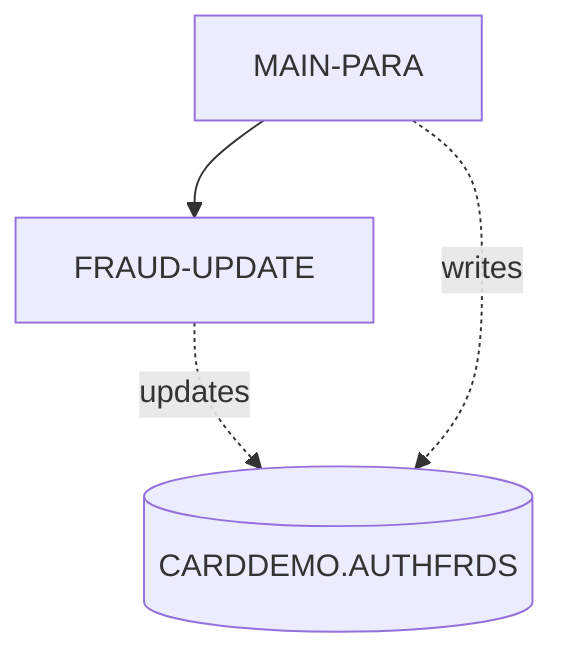

# COPAUS2C - Complete Reference

*This file contains detailed technical documentation. See SKILL.md for a summary.*

## Program Header

- **Program ID:** COPAUS2C
- **File Name:** COPAUS2C.cbl
- **File Type:** COBOL
- **Analyzed By:** WAR_RIG
- **Analyzed At:** 2026-01-28T14:54:08.127541

## Purpose

**Summary:** The COPAUS2C program is a CICS COBOL program that marks an authorization message as fraudulent by inserting or updating a record in the CARDDEMO.AUTHFRDS table. It receives transaction details via the CICS COMMAREA and uses this data to populate the AUTHFRDS table with information about the potentially fraudulent transaction.

**Business Context:** This program is part of an authorization module within the CardDemo application, likely used to flag suspicious transactions for further investigation and prevent future fraudulent activities. 
**Program Type:** ONLINE_CICS

## Inputs

### DFHCOMMAREA

- **Type:** CICS_COMMAREA
- **Description:** Contains transaction details including account ID (WS-ACCT-ID), customer ID (WS-CUST-ID), and fraud report data (WS-FRAUD-AUTH-RECORD) based on CIPAUDTY copybook, and fraud status record (WS-FRAUD-STATUS-RECORD).
- **Copybook:** CIPAUDTY

## Business Rules

### BR001

**Description:** If a record with the same CARD_NUM and AUTH_TS already exists in the AUTHFRDS table, update the AUTH_FRAUD and FRAUD_RPT_DATE columns. Otherwise, insert a new record.

**Logic:** The program first attempts to insert a new record. If the insert fails due to a duplicate key (SQLCODE = -803), it updates the existing record.

**Conditions:**
- `SQLCODE = ZERO (Insert successful)`
- `SQLCODE = -803 (Duplicate key, update required)`

## Paragraphs

### MAIN-PARA

The MAIN-PARA paragraph is the primary control flow for the COPAUS2C program. It begins by retrieving the current date and time using CICS ASKTIME and FORMATTIME commands and storing the current date in WS-CUR-DATE, which is then moved to PA-FRAUD-RPT-DATE. The paragraph then extracts date and time components from the input COMMAREA (PA-AUTH-ORIG-DATE and PA-AUTH-TIME-9C) and transforms them into a timestamp format suitable for insertion into the AUTHFRDS table. It moves data from the COMMAREA into corresponding fields defined in the AUTHFRDS copybook. The paragraph then executes an SQL INSERT statement to add a new record to the CARDDEMO.AUTHFRDS table with the provided transaction details, marking it as potentially fraudulent. If the insert fails due to a duplicate key, the FRAUD-UPDATE paragraph is performed to update the existing record. Finally, the program returns control to CICS.

**Calls:** FRAUD-UPDATE

### FRAUD-UPDATE

The FRAUD-UPDATE paragraph is executed when the initial INSERT statement in MAIN-PARA fails due to a duplicate key violation, indicating that a record with the same CARD_NUM and AUTH_TS already exists in the CARDDEMO.AUTHFRDS table. This paragraph constructs an SQL UPDATE statement to modify the existing record, setting the AUTH_FRAUD column to the value of WS-FRD-ACTION and updating the FRAUD_RPT_DATE to the current date. The WHERE clause ensures that only the record matching the CARD_NUM and AUTH_TS from the input COMMAREA is updated. After the update, the paragraph checks the SQLCODE to determine if the update was successful. If SQLCODE is ZERO, WS-FRD-UPDT-SUCCESS is set to TRUE, and a success message is moved to WS-FRD-ACT-MSG. Otherwise, WS-FRD-UPDT-FAILED is set to TRUE, and an error message containing the SQLCODE and SQLSTATE is constructed and moved to WS-FRD-ACT-MSG. This paragraph does not call any other paragraphs or programs.

## Data Flow

### Reads From

- **DFHCOMMAREA:** PA-CARD-NUM, PA-AUTH-ORIG-DATE, PA-AUTH-TIME-9C, PA-AUTH-TYPE, PA-CARD-EXPIRY-DATE, PA-MESSAGE-TYPE, PA-MESSAGE-SOURCE, PA-AUTH-ID-CODE, PA-AUTH-RESP-CODE, PA-AUTH-RESP-REASON, PA-PROCESSING-CODE, PA-TRANSACTION-AMT, PA-APPROVED-AMT, PA-MERCHANT-CATAGORY-CODE, PA-ACQR-COUNTRY-CODE, PA-POS-ENTRY-MODE, PA-MERCHANT-ID, PA-MERCHANT-NAME, PA-MERCHANT-CITY, PA-MERCHANT-STATE, PA-MERCHANT-ZIP, PA-TRANSACTION-ID, PA-MATCH-STATUS

### Writes To

- **CARDDEMO.AUTHFRDS:** CARD_NUM, AUTH_TS, AUTH_TYPE, CARD_EXPIRY_DATE, MESSAGE_TYPE, MESSAGE_SOURCE, AUTH_ID_CODE, AUTH_RESP_CODE, AUTH_RESP_REASON, PROCESSING_CODE, TRANSACTION_AMT, APPROVED_AMT, MERCHANT_CATAGORY_CODE, ACQR_COUNTRY_CODE, POS_ENTRY_MODE, MERCHANT_ID, MERCHANT_NAME, MERCHANT_CITY, MERCHANT_STATE, MERCHANT_ZIP, TRANSACTION_ID, MATCH_STATUS, AUTH_FRAUD, FRAUD_RPT_DATE, ACCT_ID, CUST_ID

### Transforms

- `PA-AUTH-ORIG-DATE` -> `WS-AUTH-TS (parts)`: Extracts year, month, and day from PA-AUTH-ORIG-DATE and moves them to WS-AUTH-YY, WS-AUTH-MM, and WS-AUTH-DD respectively.
- `PA-AUTH-TIME-9C` -> `WS-AUTH-TIME`: Calculates WS-AUTH-TIME by subtracting PA-AUTH-TIME-9C from 999999999.
- `WS-AUTH-TIME-AN` -> `WS-AUTH-TS (parts)`: Extracts hour, minute, second, and milliseconds from WS-AUTH-TIME-AN and moves them to WS-AUTH-HH, WS-AUTH-MI, WS-AUTH-SS and WS-AUTH-SSS respectively.
- `PA-MERCHANT-NAME` -> `MERCHANT-NAME-TEXT`: Moves PA-MERCHANT-NAME to MERCHANT-NAME-TEXT after setting MERCHANT-NAME-LEN to the length of PA-MERCHANT-NAME.

## Error Handling

- **SQLCODE not equal to ZERO after INSERT:** If SQLCODE is -803, perform FRAUD-UPDATE. Otherwise, set WS-FRD-UPDT-FAILED to TRUE and construct an error message with SQLCODE and SQLSTATE.
- **SQLCODE not equal to ZERO after UPDATE:** Set WS-FRD-UPDT-FAILED to TRUE and construct an error message with SQLCODE and SQLSTATE.

## SQL Operations

- **Unknown** on CARDDEMO.AUTHFRDS
- **Unknown** on CARDDEMO.AUTHFRDS

## CICS Operations

- ASKTIME
- FORMATTIME
- RETURN

## Flow Diagram

