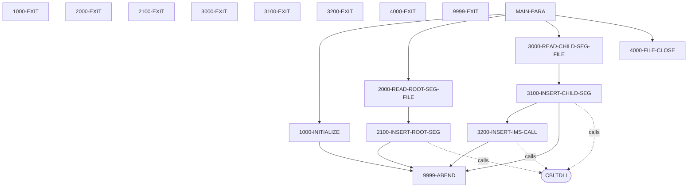

# PAUDBLOD - Complete Reference

*This file contains detailed technical documentation. See SKILL.md for a summary.*

## Program Header

- **Program ID:** PAUDBLOD
- **File Name:** cbl/PAUDBLOD.CBL
- **File Type:** COBOL
- **Analyzed By:** WAR_RIG
- **Analyzed At:** 2026-01-30T19:45:40.293787

## Purpose

**Summary:** PAUDBLOD is an IMS database loader utility that sequentially reads root segment records from INFILE1 and inserts them as PAUTSUM0 segments into the IMS database using unqualified ISRT calls. It then reads child segment records from INFILE2, which include a ROOT-SEG-KEY, uses a qualified GU call to position on the corresponding root segment, and inserts the child as PAUTDTL1 segments using unqualified ISRT. Duplicate segments (status 'II') are skipped without error, while other IMS errors or file I/O failures cause an ABEND with return code 16.

**Business Context:** Supports loading pending authorization summary and detail data into an IMS hierarchical database for authorization processing, likely part of a financial or payment system given segment names like PAUTSUM0 (Pending Auth Summary) and PAUTDTL1 (Pending Auth Details).
**Program Type:** BATCH

## Inputs

### INFILE1

- **Type:** FILE_SEQUENTIAL
- **Description:** Sequential file containing fixed-length 100-byte root segment records for PAUTSUM0 (Pending Authorization Summary) segments.

### INFILE2

- **Type:** FILE_SEQUENTIAL
- **Description:** Sequential file containing child segment records for PAUTDTL1 (Pending Authorization Details), prefixed with 11-digit COMP-3 ROOT-SEG-KEY matching root ACCNTID.

### PAUTBPCB

- **Type:** IMS_SEGMENT
- **Description:** IMS PCB mask providing database status, segment name, key feedback, and positioning for PAUT database access.
- **Copybook:** PAUTBPCB

## Outputs

### PAUTSUM0

- **Type:** IMS_SEGMENT
- **Description:** Root segments (Pending Authorization Summary) inserted into IMS database.
- **Copybook:** CIPAUSMY

### PAUTDTL1

- **Type:** IMS_SEGMENT
- **Description:** Child segments (Pending Authorization Details) inserted under matching PAUTSUM0 root segments.
- **Copybook:** CIPAUDTY

## Business Rules

### BR001

**Description:** Skip insertion of root or child segments if already exists in database (IMS status 'II' indicates duplicate).

**Logic:** After ISRT call, check PAUT-PCB-STATUS for 'II' and display message but continue without abend.

**Conditions:**
- `PAUT-PCB-STATUS = 'II'`

### BR002

**Description:** Only process child records with numeric ROOT-SEG-KEY to ensure valid qualification.

**Logic:** Before GU/ISRT for child, test IF ROOT-SEG-KEY IS NUMERIC.

**Conditions:**
- `ROOT-SEG-KEY IS NUMERIC`

## Paragraphs

### MAIN-PARA

This is the primary entry point and orchestration paragraph that controls the entire program flow for IMS database loading. It begins with an alternate ENTRY 'DLITCBL' USING PAUTBPCB to support IMS batch invocation, followed by a display startup message. It consumes no direct inputs but relies on passed PCB in linkage. It then performs 1000-INITIALIZE to open input files and set dates. Next, it enters a loop performing 2000-READ-ROOT-SEG-FILE until END-ROOT-SEG-FILE='Y', processing all root records from INFILE1. After root loading completes, it loops on 3000-READ-CHILD-SEG-FILE until END-CHILD-SEG-FILE='Y' to load children from INFILE2. Finally, it performs 4000-FILE-CLOSE to shut down files and issues GOBACK. No explicit business decisions here beyond loop control via EOF flags; errors in subordinates propagate via ABEND. It calls no external programs but coordinates all internal paragraphs.

**Calls:** 1000-INITIALIZE, 2000-READ-ROOT-SEG-FILE, 3000-READ-CHILD-SEG-FILE, 4000-FILE-CLOSE

### 1000-INITIALIZE

This paragraph handles program startup initialization including date acceptance and input file opens. It consumes system date via ACCEPT FROM DATE/DAY into CURRENT-DATE and CURRENT-YYDDD, and displays them for logging. No business data inputs. It opens INFILE1 and INFILE2 as INPUT, checking WS-INFIL1-STATUS and WS-INFIL2-STATUS after each; if not spaces or '00', displays error and branches to 9999-ABEND. Outputs are open files ready for reads and initialized flags/variables implicitly via prior WORKING-STORAGE. No decisions beyond file status validation for successful open. Error handling is immediate ABEND on open failure. Calls no other paragraphs.

### 2000-READ-ROOT-SEG-FILE

This paragraph implements the read loop for root segment input file, reading one record at a time from INFILE1. It consumes sequential records via READ INFILE1 into INFIL1-REC. If WS-INFIL1-STATUS is spaces or '00', moves entire record to PENDING-AUTH-SUMMARY and performs 2100-INSERT-ROOT-SEG to load into IMS. If status '10', sets END-ROOT-SEG-FILE='Y' to exit loop. Other statuses trigger error display but no abend here (handled in caller loop). Business logic is simple EOF/success/fail decision on file status. Produces loaded root segments via subordinate and increments counters implicitly if used. Error handling defers to insert paragraph. Called repeatedly by MAIN-PARA until EOF.

**Calls:** 2100-INSERT-ROOT-SEG

### 2100-INSERT-ROOT-SEG

This paragraph performs the IMS ISRT for root segments using unqualified SSA. It consumes PENDING-AUTH-SUMMARY (loaded from input record) and issues CALL 'CBLTDLI' USING FUNC-ISRT PAUTBPCB PENDING-AUTH-SUMMARY ROOT-UNQUAL-SSA. Displays decorative messages and checks PAUT-PCB-STATUS post-call: spaces indicates success, 'II' duplicate (logged), others cause display error and 9999-ABEND. Business logic enforces no duplicates via status check without delete/reinsert. Outputs updated IMS database with new/duplicate-skipped root. No field validations beyond IMS. Error handling abends on non-success/II. No subordinate calls.

### 3000-READ-CHILD-SEG-FILE

This paragraph reads child segment records from INFILE2 in a loop. Consumes records via READ INFILE2 into INFIL2-REC (ROOT-SEG-KEY + CHILD-SEG-REC). If status spaces/'00' and ROOT-SEG-KEY IS NUMERIC, moves key to QUAL-SSA-KEY-VALUE for qualification, moves CHILD-SEG-REC to PENDING-AUTH-DETAILS, and performs 3100-INSERT-CHILD-SEG. If '10', sets END-CHILD-SEG-FILE='Y'. Other statuses display error. Business logic validates key numeric to prevent invalid GU positioning. Produces positioned context for child insert via subordinate. Errors handled in insert.

**Calls:** 3100-INSERT-CHILD-SEG

### 3100-INSERT-CHILD-SEG

This paragraph positions on parent root via GU before child ISRT, ensuring parentage. Consumes ROOT-SEG-KEY in SSA and PENDING-AUTH-SUMMARY I/O area; initializes PAUT-PCB-STATUS, CALL 'CBLTDLI' FUNC-GU PAUTBPCB PENDING-AUTH-SUMMARY ROOT-QUAL-SSA. Displays messages; if status not spaces/'II', displays failure details (status, KEYFB) and ABENDs. On success, performs 3200-INSERT-IMS-CALL for child insert. Business logic verifies root existence before child insert to enforce hierarchy. Outputs positioned PCB for child insert. Errors abend on GU fail.

**Calls:** 3200-INSERT-IMS-CALL

### 3200-INSERT-IMS-CALL

This paragraph executes the child segment ISRT after parent GU. Consumes PENDING-AUTH-DETAILS and CHILD-UNQUAL-SSA; CALL 'CBLTDLI' FUNC-ISRT PAUTBPCB PENDING-AUTH-DETAILS CHILD-UNQUAL-SSA. Checks PAUT-PCB-STATUS: spaces success, 'II' duplicate logged, others display status/KEYFB and ABEND. Business logic skips duplicates. Outputs child segment in IMS under positioned parent. No further validations.

### 4000-FILE-CLOSE

This cleanup paragraph closes input files post-processing. Consumes open INFILE1/INFILE2; issues CLOSE for each, checks status (spaces/'00' continue, else display error but no abend). No inputs/data consumed. Outputs closed files. No business logic or decisions beyond status log. No error abend, allows graceful exit.

### 9999-ABEND

Universal error termination paragraph invoked on any fatal condition. Consumes no data; displays 'IMS LOAD ABENDING ...', sets RETURN-CODE=16, GOBACKs. Role is to halt execution with non-zero code. No inputs/outputs modified. No conditions checked here. Called from multiple error paths.

## Data Flow

### Reads From

- **INFILE1:** INFIL1-REC (entire 100-byte record)
- **INFILE2:** ROOT-SEG-KEY, CHILD-SEG-REC (entire 200-byte record)

### Writes To

- **PAUTSUM0:** PENDING-AUTH-SUMMARY (entire segment from CIPAUSMY)
- **PAUTDTL1:** PENDING-AUTH-DETAILS (entire segment from CIPAUDTY)

### Transforms

- `ROOT-SEG-KEY` -> `QUAL-SSA-KEY-VALUE`: Direct move of 11-digit COMP-3 root key from child record to qualified SSA for GU positioning on parent root.
- `INFIL1-REC` -> `PENDING-AUTH-SUMMARY`: Direct move of entire 100-byte input record to root segment working storage area.
- `CHILD-SEG-REC` -> `PENDING-AUTH-DETAILS`: Direct move of entire 200-byte child record data to child segment working storage area.

## Error Handling

- **WS-INFIL1-STATUS NOT = SPACES OR '00' on OPEN/READ:** DISPLAY error message and PERFORM 9999-ABEND
- **WS-INFIL2-STATUS NOT = SPACES OR '00' on OPEN/READ:** DISPLAY error message and PERFORM 9999-ABEND
- **PAUT-PCB-STATUS NOT = SPACES OR 'II' after ISRT/GU:** DISPLAY status/KEYFB and PERFORM 9999-ABEND

## Flow Diagram

