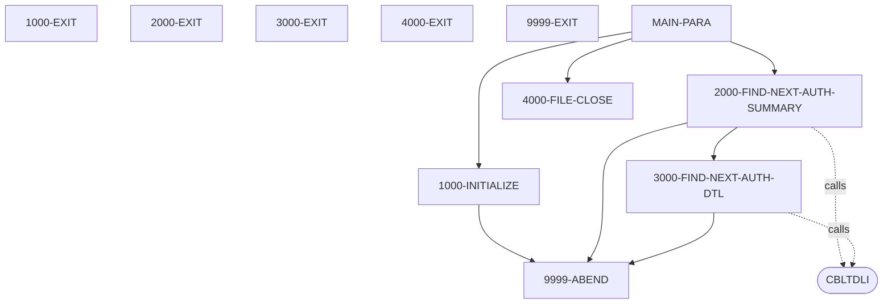

# PAUDBUNL - Complete Reference

*This file contains detailed technical documentation. See SKILL.md for a summary.*

## Program Header

- **Program ID:** PAUDBUNL
- **File Name:** PAUDBUNL.CBL
- **File Type:** COBOL
- **Analyzed By:** WAR_RIG
- **Analyzed At:** 2026-01-28T14:53:41.345925

## Purpose

**Summary:** The COBOL program PAUDBUNL unloads pending authorization summary and detail segments from an IMS database to two sequential output files. It reads PAUTSUM0 root segments and PAUTDTL1 child segments from the IMS database and writes them to OPFILE1 and OPFILE2 respectively, provided the PA-ACCT-ID is numeric.

**Business Context:** This program is likely used for data extraction or migration of pending authorization data from an IMS system.
**Program Type:** BATCH

## Inputs

### IMS Database (PAUTSUM0, PAUTDTL1 Segments)

- **Type:** IMS_SEGMENT
- **Description:** Pending authorization summary (PAUTSUM0) and detail (PAUTDTL1) segments from an IMS database.
- **Copybook:** CIPAUSMY, CIPAUDTY

### PAUTBPCB

- **Type:** PARAMETER
- **Description:** PCB mask for IMS calls.
- **Copybook:** PAUTBPCB

## Outputs

### OPFILE1

- **Type:** FILE_SEQUENTIAL
- **Description:** Sequential file containing pending authorization summary records (PAUTSUM0) extracted from the IMS database.  Each record is 100 bytes long.
- **Copybook:** CIPAUSMY

### OPFILE2

- **Type:** FILE_SEQUENTIAL
- **Description:** Sequential file containing pending authorization detail records (PAUTDTL1) extracted from the IMS database. Each record contains a ROOT-SEG-KEY (PA-ACCT-ID) and the CHILD-SEG-REC.
- **Copybook:** CIPAUDTY

## Business Rules

### BR001

**Description:** Only write summary and detail records to output files if the PA-ACCT-ID is numeric.

**Logic:** Checks if PA-ACCT-ID is numeric before writing to OPFILE1 and OPFILE2.

**Conditions:**
- `IF PA-ACCT-ID IS NUMERIC`

## Paragraphs

### MAIN-PARA

This is the main control paragraph of the program. It first calls 1000-INITIALIZE to perform initial setup tasks such as accepting the current date and opening the output files OPFILE1 and OPFILE2.  Then, it enters a loop that repeatedly calls 2000-FIND-NEXT-AUTH-SUMMARY to read and process pending authorization summary segments from the IMS database. The loop continues until the end of the database is reached, indicated by WS-END-OF-ROOT-SEG being set to 'Y'. After processing all summary segments, it calls 4000-FILE-CLOSE to close the output files. Finally, the program terminates using GOBACK.

**Calls:** 1000-INITIALIZE, 2000-FIND-NEXT-AUTH-SUMMARY, 4000-FILE-CLOSE

### 1000-INITIALIZE

This paragraph initializes the program by performing several setup tasks. It accepts the current date and day from the system. It then opens the output files OPFILE1 and OPFILE2 for writing. It checks the file status after each OPEN operation. If the file status indicates an error, it displays an error message and calls 9999-ABEND to terminate the program.  The paragraph also displays the starting program message and the current date to the console.

**Calls:** 9999-ABEND

### 2000-FIND-NEXT-AUTH-SUMMARY

This paragraph retrieves the next pending authorization summary segment (PAUTSUM0) from the IMS database. It first initializes PAUT-PCB-STATUS. It then calls the CBLTDLI routine with the FUNC-GN function code to retrieve the next summary segment using an unqualified SSA. If the PCB status is spaces (successful read), it increments counters for summary records read and processed, moves the summary segment data to OPFIL1-REC, initializes ROOT-SEG-KEY and CHILD-SEG-REC, moves PA-ACCT-ID to ROOT-SEG-KEY, and writes the record to OPFILE1 if PA-ACCT-ID is numeric. It then calls 3000-FIND-NEXT-AUTH-DTL to process the child segments. If the PCB status is 'GB' (end of database), it sets the END-OF-AUTHDB flag to TRUE and WS-END-OF-ROOT-SEG to 'Y'. If the PCB status indicates an error, it displays error messages and calls 9999-ABEND.

**Calls:** CBLTDLI, 3000-FIND-NEXT-AUTH-DTL, 9999-ABEND

### 3000-FIND-NEXT-AUTH-DTL

This paragraph retrieves the next pending authorization detail segment (PAUTDTL1) for the current summary segment from the IMS database. It calls CBLTDLI with FUNC-GNP to get the next child segment. If the PCB status is spaces, it sets MORE-AUTHS to TRUE, increments counters, moves the detail segment data to CHILD-SEG-REC, and writes the record to OPFILE2. If the PCB status is 'GE' (end of child segments for the current root), it sets WS-END-OF-CHILD-SEG to 'Y'. If the PCB status indicates an error, it displays error messages and calls 9999-ABEND. Finally, it initializes PAUT-PCB-STATUS.

**Calls:** CBLTDLI, 9999-ABEND

### 4000-FILE-CLOSE

This paragraph closes the output files OPFILE1 and OPFILE2. It displays a message indicating that the files are being closed. It then closes each file and checks the file status. If the file status indicates an error during the close operation, it displays an error message. This paragraph ensures that the output files are properly closed after processing is complete.

### 9999-ABEND

This paragraph handles abnormal program termination. It displays a message indicating that the program is abending. It sets the RETURN-CODE to 16, indicating an error condition, and then terminates the program using GOBACK.

## Data Flow

### Reads From

- **IMS Database (PAUTSUM0):** PA-ACCT-ID, All fields in CIPAUSMY copybook
- **IMS Database (PAUTDTL1):** All fields in CIPAUDTY copybook

### Writes To

- **OPFILE1:** All fields in PENDING-AUTH-SUMMARY (CIPAUSMY)
- **OPFILE2:** ROOT-SEG-KEY (PA-ACCT-ID), CHILD-SEG-REC (PENDING-AUTH-DETAILS)

## Error Handling

- **WS-OUTFL1-STATUS not equal to SPACES or '00' during OPEN:** DISPLAY error message and PERFORM 9999-ABEND
- **WS-OUTFL2-STATUS not equal to SPACES or '00' during OPEN:** DISPLAY error message and PERFORM 9999-ABEND
- **PAUT-PCB-STATUS not equal to SPACES or 'GB' after GN call:** DISPLAY error message and PERFORM 9999-ABEND
- **PAUT-PCB-STATUS not equal to SPACES or 'GE' after GNP call:** DISPLAY error message and PERFORM 9999-ABEND
- **WS-OUTFL1-STATUS not equal to SPACES or '00' during CLOSE:** DISPLAY error message
- **WS-OUTFL2-STATUS not equal to SPACES or '00' during CLOSE:** DISPLAY error message

## Flow Diagram

