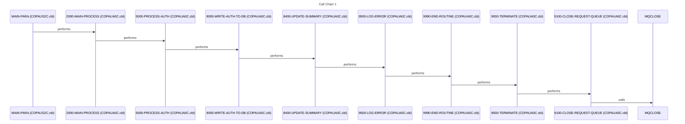
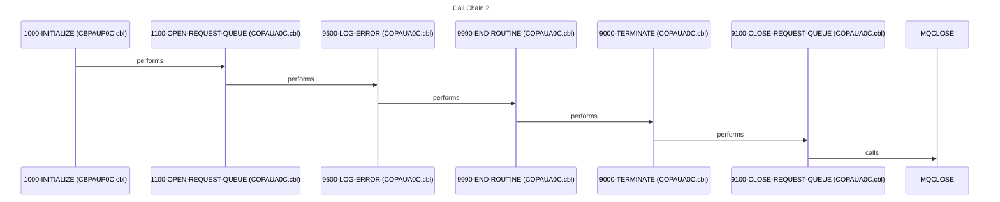
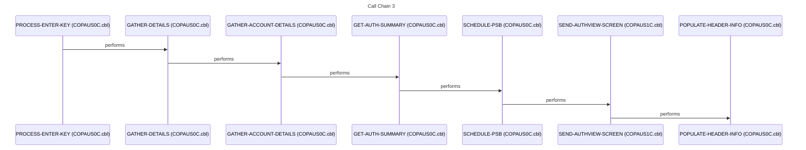
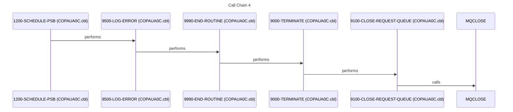
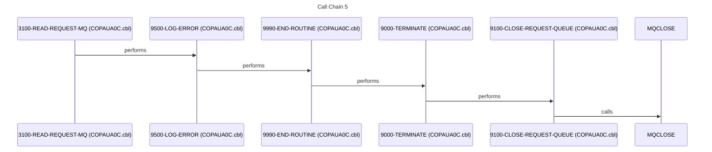

# System Overview

## About This Skill

This skill provides a high-level overview of the documented system and serves as an index for discovering specific program documentation. Use this as your starting point when exploring the codebase.

## When to Use This Skill

Use this skill when you need to:
- Understand the overall system architecture
- Find which program handles a specific function
- Get an overview before diving into specific programs
- Understand how programs relate to each other

## System Documentation

### 1. Executive Summary

This system, driven by batch JCL jobs and COBOL programs, addresses the critical business need of managing and processing authorization data, likely related to financial transactions or access control. The primary mission of the system is to ensure the integrity and validity of authorization requests, facilitating secure and compliant operations. The users of this system are likely internal operations staff, database administrators, and potentially auditors who rely on the processed data for reporting and compliance purposes. The system handles authorization requests, validates them against various data sources, and ultimately persists the authorization details in a database. Key workflows involve reading authorization requests from a message queue, validating the request against customer, account, and cross-reference data, making a decision based on predefined rules, and then writing the authorization details to a database.

The technical foundation of this system is built upon COBOL programs executing within a z/OS environment, leveraging JCL for batch processing and IMS for database management. COBOL programs such as [COPAUA0C](cbl/COPAUA0C.cbl.md) and [CBPAUP0C](cbl/CBPAUP0C.cbl.md) perform the core business logic, interacting with IMS databases through CBLTDLI calls. JCL jobs like [CBPAUP0J](jcl/CBPAUP0J.jcl.md) schedule and execute these COBOL programs, managing the flow of data and resources. Message queuing (MQ) is used for asynchronous communication, allowing external systems to submit authorization requests and receive responses. The system also utilizes copybooks like [CIPAUDTY](cpy/CIPAUDTY.cpy.md) and [CIPAUSMY](cpy/CIPAUSMY.cpy.md) to define common data structures and ensure consistency across programs.

The system's inputs include authorization requests received via MQ and data from various VSAM files and IMS databases containing customer, account, and cross-reference information. The outputs consist of updated IMS databases with authorization details and responses sent back to the requesting systems via MQ. The system integrates with external systems through MQ for receiving authorization requests and sending responses. It also interacts with IMS databases and VSAM files for data retrieval and persistence. The system is crucial for maintaining the security and integrity of authorization processes within the organization. If the system were to fail, authorization requests could not be processed, leading to potential disruptions in business operations, financial losses, and compliance violations. The system supports business metrics related to authorization processing volume, response times, and error rates, providing insights into the efficiency and effectiveness of the authorization process.

### 2. Architecture Overview

The system architecture is a hybrid of batch and online processing, centered around IMS database management and MQ messaging. Batch jobs, scheduled via JCL, perform database maintenance and data extraction. Online COBOL programs handle real-time authorization requests received via MQ. The system follows a layered architecture, with presentation logic (BMS screens), business logic (COBOL programs), and data access layers (IMS and VSAM).

The primary entry point for online authorization processing is likely the [COPAUA0C](cbl/COPAUA0C.cbl.md) program, which receives requests from MQ. Batch processing is initiated through JCL jobs such as [CBPAUP0J](jcl/CBPAUP0J.jcl.md), which executes COBOL programs like [CBPAUP0C](cbl/CBPAUP0C.cbl.md) for database unloading and loading. The system uses a combination of batch and online integration patterns. Batch jobs perform periodic data updates and maintenance, while online programs handle real-time transactions. The system leverages IMS databases for persistent storage and VSAM files for auxiliary data.

```mermaid
flowchart TD

    subgraph jobs[" "]
        CBPAUP0J([CBPAUP0J])
        DBPAUTP0([DBPAUTP0])
        PAUDBUNL([PAUDBUNL])
    end

    subgraph procs[" "]
        CBPAUP0C[CBPAUP0C]
        CCPAUERY[/CCPAUERY/]
        CCPAURLY[/CCPAURLY/]
        CCPAURQY[/CCPAURQY/]
        CIPAUDTY[/CIPAUDTY/]
        CIPAUSMY[/CIPAUSMY/]
        COPAU00[/COPAU00/]
        COPAU01[/COPAU01/]
        COPAUA0C[COPAUA0C]
        COPAUS0C[COPAUS0C]
        COPAUS1C[COPAUS1C]
        COPAUS2C[COPAUS2C]
        DBUNLDGS[DBUNLDGS]
        IMSFUNCS[/IMSFUNCS/]
        PADFLPCB[/PADFLPCB/]
        PASFLPCB[/PASFLPCB/]
        PAUDBLOD[PAUDBLOD]
        PAUTBPCB[/PAUTBPCB/]
    end

    subgraph external[" "]
        CBLTDLI>CBLTDLI]
        CDEMO_TO_PROGRAM>CDEMO-TO-PROGRAM]
        DFSRRC00>DFSRRC00]
        MQCLOSE>MQCLOSE]
        MQGET>MQGET]
        MQOPEN>MQOPEN]
        MQPUT1>MQPUT1]
        WS_PGM_AUTH_FRAUD>WS-PGM-AUTH-FRAUD]
    end

    %% Call relationships
    CBPAUP0C --> CBPAUP0C
    CBPAUP0C --> CBPAUP0C
    CBPAUP0C --> CBPAUP0C
    CBPAUP0C --> CBPAUP0C
    CBPAUP0C --> COPAUA0C
    CBPAUP0C --> COPAUA0C
    CBPAUP0C --> DBUNLDGS
    CBPAUP0C --> DBUNLDGS
    CBPAUP0C --> CBPAUP0C
    CBPAUP0C --> CBPAUP0C
    CBPAUP0C --> CBPAUP0C
    CBPAUP0C -.->|COPY| COPYBOOKS
    CBPAUP0C --> CBLTDLI
    CBPAUP0C --> CBLTDLI
    CBPAUP0C --> CBLTDLI
    CBPAUP0C --> CBLTDLI
    CBPAUP0J --> DFSRRC00
    CBPAUP0J --> DFSRRC00
    CBPAUP0J --> DFSRRC00
    CBPAUP0J --> DFSRRC00
    COPAUA0C --> COPAUA0C
    COPAUA0C --> COPAUA0C
    COPAUA0C --> COPAUA0C
    COPAUA0C --> COPAUA0C
    COPAUA0C --> COPAUA0C
    COPAUA0C --> COPAUA0C
    COPAUA0C --> COPAUA0C
    COPAUA0C --> COPAUA0C
    COPAUA0C --> COPAUA0C
    COPAUA0C --> COPAUA0C
    COPAUA0C --> COPAUA0C
    COPAUA0C --> COPAUA0C
    COPAUA0C --> COPAUA0C
    COPAUA0C --> COPAUA0C
    COPAUA0C --> COPAUA0C
    COPAUA0C --> COPAUA0C
    COPAUA0C --> COPAUA0C
    COPAUA0C --> COPAUA0C
    COPAUA0C --> COPAUA0C
    COPAUA0C --> COPAUA0C
    COPAUA0C --> COPAUA0C
    COPAUA0C --> COPAUA0C
    COPAUA0C --> COPAUA0C
    COPAUA0C --> COPAUA0C
    COPAUA0C --> COPAUA0C
    COPAUA0C --> COPAUA0C
    COPAUA0C --> COPAUA0C
    COPAUA0C --> COPAUA0C
    COPAUA0C -.->|COPY| COPYBOOKS
    COPAUA0C --> MQOPEN
    COPAUA0C --> MQGET
    COPAUA0C --> MQPUT1
    COPAUA0C --> MQCLOSE
    COPAUS0C --> COPAUS1C
    COPAUS0C --> COPAUS1C
    COPAUS0C --> COPAUS1C
    COPAUS0C --> COPAUS1C
    COPAUS0C --> COPAUS1C
    COPAUS0C --> COPAUS1C
    COPAUS0C --> COPAUS1C
    COPAUS0C --> COPAUS1C
    COPAUS0C --> COPAUS0C
    COPAUS0C --> COPAUS0C
    COPAUS0C --> COPAUS0C
    COPAUS0C --> COPAUS0C
    COPAUS0C --> COPAUS0C
    COPAUS0C --> COPAUS0C
    COPAUS0C --> COPAUS0C
    COPAUS0C --> COPAUS0C
    COPAUS0C --> COPAUS0C
    COPAUS0C --> COPAUS0C
    COPAUS0C --> COPAUS0C
    COPAUS0C --> COPAUS0C
    COPAUS0C --> COPAUS0C
    COPAUS0C --> COPAUS0C
    COPAUS0C --> COPAUS0C
    COPAUS0C --> COPAUS0C
    COPAUS0C --> COPAUS0C
    COPAUS0C --> COPAUS0C
    COPAUS0C --> COPAUS0C
    COPAUS0C --> COPAUS0C
    COPAUS0C --> COPAUS0C
    COPAUS0C --> COPAUS0C
    COPAUS0C --> COPAUS0C
    COPAUS0C --> COPAUS0C
    COPAUS0C --> COPAUS0C
    COPAUS0C --> COPAUS0C
    COPAUS0C --> COPAUS0C
    COPAUS0C --> COPAUS0C
    COPAUS0C -.->|COPY| COPYBOOKS
    COPAUS0C --> CDEMO_TO_PROGRAM
    COPAUS0C --> CDEMO_TO_PROGRAM
    COPAUS0C --> CDEMO_TO_PROGRAM
    COPAUS1C --> COPAUS1C
    COPAUS1C --> COPAUS1C
    COPAUS1C --> COPAUS1C
    COPAUS1C --> COPAUS1C
    COPAUS1C --> COPAUS0C
    COPAUS1C --> COPAUS0C
    COPAUS1C --> COPAUS1C
    COPAUS1C --> COPAUS1C
    COPAUS1C --> COPAUS1C
    COPAUS1C --> COPAUS1C
    COPAUS1C --> COPAUS1C
    COPAUS1C -.->|COPY| COPYBOOKS
    COPAUS1C --> WS_PGM_AUTH_FRAUD
    COPAUS2C --> CBPAUP0C
    COPAUS2C --> CBPAUP0C
    COPAUS2C --> DBUNLDGS
    COPAUS2C --> COPAUS0C
    COPAUS2C --> COPAUS0C
    COPAUS2C --> COPAUS1C
    COPAUS2C --> COPAUS1C
    COPAUS2C --> COPAUS1C
    COPAUS2C --> COPAUS0C
    COPAUS2C --> COPAUA0C
    COPAUS2C --> COPAUA0C
    COPAUS2C --> PAUDBLOD
    COPAUS2C --> PAUDBLOD
    COPAUS2C --> CBPAUP0C
    COPAUS2C --> CBPAUP0C
    COPAUS2C --> CBPAUP0C
    COPAUS2C --> CBPAUP0C
    COPAUS2C --> CBPAUP0C
    COPAUS2C --> COPAUS0C
    COPAUS2C --> COPAUS0C
    COPAUS2C --> COPAUS0C
    COPAUS2C --> COPAUS0C
    COPAUS2C --> COPAUS2C
    COPAUS2C -.->|COPY| COPYBOOKS
    DBPAUTP0 --> DFSRRC00
    DBUNLDGS --> CBPAUP0C
    DBUNLDGS --> CBPAUP0C
    DBUNLDGS -.->|COPY| COPYBOOKS
    DBUNLDGS --> CBLTDLI
    DBUNLDGS --> CBLTDLI
    PAUDBLOD --> PAUDBLOD
    PAUDBLOD --> CBPAUP0C
    PAUDBLOD --> PAUDBLOD
    PAUDBLOD --> PAUDBLOD
    PAUDBLOD --> CBPAUP0C
    PAUDBLOD --> CBPAUP0C
    PAUDBLOD -.->|COPY| COPYBOOKS
    PAUDBLOD --> CBLTDLI
    PAUDBLOD --> CBLTDLI
    PAUDBLOD --> CBLTDLI
    PAUDBUNL -.->|COPY| COPYBOOKS

    %% Styling
    classDef entryPoint fill:#90EE90,stroke:#228B22
    class CBPAUP0J,DBPAUTP0,LOADPADB,PAUDBUNL,UNLDGSAM,UNLDPADB entryPoint
    classDef missing fill:#1E3A5F,stroke:#2E5A8F,color:#FFFFFF
    class CBLTDLI,CDEMO_TO_PROGRAM,DFSRRC00,MQCLOSE,MQGET,MQOPEN,MQPUT1,WS_PGM_AUTH_FRAUD missing
```

### 3. Component Catalog

| Component | Type | Purpose | Dependencies | Doc Link |
|-----------|------|---------|--------------|----------|
| [PAUDBUNL](cbl/PAUDBUNL.CBL.md) | COBOL | Unloads data from a database | [CIPAUDTY](cpy/CIPAUDTY.cpy.md), [CIPAUSMY](cpy/CIPAUSMY.cpy.md), [IMSFUNCS](cpy/IMSFUNCS.cpy.md), [PAUTBPCB](cpy/PAUTBPCB.CPY.md) | [PAUDBUNL](cbl/PAUDBUNL.CBL.md) |
| [COPAUS1C](cbl/COPAUS1C.cbl.md) | COBOL | Processes authorization requests | [CIPAUDTY](cpy/CIPAUDTY.cpy.md), [CIPAUSMY](cpy/CIPAUSMY.cpy.md), [COCOM01Y](cpy/COCOM01Y.cpy.md), [COTTL01Y](cpy/COTTL01Y.cpy.md), [CSDAT01Y](cpy/CSDAT01Y.cpy.md), [CSMSG01Y](cpy/CSMSG01Y.cpy.md), [CSMSG02Y](cpy/CSMSG02Y.cpy.md), [DFHAID](cpy/DFHAID.cpy.md), [DFHBMSCA](cpy/DFHBMSCA.cpy.md) | [COPAUS1C](cbl/COPAUS1C.cbl.md) |
| [COPAUA0C](cbl/COPAUA0C.cbl.md) | COBOL | Handles user interface and MQ interactions | [CIPAUDTY](cpy/CIPAUDTY.cpy.md), [CIPAUSMY](cpy/CIPAUSMY.cpy.md), [CVACT01Y](cpy/CVACT01Y.cpy.md), [CVACT03Y](cpy/CVACT03Y.cpy.md), [CVCUS01Y](cpy/CVCUS01Y.cpy.md) | [COPAUA0C](cbl/COPAUA0C.cbl.md) |
| [PAUDBLOD](cbl/PAUDBLOD.CBL.md) | COBOL | Loads data into a database | [CIPAUDTY](cpy/CIPAUDTY.cpy.md), [CIPAUSMY](cpy/CIPAUSMY.cpy.md), [IMSFUNCS](cpy/IMSFUNCS.cpy.md), [PAUTBPCB](cpy/PAUTBPCB.CPY.md) | [PAUDBLOD](cbl/PAUDBLOD.CBL.md) |
| [DBUNLDGS](cbl/DBUNLDGS.CBL.md) | COBOL | Unloads data from a GSAM database | [CIPAUDTY](cpy/CIPAUDTY.cpy.md), [CIPAUSMY](cpy/CIPAUSMY.cpy.md), [IMSFUNCS](cpy/IMSFUNCS.cpy.md), [PAUTBPCB](cpy/PAUTBPCB.CPY.md) | [DBUNLDGS](cbl/DBUNLDGS.CBL.md) |
| [CBPAUP0C](cbl/CBPAUP0C.cbl.md) | COBOL | Processes database updates | [CIPAUDTY](cpy/CIPAUDTY.cpy.md), [CIPAUSMY](cpy/CIPAUSMY.cpy.md) | [CBPAUP0C](cbl/CBPAUP0C.cbl.md) |
| [COPAUS0C](cbl/COPAUS0C.cbl.md) | COBOL | CICS transaction program | [CIPAUDTY](cpy/CIPAUDTY.cpy.md), [CIPAUSMY](cpy/CIPAUSMY.cpy.md), [COCOM01Y](cpy/COCOM01Y.cpy.md), [COTTL01Y](cpy/COTTL01Y.cpy.md), [CSDAT01Y](cpy/CSDAT01Y.cpy.md), [CSMSG01Y](cpy/CSMSG01Y.cpy.md), [CSMSG02Y](cpy/CSMSG02Y.cpy.md), [CVACT01Y](cpy/CVACT01Y.cpy.md), [CVACT03Y](cpy/CVACT03Y.cpy.md), [CVCUS01Y](cpy/CVCUS01Y.cpy.md), [DFHAID](cpy/DFHAID.cpy.md), [DFHBMSCA](cpy/DFHBMSCA.cpy.md) | [COPAUS0C](cbl/COPAUS0C.cbl.md) |
| [COPAUS2C](cbl/COPAUS2C.cbl.md) | COBOL | Main driver program | [CIPAUDTY](cpy/CIPAUDTY.cpy.md), [CIPAUSMY](cpy/CIPAUSMY.cpy.md) | [COPAUS2C](cbl/COPAUS2C.cbl.md) |
| [COPAU00](bms/COPAU00.bms.md) | BMS | BMS map definition | - | [COPAU00](bms/COPAU00.bms.md) |
| [COPAU01](bms/COPAU01.bms.md) | BMS | BMS map definition | - | [COPAU01](bms/COPAU01.bms.md) |
| [PADFLPCB](cpy/PADFLPCB.CPY.md) | COPY | PCB definition | - | [PADFLPCB](cpy/PADFLPCB.CPY.md) |
| [CIPAUSMY](cpy/CIPAUSMY.cpy.md) | COPY | Copybook for authorization data | - | [CIPAUSMY](cpy/CIPAUSMY.cpy.md) |
| [CCPAURQY](cpy/CCPAURQY.cpy.md) | COPY | Copybook for request data | - | [CCPAURQY](cpy/CCPAURQY.cpy.md) |
| [CIPAUDTY](cpy/CIPAUDTY.cpy.md) | COPY | Copybook for database fields | - | [CIPAUDTY](cpy/CIPAUDTY.cpy.md) |
| [PAUTBPCB](cpy/PAUTBPCB.CPY.md) | COPY | PCB definition | - | [PAUTBPCB](cpy/PAUTBPCB.CPY.md) |
| [PASFLPCB](cpy/PASFLPCB.CPY.md) | COPY | PCB definition | - | [PASFLPCB](cpy/PASFLPCB.CPY.md) |
| [IMSFUNCS](cpy/IMSFUNCS.cpy.md) | COPY | IMS function codes | - | [IMSFUNCS](cpy/IMSFUNCS.cpy.md) |
| [CCPAUERY](cpy/CCPAUERY.cpy.md) | COPY | Copybook for error messages | - | [CCPAUERY](cpy/CCPAUERY.cpy.md) |
| [CCPAURLY](cpy/CCPAURLY.cpy.md) | COPY | Copybook for list data | - | [CCPAURLY](cpy/CCPAURLY.cpy.md) |
| [XAUTHFRD](ddl/XAUTHFRD.ddl.md) | DDL | Table definition | - | [XAUTHFRD](ddl/XAUTHFRD.ddl.md) |
| [AUTHFRDS](ddl/AUTHFRDS.ddl.md) | DDL | Table definition | - | [AUTHFRDS](ddl/AUTHFRDS.ddl.md) |
| [DBPAUTP0](ims/DBPAUTP0.dbd.md) | DBD | IMS database definition | - | [DBPAUTP0](ims/DBPAUTP0.dbd.md) |
| [DBPAUTX0](ims/DBPAUTX0.dbd.md) | DBD | IMS database definition | - | [DBPAUTX0](ims/DBPAUTX0.dbd.md) |
| [PADFLDBD](ims/PADFLDBD.DBD.md) | DBD | IMS database definition | - | [PADFLDBD](ims/PADFLDBD.DBD.md) |
| [PSBPAUTL](ims/PSBPAUTL.psb.md) | PSB | IMS program specification block | - | [PSBPAUTL](ims/PSBPAUTL.psb.md) |
| [PSBPAUTB](ims/PSBPAUTB.psb.md) | PSB | IMS program specification block | - | [PSBPAUTB](ims/PSBPAUTB.psb.md) |
| [PASFLDBD](ims/PASFLDBD.DBD.md) | DBD | IMS database definition | - | [PASFLDBD](ims/PASFLDBD.DBD.md) |
| [PAUTBUNL](ims/PAUTBUNL.PSB.md) | PSB | IMS program specification block | - | [PAUTBUNL](ims/PAUTBUNL.PSB.md) |
| [DLIGSAMP](ims/DLIGSAMP.PSB.md) | PSB | IMS program specification block | - | [DLIGSAMP](ims/DLIGSAMP.PSB.md) |
| [COPAU00](cpy-bms/COPAU00.cpy.md) | COPY | Copy of BMS map | - | [COPAU00](cpy-bms/COPAU00.cpy.md) |
| [COPAU01](cpy-bms/COPAU01.cpy.md) | COPY | Copy of BMS map | - | [COPAU01](cpy-bms/COPAU01.cpy.md) |
| [UNLDPADB](jcl/UNLDPADB.JCL.md) | JCL | Unloads database | [PAUDBUNL](cbl/PAUDBUNL.CBL.md) | [UNLDPADB](jcl/UNLDPADB.JCL.md) |
| [LOADPADB](jcl/LOADPADB.JCL.md) | JCL | Loads database | [PAUDBLOD](cbl/PAUDBLOD.CBL.md) | [LOADPADB](jcl/LOADPADB.JCL.md) |
| [UNLDGSAM](jcl/UNLDGSAM.JCL.md) | JCL | Unloads GSAM database | [DBUNLDGS](cbl/DBUNLDGS.CBL.md) | [UNLDGSAM](jcl/UNLDGSAM.JCL.md) |
| [DBPAUTP0](jcl/DBPAUTP0.jcl.md) | JCL | Executes IMS program | - | [DBPAUTP0](jcl/DBPAUTP0.jcl.md) |
| [CBPAUP0J](jcl/CBPAUP0J.jcl.md) | JCL | Executes database update program | [CBPAUP0C](cbl/CBPAUP0C.cbl.md) | [CBPAUP0J](jcl/CBPAUP0J.jcl.md) |

### 4. Subsystem Breakdown

*   **IMS Database Maintenance Subsystem**: This subsystem is responsible for maintaining the integrity and availability of the IMS databases. It includes the following components:
    *   [UNLDPADB](jcl/UNLDPADB.JCL.md): JCL job to unload the database.
    *   [PAUDBUNL](cbl/PAUDBUNL.CBL.md): COBOL program to unload the database.
    *   [LOADPADB](jcl/LOADPADB.JCL.md): JCL job to load the database.
    *   [PAUDBLOD](cbl/PAUDBLOD.CBL.md): COBOL program to load the database.
    *   [UNLDGSAM](jcl/UNLDGSAM.JCL.md): JCL job to unload the GSAM database.
    *   [DBUNLDGS](cbl/DBUNLDGS.CBL.md): COBOL program to unload the GSAM database.
*   **Online Authorization Processing Subsystem**: This subsystem handles real-time authorization requests. It includes the following components:
    *   [COPAUA0C](cbl/COPAUA0C.cbl.md): COBOL program to handle user interface and MQ interactions.
    *   [COPAUS0C](cbl/COPAUS0C.cbl.md): COBOL program for CICS transaction processing.
    *   [COPAUS1C](cbl/COPAUS1C.cbl.md): COBOL program to process authorization requests.
    *   [COPAUS2C](cbl/COPAUS2C.cbl.md): COBOL program that acts as a main driver.
    *   [COPAU00](bms/COPAU00.bms.md): BMS map definition for screen display.
    *   [COPAU01](bms/COPAU01.bms.md): BMS map definition for screen display.
*   **Batch Update Subsystem**: This subsystem handles batch updates to the database.
    *   [CBPAUP0J](jcl/CBPAUP0J.jcl.md): JCL job to execute the database update program.
    *   [CBPAUP0C](cbl/CBPAUP0C.cbl.md): COBOL program to process database updates.
*   **IMS Control Subsystem**: This subsystem manages the execution of IMS programs.
    *   [DBPAUTP0](jcl/DBPAUTP0.jcl.md): JCL job to execute IMS program.

### 5. Data Architecture

The system utilizes both IMS databases and VSAM files for data storage. IMS databases, defined by DBDs such as [DBPAUTP0](ims/DBPAUTP0.dbd.md), [DBPAUTX0](ims/DBPAUTX0.dbd.md), [PADFLDBD](ims/PADFLDBD.DBD.md), and [PASFLDBD](ims/PASFLDBD.DBD.md), store authorization details and related information. VSAM files are used for storing customer, account, and cross-reference data.

Data flows from external systems via MQ to the [COPAUA0C](cbl/COPAUA0C.cbl.md) program. This program then interacts with IMS databases and VSAM files to validate the authorization request. The validated authorization details are then written to the IMS database using CBLTDLI calls. Batch jobs such as [UNLDPADB](jcl/UNLDPADB.JCL.md) and [LOADPADB](jcl/LOADPADB.JCL.md) extract data from and load data into the IMS databases, respectively. The copybooks, such as [CIPAUDTY](cpy/CIPAUDTY.cpy.md) and [CIPAUSMY](cpy/CIPAUSMY.cpy.md), define the structure of the data being processed.

The input sources include MQ messages containing authorization requests and VSAM files containing customer, account, and cross-reference data. The output destinations include IMS databases containing authorization details and MQ messages containing responses to the authorization requests.

### 6. Integration Points

*   **MQ Messaging**: The system integrates with external systems via MQ for receiving authorization requests and sending responses. The [COPAUA0C](cbl/COPAUA0C.cbl.md) program interacts with MQ using MQOPEN, MQGET, MQPUT1, and MQCLOSE calls.
*   **IMS Database**: The system interacts with IMS databases for persistent storage of authorization details. COBOL programs use CBLTDLI calls to access and update the IMS databases.
*   **VSAM Files**: The system reads customer, account, and cross-reference data from VSAM files.
*   **Batch Job Scheduling**: Batch jobs are scheduled using JCL and are dependent on the successful completion of previous jobs. For example, the [LOADPADB](jcl/LOADPADB.JCL.md) job is dependent on the successful completion of the [UNLDPADB](jcl/UNLDPADB.JCL.md) job.

### 7. Business Rules Summary

*   Authorization requests must be validated against customer, account, and cross-reference data. (Source: Implied by the data access patterns in [COPAUA0C](cbl/COPAUA0C.cbl.md) and [COPAUS0C](cbl/COPAUS0C.cbl.md))
*   Authorization details must be persisted in the IMS database. (Source: Implied by the CBLTDLI calls in various COBOL programs)
*   Responses must be sent back to the requesting systems via MQ. (Source: Implied by the MQPUT1 calls in [COPAUA0C](cbl/COPAUA0C.cbl.md))
*   Database maintenance must be performed regularly to ensure data integrity and availability. (Source: Implied by the existence of [UNLDPADB](jcl/UNLDPADB.JCL.md) and [LOADPADB](jcl/LOADPADB.JCL.md) jobs)

### 8. Error Handling Patterns

The system uses a combination of error logging and recovery procedures. COBOL programs use the [CCPAUERY](cpy/CCPAUERY.cpy.md) copybook to define error messages. Error messages are logged to a system log or console. Recovery procedures include restarting batch jobs and resubmitting authorization requests. The `9500-LOG-ERROR` routine is used to log errors. ❓ QUESTION: What specific error codes are handled and what are the corresponding recovery actions?

### 9. Open Questions and Uncertainties

*   ❓ QUESTION: What specific error codes are handled and what are the corresponding recovery actions?
*   ❓ QUESTION: What are the specific business rules used to validate authorization requests?
*   ❓ QUESTION: What are the performance requirements for the online authorization processing subsystem?
*   ❓ QUESTION: What are the security requirements for the system?
*   ❓ QUESTION: What are the data retention policies for the IMS databases?
*   ❓ QUESTION: What are the specific VSAM files used by the system and what data do they contain?
*   ❓ QUESTION: What are the specific MQ queues used by the system and what is the message format?

## Flows

The following sequence diagrams illustrate key call sequences identified in the codebase, showing how programs interact during execution.

### Flow 1

### Flow 2

### Flow 3

### Flow 4

### Flow 5

## Program Catalog

The following programs are documented. Use the program name to load its specific skill for detailed information.

### BATCH Programs

| Program | Skill | Description |
|---------|-------|-------------|
| CBPAUP0C | `cbpaup0c` | This batch COBOL IMS program deletes expired pending authorization messages from the IMS database. It reads pending authorization summary and detail segments, checks if they are expired based on a... |
| CBPAUP0J | `cbpaup0j` | This JCL executes an IMS program (DFSRRC00) to delete expired authorizations, using the BMP region controller. It specifies the program CBPAUP0C and PSB PSBPAUTB for the IMS execution. |
| DBPAUTP0 | `dbpautp0` | This JCL job unloads the DBD DBPAUTP0 from an IMS database. It first deletes the output dataset if it exists, then executes the DFSRRC00 program with the ULU parameter to perform the unload. It... |
| DBUNLDGS | `dbunldgs` | This COBOL program, named DBUNLDGS, extracts data related to pending authorizations from an IMS database. It retrieves pending authorization summary and detail segments and writes them to GSAM... |
| LOADPADB | `loadpadb` | This JCL job executes an IMS program (DFSRRC00) to load the PAUTDB database using a BMP (Batch Message Processing) region. It specifies the program, PSB, and input files required for the database... |
| PAUDBLOD | `paudblod` | The COBOL program PAUDBLOD reads two sequential files, INFILE1 and INFILE2, and inserts data from these files into an IMS database. INFILE1 contains root segment data for 'PAUTSUM0', and INFILE2... |
| PAUDBUNL | `paudbunl` | The COBOL program PAUDBUNL unloads pending authorization summary and detail segments from an IMS database to two sequential output files. It reads PAUTSUM0 root segments and PAUTDTL1 child... |
| UNLDGSAM | `unldgsam` | This JCL job executes the IMS program DFSRRC00 to unload a GSAM database. It specifies the program parameters, required libraries, and input/output datasets for the IMS database unload process. |
| UNLDPADB | `unldpadb` | This JCL unloads the PAUTDB IMS database to sequential files. It executes the IMS program DFSRRC00 with the PARM parameter specifying the DLI function and the PAUDBUNL application program. It also... |

### BMS Programs

| Program | Skill | Description |
|---------|-------|-------------|
| COPAU01 | `copau01` | This copybook defines the input and output data structures for a CICS BMS map named COPAU1. It contains field definitions for transaction details, dates, times, card numbers, authorization... |

### COPYBOOK Programs

| Program | Skill | Description |
|---------|-------|-------------|
| CCPAUERY | `ccpauery` | This copybook defines the data structure for an error log record, used for logging errors and warnings within an application. The record includes fields for date, time, application, program,... |
| CCPAURLY | `ccpaurly` | This copybook defines the data structure for a pending authorization response related to card transactions. It includes fields for card number, transaction ID, authorization codes, response codes,... |
| CCPAURQY | `ccpaurqy` | This copybook defines the data structure for a pending authorization request. It includes fields for transaction details such as card number, amount, merchant information, and date/time of the... |

### ONLINE_CICS Programs

| Program | Skill | Description |
|---------|-------|-------------|
| COPAU00 | `copau00` | This BMS map defines the screen layout for the CardDemo Pending Authorization screen. It displays customer account information and a list of pending transactions, allowing the user to select a... |
| COPAU01 | `copau01` | This BMS map defines the screen layout for displaying pending authorization details in the CardDemo application. It includes fields for transaction information, card details, authorization... |
| COPAUA0C | `copaua0c` | This COBOL program processes authorization requests, retrieves account and customer information, makes authorization decisions based on available credit and transaction amount, and sends a... |
| COPAUS1C | `copaus1c` | COPAUS1C is a CICS COBOL program that displays detailed information about an authorization message. It retrieves authorization details from an IMS database, allows users to mark authorizations as... |
| COPAUS2C | `copaus2c` | The COPAUS2C program is a CICS COBOL program that marks an authorization message as fraudulent by inserting or updating a record in the CARDDEMO.AUTHFRDS table. It receives transaction details via... |

### OTHER Programs

| Program | Skill | Description |
|---------|-------|-------------|
| CIPAUDTY | `cipaudty` | This copybook defines the data structure for the IMS segment related to pending authorization details. It includes fields for authorization keys, card details, transaction amounts, merchant... |
| DLIGSAMP | `dligsamp` | This PSB (Program Specification Block) defines the database access characteristics for an IMS application program. It specifies the PCBs (Program Communication Blocks) that the program will use to... |
| PADFLPCB | `padflpcb` | This copybook defines the structure of PADFLPCB, which appears to be related to IMS PCB (Program Communication Block) information. It contains fields for DBD name, segment level, PCB status,... |

### SUBROUTINE Programs

| Program | Skill | Description |
|---------|-------|-------------|
| CIPAUSMY | `cipausmy` | This copybook defines the data structure for the IMS segment 'PENDING AUTHORIZATION SUMMARY'. It contains fields related to account identification, authorization status, credit and cash... |
| IMSFUNCS | `imsfuncs` | This copybook defines a set of constant values representing IMS function codes and a parameter count used in IMS database interactions. These codes are used to specify the type of operation to be... |
| PASFLPCB | `pasflpcb` | This copybook defines the structure of the PASFLPCB, which appears to be a PCB (Program Communication Block) used for IMS database communication. It contains fields related to database name,... |
| PAUTBPCB | `pautbpcb` | This copybook defines the structure of the PAUTBPCB data area, which appears to be related to IMS PCB (Program Communication Block) information. It includes fields for database name, segment... |

### UNKNOWN Programs

| Program | Skill | Description |
|---------|-------|-------------|
| COPAU00 | `copau00` | This copybook defines the data structure COPAU0AI, which appears to be used for screen mapping in a CICS environment. It contains fields for transaction names, titles, dates, times, account IDs,... |
| COPAUS0C | `copaus0c` | This COBOL program's purpose is currently unknown due to the lack of source code provided. Without code, its functionality, business context, and specific operations cannot be determined. |

### UTILITY Programs

| Program | Skill | Description |
|---------|-------|-------------|
| AUTHFRDS | `authfrds` | This DDL file defines the CARDDEMO.AUTHFRDS table, specifying its columns, data types, constraints, and primary key. The table appears to be designed for storing authorization and fraud-related... |
| DBPAUTP0 | `dbpautp0` | This DBD (Database Description) defines the structure and characteristics of the DBPAUTP0 database for IMS (Information Management System). It specifies the database organization as HIDAM with... |
| DBPAUTX0 | `dbpautx0` | This file defines the Database Description (DBD) for DBPAUTX0, an IMS database. It specifies the database structure, including dataset groups, segments, fields, and indexing, using the INDEX... |
| PADFLDBD | `padfldbd` | This file contains the DBD (Database Description) for PADFLDBD, defining its access method as GSAM/BSAM and specifying the datasets PADFILIP and PADFILOP. It also includes copyright and licensing... |
| PASFLDBD | `pasfldbd` | This file contains the Data Base Description (DBD) for PASFLDBD, defining its structure and access methods. It specifies the database name, access method (GSAM, BSAM), dataset names (PASFILIP,... |
| PAUTBUNL | `pautbunl` | This PSB (Program Specification Block) defines the database access parameters for an IMS (Information Management System) application. It specifies the database (DBPAUTP0), the processing options... |
| PSBPAUTB | `psbpautb` | This file defines a Program Specification Block (PSB) named PSBPAUTB for an IMS database application. It specifies the database (DBPAUTP0), processing options (AP), key length (14), and defines... |
| PSBPAUTL | `psbpautl` | This file defines a Program Specification Block (PSB) for IMS database access. It specifies the database (DBPAUTP0), processing options, and sensitive segments (PAUTSUM0, PAUTDTL1) that the... |
| XAUTHFRD | `xauthfrd` | This DDL file creates a unique index named CARDDEMO.XAUTHFRD on the CARDDEMO.AUTHFRDS table, using CARD_NUM in ascending order and AUTH_TS in descending order. The index allows copies. |

## Related Skills

- **call-graph**: View program call relationships
- **datacards**: View data structure documentation (if available)
- Individual program skills: Load `programs/{program-name}` for details